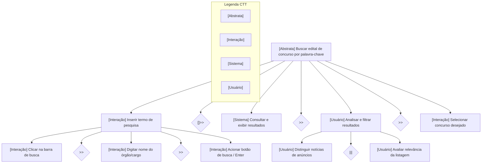
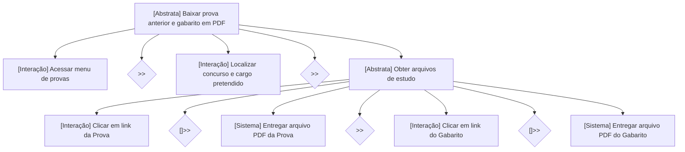

<b>Tabela de Contribuição</b>

| Membro | Contribuição |
| :--- | :--- |
| Daniel da Silva Batista | Fundamentação teórica de ConcurTaskTrees (Paternò, 1999; Barbosa e Silva, 2010), taxonomia de tipos de tarefas e operadores temporais, modelagem formal completa com diagramas e tabelas das Tarefas 01 e 02 e organização dos templates para a equipe. |
| Arthur Sismene Carvalho | Revisão dos operadores temporais de interação e estruturação das Tarefas 05 e 06. |
| Leonardo da Silva Lopes Júnior | Revisão da classificação de tarefas de sistema e interação das Tarefas 07 e 08. |
| Pedro Rocha Ferreira Lima | Definição das relações temporais de escolha e estruturação das Tarefas 03 e 04. |

Fonte: Daniel da Silva Batista (2026).

# ConcurTaskTrees (CTT)

## 1. Introdução e Fundamentação Teórica

O método **ConcurTaskTrees** (CTT), concebido pelo pesquisador italiano Fabio Paternò (1999) no âmbito do CNR-ISTI e amplamente referenciado por Barbosa e Silva (2010, Cap. 8.4), é uma notação gráfica e formal desenvolvida especificamente para a Engenharia de Usabilidade e o Design de Interação. Diferentemente de métodos puramente funcionais, o CTT destaca-se por modelar com precisão as relações temporais e a concorrência entre as atividades, além de distinguir claramente a responsabilidade de execução entre o ser humano e a máquina.

### 1.1 Tipos de Tarefas no CTT

A notação CTT classifica cada nó da árvore hierárquica em quatro categorias fundamentais:

* **Tarefa Abstrata (Abstract):** Representa um objetivo de composição de alto nível que não é executado diretamente, mas sim desdobrado em subtarefas de naturezas distintas.
* **Tarefa de Usuário (User):** Atividade estritamente cognitiva ou sensorial realizada pelo usuário sem envolver diretamente a manipulação da interface (ex.: decidir qual concurso prestar, analisar se o cargo é compatível).
* **Tarefa de Interação (Interaction):** Ação mútua e bidirecional de comunicação entre o usuário e o sistema computacional (ex.: preencher campo de busca, clicar em botão, selecionar item de menu).
* **Tarefa de Sistema (System):** Processamento autônomo executado pelo computador sem intervenção direta do usuário (ex.: consultar banco de dados de concursos, gerar página de resultados, disparar download do PDF).

### 1.2 Operadores Temporais do CTT

As relações lógicas e a ordem de execução entre tarefas irmãs no mesmo nível hierárquico são expressas por operadores temporais formais:

<b>Tabela 1: Operadores Temporais da Notação CTT</b>

| Notação Formal | Nome do Operador | Descrição Semântica |
| :---: | :--- | :--- |
| `T1 >> T2` | **Ativação Sequencial** | A tarefa `T2` só pode ser iniciada imediatamente após o término com sucesso de `T1`. |
| `T1 []>> T2` | **Ativação com Passagem de Informação** | `T2` é ativada após o término de `T1`, recebendo como entrada os dados gerados por `T1`. |
| `T1 [] T2` | **Escolha Alternativa** | O usuário ou o fluxo deve optar por executar `T1` ou `T2`. A escolha de uma desativa a outra. |
| `T1 ||| T2` | **Concorrência e Independência** | As tarefas `T1` e `T2` podem ser executadas simultaneamente ou em qualquer ordem relativa. |
| `T1 [> T2` | **Desativação / Interrupção** | A tarefa `T1` é desativada e interrompida no momento exato em que a tarefa `T2` é iniciada. |
| `T1 \|> T2` | **Suspensão e Retomada** | `T1` é temporariamente suspensa por `T2` e retoma sua execução após o término de `T2`. |
| `T*` | **Iteração** | A tarefa `T` é executada repetidas vezes até que uma condição de parada seja satisfeita. |

Fonte: Daniel da Silva Batista (2026).

---

## 2. Matriz de Atribuição das Tarefas para Modelagem CTT

Em consonância com a análise HTA e a divisão do grupo, as 10 tarefas do PCI Concursos foram mapeadas e atribuídas aos integrantes conforme a tabela abaixo:

<b>Tabela 2: Matriz de Tarefas para ConcurTaskTrees</b>

| ID | Nome da Tarefa | Membro Responsável |
| :---: | :--- | :--- |
| **TAR-01** | Buscar edital de concurso por palavra-chave ou órgão | **Daniel da Silva Batista** |
| **TAR-02** | Baixar caderno de provas anteriores e gabarito oficial em PDF | **Daniel da Silva Batista** |
| **TAR-03** | Filtrar concursos abertos na região Centro-Oeste / DF | Pedro Rocha Ferreira Lima |
| **TAR-04** | Consultar retificações de edital e prorrogações de cronograma | Pedro Rocha Ferreira Lima |
| **TAR-05** | Realizar simulado de questões online no navegador | Arthur Sismene Carvalho |
| **TAR-06** | Buscar oportunidades de estágio de nível superior no DF | Arthur Sismene Carvalho |
| **TAR-07** | Acessar videoaulas e dicas de disciplinas para estudo | Leonardo da Silva Lopes Júnior |
| **TAR-08** | Cadastrar endereço de e-mail para alerta de novos concursos | Leonardo da Silva Lopes Júnior |
| **TAR-09** | Consultar vagas reservadas para cotas e pessoas com deficiência (PcD) | João Vitor |
| **TAR-10** | Acompanhar notícias de homologação e convocações de aprovados | João Vitor |

Fonte: Daniel da Silva Batista (2026).

---

## 3. Modelagem Detalhada das Tarefas (Daniel da Silva Batista)

### 3.1 Tarefa 01: Buscar edital de concurso por palavra-chave ou órgão (TAR-01)

A representação em árvore de tarefas CTT para a Tarefa 01 é apresentada no diagrama da Figura 1 a seguir, e a especificação formal de seus nós, tipos e operadores temporais é apresentada na Tabela 3.

#### Diagrama de Árvore CTT (Figura 1)

<b>Figura 1: Representação em Árvore CTT da Tarefa 01</b>

Fonte: Daniel da Silva Batista (2026).

#### Tabela de Especificação dos Nós e Operadores da Tarefa 01

<b>Tabela 3: Especificação Formal dos Nós CTT da Tarefa 01</b>

| Nó / Tarefa | Tipo CTT | Operador Subsequente | Descrição da Operação |
| :--- | :---: | :---: | :--- |
| **Buscar edital por palavra-chave** | Abstrata | - | Tarefa raiz de alto nível que engloba toda a busca e localização do concurso. |
| **Inserir termo de pesquisa** | Interação | `[]>>` | O usuário digita a palavra-chave e submete os dados de texto para o sistema. |
| **Clicar na barra de busca** | Interação | `>>` | Posicionamento do cursor e foco no componente de entrada. |
| **Digitar nome do órgão/cargo** | Interação | `>>` | Entrada dos caracteres da busca (ex.: "TJDFT"). |
| **Acionar busca / Enter** | Interação | `[]>>` | Disparo do evento de submissão repassando o termo à consulta. |
| **Consultar e exibir resultados** | Sistema | `>>` | O servidor do PCI Concursos pesquisa a base e renderiza a listagem de links na tela. |
| **Analisar e filtrar resultados** | Usuário | `>>` | O usuário realiza julgamento cognitivo para distinguir os links de notícias dos anúncios publicitários. |
| **Distinguir notícias de anúncios** | Usuário | `\|\|\|` | Esforço cognitivo paralelo para ignorar banners do Google Ads. |
| **Avaliar relevância da listagem** | Usuário | `>>` | Leitura das manchetes para identificar a data e o órgão correto. |
| **Selecionar concurso desejado** | Interação | - | Clique no hiperlink do concurso selecionado para abrir a página do edital. |

Fonte: Daniel da Silva Batista (2026).

---

### 3.2 Tarefa 02: Baixar caderno de provas anteriores e gabarito oficial em PDF (TAR-02)

A representação em árvore da Tarefa 02 é ilustrada na Figura 2 a seguir, e sua especificação formal de nós, tipos e operadores temporais é apresentada na Tabela 4.

#### Diagrama de Árvore CTT (Figura 2)

<b>Figura 2: Representação em Árvore CTT da Tarefa 02</b>

Fonte: Daniel da Silva Batista (2026).

#### Tabela de Especificação dos Nós e Operadores da Tarefa 02

<b>Tabela 4: Especificação Formal dos Nós CTT da Tarefa 02</b>

| Nó / Tarefa | Tipo CTT | Operador Subsequente | Descrição da Operação |
| :--- | :---: | :---: | :--- |
| **Baixar prova e gabarito em PDF** | Abstrata | - | Tarefa raiz de download dos materiais de estudo em formato digital. |
| **Acessar menu de provas** | Interação | `>>` | Clique no menu lateral ou de navegação superior para abrir o catálogo. |
| **Localizar concurso e cargo** | Interação | `>>` | Seleção de filtros de banca, ano e busca textual pelo cargo pretendido. |
| **Obter arquivos de estudo** | Abstrata | - | Subtarefa composta responsável pela obtenção sequencial dos dois documentos. |
| **Clicar em link da Prova** | Interação | `[]>>` | Identificação e clique no hiperlink legítimo do caderno de questões. |
| **Entregar arquivo PDF da Prova** | Sistema | `>>` | O servidor transmite os bytes do PDF para download ou abertura no navegador. |
| **Clicar em link do Gabarito** | Interação | `[]>>` | Retorno à página e clique no hiperlink correspondente à folha de gabarito. |
| **Entregar arquivo PDF do Gabarito** | Sistema | - | O sistema dispara o download da chave de respostas oficiais. |

Fonte: Daniel da Silva Batista (2026).

---

## 4. Estrutura para Modelagem das Tarefas 03 a 10 pelos Demais Integrantes

As Tarefas 03 a 10 seguirão o padrão rigoroso estabelecido nas Tabelas 3 e 4, utilizando a classificação quadripartite de Paternò e detalhando a interação humano-máquina com base nas gravações empíricas:

* **Tarefas 03 e 04 (Pedro Rocha):** Modelagem de filtragem regional com operadores de escolha alternativa (`[]`) e checagem periódica de retificações (`T*`).
* **Tarefas 05 e 06 (Arthur Sismene):** Modelagem de fluxo interativo de resposta a questões em simulado e submissão de respostas com feedback instantâneo do sistema.
* **Tarefas 07 e 08 (Leonardo Lopes):** Modelagem de reprodução audiovisual de mídia e envio de formulário com validação de formato de e-mail pelo sistema.
* **Tarefas 09 e 10 (João Vitor):** Modelagem de varredura de tabelas de vagas de PcD e acompanhamento de editais de resultado definitivo.

---

## 5. Bibliografia

> BARBOSA, S. D. J.; SILVA, B. S. *Interação Humano-Computador*. Rio de Janeiro: Elsevier, 2010.  
> MORI, Giulio; PATERNÒ, Fabio; SANTORO, Carmen. *CTTE: Support for Developing and Analyzing Task Models for Interactive System Design*. IEEE Transactions on Software Engineering, v. 28, n. 8, p. 797-813, 2002.  
> PATERNÒ, Fabio. *Model-Based Design and Evaluation of Human-Computer Interfaces*. London: Springer-Verlag, 1999.

## 6. Histórico de Versões

| Versão | Data | Descrição | Autor(es) | Revisor(es) |
| :---: | :---: | :--- | :---: | :---: |
| `1.0` | 21/09/2026 | Fundamentação de CTT (Paternò; Barbosa & Silva), taxonomia de tarefas e operadores temporais, matriz das 10 tarefas, modelagem formal completa das Tarefas 01 e 02 (diagramas e tabelas de nós). | Daniel da Silva Batista | Pedro Rocha Ferreira Lima |

