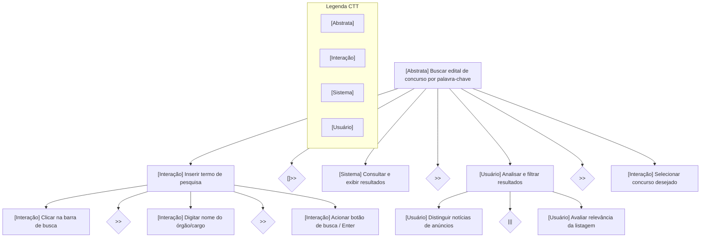
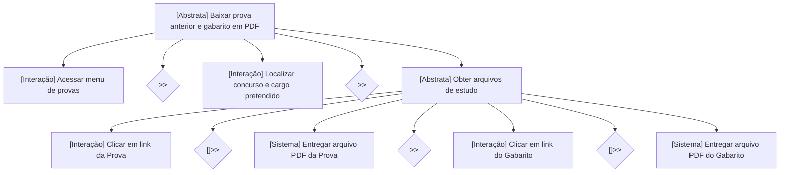
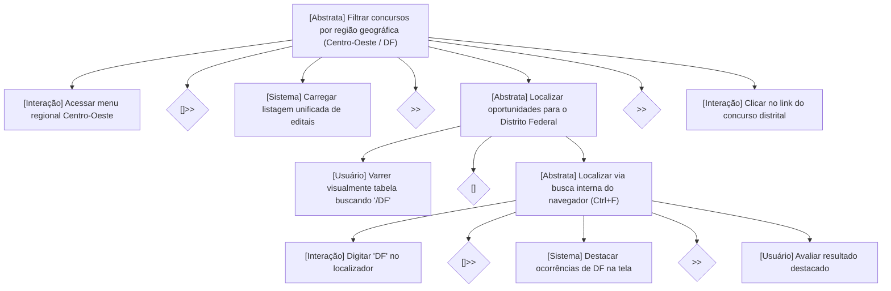
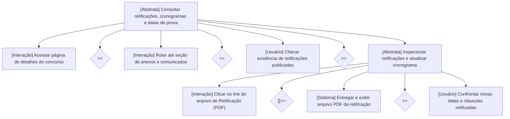
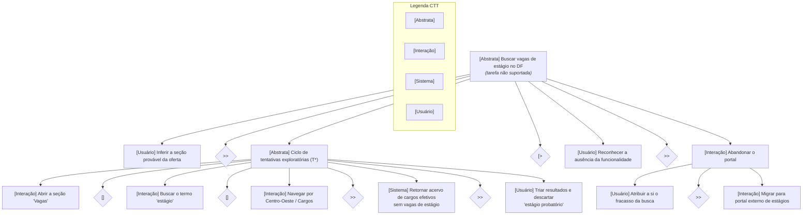

<b>Tabela de Contribuição</b>

| Membro | Contribuição |
| :--- | :--- |
| Daniel da Silva Batista | Fundamentação teórica de ConcurTaskTrees (Paternò, 1999; Barbosa e Silva, 2010), taxonomia de tipos de tarefas e operadores temporais, modelagem formal completa com diagramas e tabelas das Tarefas 01 e 02 e organização dos templates para a equipe. |
| Arthur Sismene Carvalho | Revisão dos operadores temporais de interação e modelagem CTT integral das Tarefas 05 e 06, com emprego dos operadores de iteração (`T*`), suspensão (`|>`), escolha alternativa (`[]`) e desativação (`[>`) para formalizar o ciclo de respostas e o padrão de tentativa e abandono. |
| João Vitor Sales Ibiapina | Revisão das relações temporais e estruturação das Tarefas 09 e 10. |
| Leonardo da Silva Lopes Júnior | Revisão da classificação de tarefas de sistema e interação das Tarefas 07 e 08. |
| Pedro Rocha Ferreira Lima | Modelagem formal completa em CTT (árvores de tarefas e especificação de nós com operadores temporais) das Tarefas 03 e 04 com base no método sem usuário (DOC-02) e na persona Lucas Ferreira Rocha. |
| Gemini | Geração dos diagramas CTT em notação Mermaid e auxílio na estruturação textual do artefato em Markdown (conforme Política de Uso de IA). |

<b>Fonte:</b> Daniel da Silva Batista (2026).

# ConcurTaskTrees (CTT)

## 1. Introdução e Fundamentação Teórica

O método **ConcurTaskTrees** (CTT), concebido pelo pesquisador italiano Fabio Paternò (1999) no âmbito do CNR-ISTI e amplamente referenciado por Barbosa e Silva (2010, Cap. 8.4), é uma notação gráfica e formal desenvolvida especificamente para a Engenharia de Usabilidade e o Design de Interação. Diferentemente de métodos puramente funcionais, o CTT destaca-se por modelar com precisão as relações temporais e a concorrência entre as atividades, além de distinguir claramente a responsabilidade de execução entre o ser humano e a máquina.

No CTT, as tarefas são decompostas hierarquicamente em uma árvore estrita e categorizadas segundo quatro papéis fundamentais de execução (*Taxonomia Quadripartite*):

* **Tarefa de Usuário (*User Task*):** Atividade puramente cognitiva ou sensorial executada internamente pelo indivíduo (ex.: avaliar a relevância de uma listagem ou tomar uma decisão mental), sem interação direta com o dispositivo.
* **Tarefa do Sistema (*System Task*):** Processamento automatizado realizado pelo software (ex.: consultar banco de dados, filtrar registros ou gerar arquivo PDF), sem intervenção humana no momento da execução.
* **Tarefa de Interação (*Interaction Task*):** Ação direta de diálogo físico entre usuário e máquina (ex.: clicar em um hiperlink, digitar um termo em um campo de texto ou acionar um botão).
* **Tarefa Abstrata (*Abstract Task*):** Nó de composição ou objetivo de alto nível que engloba subconjuntos de tarefas de tipos heterogêneos.

A grande potência do CTT reside em sua gramática de **operadores temporais formais**, que expressam a lógica dinâmica de execução entre tarefas irmãs situadas no mesmo nível hierárquico, conforme sintetizado na Tabela 1:

<b>Tabela 1: Operadores Temporais de Relação entre Tarefas no CTT</b>

| Operador | Nome Formal | Significado Semântico |
| :---: | :--- | :--- |
| `T1 >> T2` | **Ativação Sequencial (*Enabling*)** | A tarefa `T2` só pode ser iniciada após a conclusão bem-sucedida de `T1`. |
| `T1 []>> T2` | **Ativação com Passagem de Informação** | `T1` habilita `T2` e transfere os dados produzidos para a entrada de `T2`. |
| `T1 [] T2` | **Escolha Alternativa (*Choice*)** | O usuário pode optar por executar `T1` OU `T2`; ao iniciar uma, a outra é descartada. |
| `T1 \|\|\| T2` | **Interleaving (Concorrência)** | `T1` e `T2` podem ser executadas em qualquer ordem ou alternadamente sem interferência. |
| `T1 [> T2` | **Desativação (*Deactivation*)** | A execução de `T2` interrompe definitivamente a execução de `T1`. |
| `T1 \|> T2` | **Suspensão e Retomada** | `T1` é temporariamente suspensa por `T2` e retoma sua execução após o término de `T2`. |
| `T*` | **Iteração** | A tarefa `T` é executada repetidas vezes até que uma condição de parada seja satisfeita. |

<b>Fonte:</b> Daniel da Silva Batista (2026).

---

## 2. Matriz de Tarefas do PCI Concursos

A equipe consolidou a matriz com as dez tarefas avaliadas no portal, mapeando a distribuição individual entre os integrantes:

<b>Tabela 2: Matriz de Tarefas Mapeadas para CTT</b>

| ID | Descrição da Tarefa | Responsável |
| :---: | :--- | :--- |
| **TAR-01** | Buscar edital de concurso por palavra-chave ou órgão | Daniel da Silva Batista |
| **TAR-02** | Baixar caderno de provas anteriores e gabarito oficial em PDF | Daniel da Silva Batista |
| **TAR-03** | Filtrar concursos por região geográfica (Centro-Oeste / DF) | Pedro Rocha Ferreira Lima |
| **TAR-04** | Consultar retificações, cronogramas e datas de prova | Pedro Rocha Ferreira Lima |
| **TAR-05** | Realizar simulado de questões online com feedback de gabarito | Arthur Sismene Carvalho |
| **TAR-06** | Buscar oportunidades de estágio de nível superior no DF | Arthur Sismene Carvalho |
| **TAR-07** | Acessar videoaulas e dicas teóricas de disciplinas | Leonardo da Silva Lopes Júnior |
| **TAR-08** | Cadastrar e configurar recebimento de alertas de vagas por e-mail | Leonardo da Silva Lopes Júnior |
| **TAR-09** | Consultar vagas reservadas para cotas e pessoas com deficiência (PcD) | João Vitor Sales Ibiapina |
| **TAR-10** | Acompanhar notícias de homologação e convocações de aprovados | João Vitor Sales Ibiapina |

<b>Fonte:</b> Daniel da Silva Batista (2026).

---

## 3. Modelagem Detalhada das Tarefas (Daniel da Silva Batista)

### 3.1 Tarefa 01: Buscar edital de concurso por palavra-chave ou órgão (TAR-01)

A representação em árvore de tarefas CTT para a Tarefa 01 é apresentada no diagrama da Figura 1 a seguir, e a especificação formal de seus nós, tipos e operadores temporais é apresentada na Tabela 3.

#### Diagrama de Árvore CTT (Figura 1)

<b>Figura 1:</b> Representação em Árvore CTT da Tarefa 01

```mermaid
flowchart TD
    subgraph Legenda ["Legenda CTT"]
        direction LR
        L_Abs["[Abstrata]"]
        L_Int["[Interação]"]
        L_Sis["[Sistema]"]
        L_Usu["[Usuário]"]
    end

    Root["[Abstrata] Buscar edital de concurso por palavra-chave"]
    
    Sub1["[Interação] Inserir termo de pesquisa"]
    Op1{"[]>>"}
    Sub2["[Sistema] Consultar e exibir resultados"]
    Op2{">>"}
    Sub3["[Usuário] Analisar e filtrar resultados"]
    Op3{">>"}
    Sub4["[Interação] Selecionar concurso desejado"]

    Root --> Sub1
    Root --> Op1
    Root --> Sub2
    Root --> Op2
    Root --> Sub3
    Root --> Op3
    Root --> Sub4

    %% Decomposição de Sub1
    Sub1_1["[Interação] Clicar na barra de busca"]
    Sub1_Op{">>"}
    Sub1_2["[Interação] Digitar nome do órgão/cargo"]
    Sub1_Op2{">>"}
    Sub1_3["[Interação] Acionar botão de busca / Enter"]
    Sub1 --> Sub1_1
    Sub1 --> Sub1_Op
    Sub1 --> Sub1_2
    Sub1 --> Sub1_Op2
    Sub1 --> Sub1_3

    %% Decomposição de Sub3
    Sub3_1["[Usuário] Distinguir notícias de anúncios"]
    Sub3_Op{"|||"}
    Sub3_2["[Usuário] Avaliar relevância da listagem"]
    Sub3 --> Sub3_1
    Sub3 --> Sub3_Op
    Sub3 --> Sub3_2
```

<b>Fonte:</b> Gerado por Inteligência Artificial (Gemini) (2026).

#### Tabela de Especificação dos Nós e Operadores da Tarefa 01

<b>Tabela 3: Especificação Formal dos Nós CTT da Tarefa 01</b>

| Nó / Tarefa | Tipo CTT | Operador Subsequente | Descrição da Operação |
| :--- | :---: | :---: | :--- |
| **Buscar edital por palavra-chave** | Abstrata | - | Tarefa raiz de alto nível que engloba toda a busca e localização do concurso. |
| **Inserir termo de pesquisa** | Interação | `[]>>` | O usuário digita a palavra-chave e submete os dados de texto para o sistema. |
| **Clicar na barra de busca** | Interação | `>>` | Posicionamento do cursor e foco no componente de entrada. |
| **Digitar nome do órgão/cargo** | Interação | `>>` | Entrada dos caracteres da busca (ex.: "TJDFT"). |
| **Acionar busca / Enter** | Interação | `[]>>` | Disparo do evento de submissão repassando o termo à consulta. |
| **Consultar e exibir resultados** | Sistema | `>>` | O servidor do PCI Concursos pesquisa a base e renderiza a listagem de links na tela. |
| **Analisar e filtrar resultados** | Usuário | `>>` | O usuário realiza julgamento cognitivo para distinguir os links de notícias dos anúncios publicitários. |
| **Distinguir notícias de anúncios** | Usuário | `\|\|\|` | Esforço cognitivo paralelo para ignorar banners do Google Ads. |
| **Avaliar relevância da listagem** | Usuário | `>>` | Leitura das manchetes para identificar a data e o órgão correto. |
| **Selecionar concurso desejado** | Interação | - | Clique no hiperlink do concurso selecionado para abrir a página do edital. |

<b>Fonte:</b> Daniel da Silva Batista (2026).

---

### 3.2 Tarefa 02: Baixar caderno de provas anteriores e gabarito oficial em PDF (TAR-02)

A representação em árvore da Tarefa 02 é ilustrada na Figura 2 a seguir, e sua especificação formal de nós, tipos e operadores temporais é apresentada na Tabela 4.

#### Diagrama de Árvore CTT (Figura 2)

<b>Figura 2:</b> Representação em Árvore CTT da Tarefa 02

```mermaid
flowchart TD
    Root2["[Abstrata] Baixar prova anterior e gabarito em PDF"]

    N1["[Interação] Acessar menu de provas"]
    O1{">>"}
    N2["[Interação] Localizar concurso e cargo pretendido"]
    O2{">>"}
    N3["[Abstrata] Obter arquivos de estudo"]

    Root2 --> N1
    Root2 --> O1
    Root2 --> N2
    Root2 --> O2
    Root2 --> N3

    %% Decomposição de N3
    N3_1["[Interação] Clicar em link da Prova"]
    O3_1{"[]>>"}
    N3_2["[Sistema] Entregar arquivo PDF da Prova"]
    O3_2{">>"}
    N3_3["[Interação] Clicar em link do Gabarito"]
    O3_3{"[]>>"}
    N3_4["[Sistema] Entregar arquivo PDF do Gabarito"]

    N3 --> N3_1
    N3 --> O3_1
    N3 --> N3_2
    N3 --> O3_2
    N3 --> N3_3
    N3 --> O3_3
    N3 --> N3_4
```

<b>Fonte:</b> Gerado por Inteligência Artificial (Gemini) (2026).

#### Tabela de Especificação dos Nós e Operadores da Tarefa 02

<b>Tabela 4: Especificação Formal dos Nós CTT da Tarefa 02</b>

| Nó / Tarefa | Tipo CTT | Operador Subsequente | Descrição da Operação |
| :--- | :---: | :---: | :--- |
| **Baixar prova e gabarito em PDF** | Abstrata | - | Tarefa raiz de download dos materiais de estudo em formato digital. |
| **Acessar menu de provas** | Interação | `>>` | Clique no menu lateral ou de navegação superior para abrir o catálogo. |
| **Localizar concurso e cargo** | Interação | `>>` | Seleção de filtros de banca, ano e busca textual pelo cargo pretendido. |
| **Obter arquivos de estudo** | Abstrata | - | Subtarefa composta responsável pela obtenção sequencial dos dois documentos. |
| **Clicar em link da Prova** | Interação | `[]>>` | Identificação e clique no hiperlink legítimo do caderno de questões. |
| **Entregar arquivo PDF da Prova** | Sistema | `>>` | O servidor transmite os bytes do PDF para download ou abertura no navegador. |
| **Clicar em link do Gabarito** | Interação | `[]>>` | Retorno à página e clique no hiperlink correspondente à folha de gabarito. |
| **Entregar arquivo PDF do Gabarito** | Sistema | - | O sistema dispara o download da chave de respostas oficiais. |

<b>Fonte:</b> Daniel da Silva Batista (2026).

---

## 4. Modelagem Detalhada das Tarefas (Pedro Rocha Ferreira Lima)

### 4.1 Tarefa 03: Filtrar concursos por região geográfica (Centro-Oeste / DF) (TAR-03)

A representação em árvore de tarefas CTT para a Tarefa 03 é apresentada na Figura 3, decompondo os fluxos de filtragem regional com operadores temporais de ativação com transferência de informação (`[]>>`), escolha (`[]`) e ativação sequencial (`>>`). A especificação formal dos nós é detalhada na Tabela 5.

#### Diagrama de Árvore CTT (Figura 3)

<b>Figura 3:</b> Representação em Árvore CTT da Tarefa 03

```mermaid
flowchart TD
    Root3["[Abstrata] Filtrar concursos por região geográfica (Centro-Oeste / DF)"]

    P1["[Interação] Acessar menu regional Centro-Oeste"]
    POp1{"[]>>"}
    P2["[Sistema] Carregar listagem unificada de editais"]
    POp2{">>"}
    P3["[Abstrata] Localizar oportunidades para o Distrito Federal"]
    POp3{">>"}
    P4["[Interação] Clicar no link do concurso distrital"]

    Root3 --> P1
    Root3 --> POp1
    Root3 --> P2
    Root3 --> POp2
    Root3 --> P3
    Root3 --> POp3
    Root3 --> P4

    %% Decomposição de P3 (Estratégias de Localização - Escolha [])
    P3_1["[Usuário] Varrer visualmente tabela buscando '/DF'"]
    P3_Op{"[]"}
    P3_2["[Abstrata] Localizar via busca interna do navegador (Ctrl+F)"]

    P3 --> P3_1
    P3 --> P3_Op
    P3 --> P3_2

    %% Decomposição de P3_2
    P3_2_1["[Interação] Digitar 'DF' no localizador"]
    P3_2_Op{"[]>>"}
    P3_2_2["[Sistema] Destacar ocorrências de DF na tela"]
    P3_2_Op2{">>"}
    P3_2_3["[Usuário] Avaliar resultado destacado"]

    P3_2 --> P3_2_1
    P3_2 --> P3_2_Op
    P3_2 --> P3_2_2
    P3_2 --> P3_2_Op2
    P3_2 --> P3_2_3
```

<b>Fonte:</b> Gerado por Inteligência Artificial (Gemini) e revisado por Pedro Rocha Ferreira Lima (2026).

#### Tabela de Especificação dos Nós e Operadores da Tarefa 03

<b>Tabela 5: Especificação Formal dos Nós CTT da Tarefa 03</b>

| Nó / Tarefa | Tipo CTT | Operador Subsequente | Descrição da Operação |
| :--- | :---: | :---: | :--- |
| **Filtrar concursos por região (Centro-Oeste / DF)** | Abstrata | - | Tarefa raiz de alto nível que abrange o afunilamento geográfico até a seleção de uma vaga distrital. |
| **Acessar menu regional Centro-Oeste** | Interação | `[]>>` | O usuário clica na opção "Centro-Oeste" na navegação lateral, enviando a requisição de rota com a região selecionada. |
| **Carregar listagem unificada de editais** | Sistema | `>>` | O servidor do portal consulta a base de dados e renderiza a listagem plana englobando DF, GO, MT e MS. |
| **Localizar oportunidades para o Distrito Federal** | Abstrata | `>>` | Subtarefa complexa de triagem, onde o usuário adota uma de duas estratégias concorrentes de busca. |
| **Varrer visualmente tabela buscando '/DF'** | Usuário | `[]` | Leitura cognitiva linha por linha dos títulos procurando a sigla distrital (estratégia manual). |
| **Localizar via busca do navegador (Ctrl+F)** | Abstrata | - | Estratégia alternativa adotada para contornar a ausência de subfiltros nativos por UF no portal. |
| **Digitar 'DF' no localizador** | Interação | `[]>>` | Entrada textual da sigla no utilitário de busca do navegador. |
| **Destacar ocorrências de DF na tela** | Sistema | `>>` | O navegador renderiza o realce luminoso nas palavras coincidentes dentro do DOM da página. |
| **Avaliar resultado destacado** | Usuário | - | Julgamento cognitivo do usuário sobre o órgão público distrital identificado. |
| **Clicar no link do concurso distrital** | Interação | - | Ação física de clique sobre o título do concurso pretendido para abrir a página do edital. |

<b>Fonte:</b> Pedro Rocha Ferreira Lima (2026).

---

### 4.2 Tarefa 04: Consultar retificações, cronogramas e datas de prova (TAR-04)

A representação em árvore da Tarefa 04 é ilustrada na Figura 4, destacando o fluxo de inspeção de comunicados e confrontação de datas com o operador de ativação com dados (`[]>>`) e tarefas de julgamento cognitivo do usuário. A especificação formal dos nós e seus operadores temporais é apresentada na Tabela 6.

#### Diagrama de Árvore CTT (Figura 4)

<b>Figura 4:</b> Representação em Árvore CTT da Tarefa 04

```mermaid
flowchart TD
    Root4["[Abstrata] Consultar retificações, cronogramas e datas de prova"]

    Q1["[Interação] Acessar página de detalhes do concurso"]
    QOp1{">>"}
    Q2["[Interação] Rolar até seção de anexos e comunicados"]
    QOp2{">>"}
    Q3["[Usuário] Checar existência de retificações publicadas"]
    QOp3{">>"}
    Q4["[Abstrata] Inspecionar retificações e atualizar cronograma"]

    Root4 --> Q1
    Root4 --> QOp1
    Root4 --> Q2
    Root4 --> QOp2
    Root4 --> Q3
    Root4 --> QOp3
    Root4 --> Q4

    %% Decomposição de Q4
    Q4_1["[Interação] Clicar no link do arquivo de Retificação (PDF)"]
    Q4_Op1{"[]>>"}
    Q4_2["[Sistema] Entregar e exibir arquivo PDF da retificação"]
    Q4_Op2{">>"}
    Q4_3["[Usuário] Confrontar novas datas e cláusulas retificadas"]

    Q4 --> Q4_1
    Q4 --> Q4_Op1
    Q4 --> Q4_2
    Q4 --> Q4_Op2
    Q4 --> Q4_3
```

<b>Fonte:</b> Gerado por Inteligência Artificial (Gemini) e revisado por Pedro Rocha Ferreira Lima (2026).

#### Tabela de Especificação dos Nós e Operadores da Tarefa 04

<b>Tabela 6: Especificação Formal dos Nós CTT da Tarefa 04</b>

| Nó / Tarefa | Tipo CTT | Operador Subsequente | Descrição da Operação |
| :--- | :---: | :---: | :--- |
| **Consultar retificações e cronogramas** | Abstrata | - | Tarefa raiz de verificação da integridade das informações e prazos atualizados do edital. |
| **Acessar página de detalhes do concurso** | Interação | `>>` | Clique no título do concurso a partir da listagem ou resultado de pesquisa. |
| **Rolar até seção de anexos e comunicados** | Interação | `>>` | Ação física de rolagem na página para transpassar anúncios e chegar aos arquivos oficiais. |
| **Checar existência de retificações** | Usuário | `>>` | Inspeção cognitiva da listagem de links para identificar termos como "Retificação", "Prorrogação" ou "Errata". |
| **Inspecionar retificações e cronograma** | Abstrata | - | Subtarefa de obtenção documental e atualização dos marcos temporais da preparação. |
| **Clicar no link da Retificação (PDF)** | Interação | `[]>>` | Disparo do evento de requisição do anexo suplementar ao servidor. |
| **Entregar e exibir arquivo PDF** | Sistema | `>>` | O sistema processa e transmite o arquivo PDF da retificação para exibição ou download local. |
| **Confrontar novas datas e cláusulas** | Usuário | - | Processamento cognitivo de comparação entre as datas retificadas e o cronograma originalmente anotado. |

<b>Fonte:</b> Pedro Rocha Ferreira Lima (2026).

---

## 5. Modelagem Detalhada das Tarefas (Arthur Sismene Carvalho)

### 5.1 Tarefa 05: Realizar simulado de questões online com feedback de gabarito (TAR-05)

A modelagem CTT da Tarefa 05 evidencia sua característica distintiva em relação às Tarefas 01 e 02: trata-se de uma tarefa **fortemente iterativa**, cujo núcleo é um ciclo de resposta repetido sob o operador de iteração (`T*`), e cuja conclusão depende de uma tarefa de sistema (consolidação do desempenho) que o portal não executa.

#### Diagrama de Árvore CTT (Figura 5)

<b>Figura 5:</b> Representação em Árvore CTT da Tarefa 05

```mermaid
flowchart TD
    subgraph Legenda ["Legenda CTT"]
        direction LR
        L_Abs["[Abstrata]"]
        L_Int["[Interação]"]
        L_Sis["[Sistema]"]
        L_Usu["[Usuário]"]
    end

    Root["[Abstrata] Realizar simulado de questões online"]

    Sub1["[Interação] Acessar a seção de Simulados"]
    Op1{">>"}
    Sub2["[Sistema] Carregar árvore de disciplinas e assuntos"]
    Op2{"[]>>"}
    Sub3["[Abstrata] Delimitar o escopo do simulado"]
    Op3{">>"}
    Sub4["[Abstrata] Ciclo de resposta às questões (T*)"]
    Op4{">>"}
    Sub5["[Usuário] Avaliar o próprio desempenho"]

    Root --> Sub1
    Root --> Op1
    Root --> Sub2
    Root --> Op2
    Root --> Sub3
    Root --> Op3
    Root --> Sub4
    Root --> Op4
    Root --> Sub5

    %% Decomposição de Sub3
    Sub3_1["[Usuário] Escolher a disciplina pretendida"]
    Sub3_Op{"[]>>"}
    Sub3_2["[Interação] Selecionar o assunto na árvore"]
    Sub3_Op2{">>"}
    Sub3_3["[Interação] Parametrizar quantidade e tempo<br>(NÃO SUPORTADA)"]
    Sub3 --> Sub3_1
    Sub3 --> Sub3_Op
    Sub3 --> Sub3_2
    Sub3 --> Sub3_Op2
    Sub3 --> Sub3_3

    %% Decomposição de Sub4 (ciclo iterativo)
    Sub4_1["[Sistema] Renderizar a questão"]
    Sub4_Op{">>"}
    Sub4_2["[Usuário] Interpretar o enunciado"]
    Sub4_Op2{"[]>>"}
    Sub4_3["[Interação] Marcar a alternativa"]
    Sub4_Op3{">>"}
    Sub4_4["[Sistema] Registrar resposta e exibir gabarito"]
    Sub4_Op4{"|>"}
    Sub4_5["[Sistema] Perda de progresso por queda de conexão<br>(SUSPENSÃO NÃO RECUPERÁVEL)"]
    Sub4 --> Sub4_1
    Sub4 --> Sub4_Op
    Sub4 --> Sub4_2
    Sub4 --> Sub4_Op2
    Sub4 --> Sub4_3
    Sub4 --> Sub4_Op3
    Sub4 --> Sub4_4
    Sub4 --> Sub4_Op4
    Sub4 --> Sub4_5

    %% Decomposição de Sub5
    Sub5_1["[Usuário] Conferir gabarito questão a questão"]
    Sub5_Op{">>"}
    Sub5_2["[Sistema] Consolidar placar de acertos<br>(NÃO SUPORTADA)"]
    Sub5 --> Sub5_1
    Sub5 --> Sub5_Op
    Sub5 --> Sub5_2
```

<b>Fonte:</b> Arthur Sismene Carvalho (2026).

#### Tabela de Especificação dos Nós e Operadores da Tarefa 05

<b>Tabela 7: Especificação Formal dos Nós CTT da Tarefa 05</b>

| Nó / Tarefa | Tipo CTT | Operador Subsequente | Descrição da Operação |
| :--- | :---: | :---: | :--- |
| **Realizar simulado de questões online** | Abstrata | - | Tarefa raiz que engloba o acesso, a delimitação de escopo, o ciclo de respostas e a avaliação de desempenho. |
| **Acessar a seção de Simulados** | Interação | `>>` | O usuário localiza e aciona o item "Simulados" entre os quinze rótulos do menu principal. |
| **Carregar árvore de disciplinas e assuntos** | Sistema | `[]>>` | O servidor renderiza a hierarquia de disciplinas com as respectivas contagens de questões e repassa a estrutura navegável ao usuário. |
| **Delimitar o escopo do simulado** | Abstrata | `>>` | Nó de composição que agrupa as decisões de recorte temático da sessão de estudo. |
| **Escolher a disciplina pretendida** | Usuário | `[]>>` | Julgamento cognitivo sobre qual disciplina praticar, com passagem da decisão à etapa de seleção. |
| **Selecionar o assunto na árvore** | Interação | `>>` | Acionamento do subtópico específico dentro da disciplina escolhida. |
| **Parametrizar quantidade e tempo** | Interação | — | **Tarefa de interação pretendida pelo usuário e ausente no sistema.** A impossibilidade de definir o número de questões e o cronômetro inviabiliza o ajuste da sessão à janela de tempo disponível. |
| **Ciclo de resposta às questões** | Abstrata | `>>` | Nó iterativo (`T*`) que se repete até o esgotamento do escopo ou a interrupção por fator externo. |
| **Renderizar a questão** | Sistema | `>>` | Exibição do enunciado e das alternativas na viewport do dispositivo. |
| **Interpretar o enunciado** | Usuário | `[]>>` | Esforço cognitivo de leitura e compreensão, com produção da decisão que alimenta a marcação. |
| **Marcar a alternativa** | Interação | `>>` | Toque ou clique sobre a alternativa eleita, sujeito a erro por alvo de toque reduzido. |
| **Registrar resposta e exibir gabarito** | Sistema | `\|>` | O sistema processa a resposta e devolve a alternativa correta, sem comentário explicativo. |
| **Perda de progresso por queda de conexão** | Sistema | — | **Suspensão não recuperável.** Modelada com o operador `\|>` para explicitar que a interrupção suspende o ciclo sem possibilidade de retomada, uma vez que o estado da sessão não é persistido — violação do princípio de prevenção de perda de trabalho do usuário. |
| **Avaliar o próprio desempenho** | Usuário | `>>` | Julgamento final sobre o resultado alcançado, objetivo central que motivou o uso da ferramenta. |
| **Conferir gabarito questão a questão** | Usuário | `>>` | Verificação pontual e fragmentada, a única efetivamente disponível no portal. |
| **Consolidar placar de acertos** | Sistema | — | **Tarefa de sistema esperada e inexistente.** Sua ausência impede o fechamento do ciclo diagnóstico e constitui o principal ponto de ruptura da tarefa. |

<b>Fonte:</b> Arthur Sismene Carvalho (2026).

---

### 5.2 Tarefa 06: Buscar oportunidades de estágio de nível superior no DF (TAR-06)

!!! warning "Tarefa não suportada pelo sistema"
    Conforme registrado na [modelagem HTA da TAR-06](hta.md#52-tarefa-06-buscar-oportunidades-de-estagio-de-nivel-superior-no-df-tar-06) e fundamentado na [Análise Documental `DOC-03`](../perfil-de-usuario.md#53-analise-documental-03-responsavel-arthur-sismene-carvalho), o PCI Concursos **não indexa vagas de estágio**. A árvore CTT a seguir modela, portanto, um **padrão de tentativa e abandono**.

    A notação de Paternò (1999) é particularmente adequada a essa situação por dois recursos formais: o operador de **escolha alternativa** (`[]`), que expressa as hipóteses mutuamente excludentes que o usuário testa, e o operador de **desativação** (`[>`), que formaliza o momento em que o reconhecimento da ausência da funcionalidade interrompe definitivamente o ciclo exploratório. A modelagem evidencia ainda um desequilíbrio revelador: as tarefas de sistema do fluxo apenas **retornam acervo incompatível**, sem jamais comunicar a limitação de escopo.

#### Diagrama de Árvore CTT (Figura 6)

<b>Figura 6:</b> Representação em Árvore CTT da Tarefa 06 (padrão de tentativa e abandono)

```mermaid
flowchart TD
    subgraph Legenda ["Legenda CTT"]
        direction LR
        L_Abs["[Abstrata]"]
        L_Int["[Interação]"]
        L_Sis["[Sistema]"]
        L_Usu["[Usuário]"]
    end

    Root["[Abstrata] Buscar vagas de estágio no DF<br><i>(tarefa não suportada)</i>"]

    Sub1["[Usuário] Inferir a seção provável da oferta"]
    Op1{">>"}
    Sub2["[Abstrata] Ciclo de tentativas exploratórias (T*)"]
    Op2{"[>"}
    Sub3["[Usuário] Reconhecer a ausência da funcionalidade"]
    Op3{">>"}
    Sub4["[Interação] Abandonar o portal"]

    Root --> Sub1
    Root --> Op1
    Root --> Sub2
    Root --> Op2
    Root --> Sub3
    Root --> Op3
    Root --> Sub4

    %% Decomposição de Sub2 - hipóteses alternativas
    Sub2_A["[Interação] Abrir a seção 'Vagas'"]
    Sub2_OpA{"[]"}
    Sub2_B["[Interação] Buscar o termo 'estágio'"]
    Sub2_OpB{"[]"}
    Sub2_C["[Interação] Navegar por Centro-Oeste / Cargos"]
    Sub2_OpC{">>"}
    Sub2_D["[Sistema] Retornar acervo de cargos efetivos<br>sem vagas de estágio"]
    Sub2_OpD{">>"}
    Sub2_E["[Usuário] Triar resultados e descartar<br>'estágio probatório'"]

    Sub2 --> Sub2_A
    Sub2 --> Sub2_OpA
    Sub2 --> Sub2_B
    Sub2 --> Sub2_OpB
    Sub2 --> Sub2_C
    Sub2 --> Sub2_OpC
    Sub2 --> Sub2_D
    Sub2 --> Sub2_OpD
    Sub2 --> Sub2_E

    %% Decomposição de Sub4
    Sub4_1["[Usuário] Atribuir a si o fracasso da busca"]
    Sub4_Op{">>"}
    Sub4_2["[Interação] Migrar para portal externo de estágios"]
    Sub4 --> Sub4_1
    Sub4 --> Sub4_Op
    Sub4 --> Sub4_2
```

<b>Fonte:</b> Arthur Sismene Carvalho (2026).

#### Tabela de Especificação dos Nós e Operadores da Tarefa 06

<b>Tabela 8: Especificação Formal dos Nós CTT da Tarefa 06</b>

| Nó / Tarefa | Tipo CTT | Operador Subsequente | Descrição da Operação |
| :--- | :---: | :---: | :--- |
| **Buscar vagas de estágio no DF** | Abstrata | - | Tarefa raiz cujo objetivo não é atingível no sistema avaliado, por ausência da funcionalidade correspondente. |
| **Inferir a seção provável da oferta** | Usuário | `>>` | Operação exclusivamente cognitiva: o usuário formula hipóteses de localização a partir do seu modelo mental de que o maior portal de oportunidades públicas cobriria estágio. |
| **Ciclo de tentativas exploratórias** | Abstrata | `[>` | Nó iterativo (`T*`) que agrupa as hipóteses testadas. É **desativado** pelo reconhecimento da ausência da funcionalidade, e não concluído com êxito. |
| **Abrir a seção "Vagas"** | Interação | `[]` | Primeira hipótese testada, em escolha alternativa com as demais. A seção indexa somente cargos efetivos. |
| **Buscar o termo "estágio"** | Interação | `[]` | Segunda hipótese. A busca textual é tecnicamente bem-sucedida e semanticamente inútil, por colisão com *estágio probatório*. |
| **Navegar por Centro-Oeste / Cargos** | Interação | `>>` | Terceira hipótese. O filtro geográfico e a taxonomia de mais de trezentos cargos operam sobre acervo que não contém o tipo de oportunidade buscada. |
| **Retornar acervo de cargos efetivos sem vagas de estágio** | Sistema | `>>` | **Nó crítico da modelagem:** a única tarefa de sistema do fluxo devolve resultados formalmente válidos e materialmente inúteis, **sem em nenhum momento comunicar a limitação de escopo do portal**. |
| **Triar resultados e descartar "estágio probatório"** | Usuário | — | Esforço cognitivo desperdiçado. Como o usuário é iniciante no domínio e desconhece a distinção entre as duas acepções do termo, a triagem é lenta e inicialmente conduz à falsa impressão de sucesso. |
| **Reconhecer a ausência da funcionalidade** | Usuário | `>>` | Conclusão cognitiva que **desativa** (`[>`) o ciclo de tentativas, alcançada apenas por exaustão das hipóteses e não por informação fornecida pelo sistema. |
| **Abandonar o portal** | Interação | - | Encerramento da interação sem cumprimento do objetivo. |
| **Atribuir a si o fracasso da busca** | Usuário | `>>` | Consequência mais grave do fluxo: na ausência de comunicação explícita de escopo, o usuário conclui que "não soube procurar", com prejuízo à autoconfiança — violação da heurística de visibilidade do estado do sistema (Nielsen, 1993). |
| **Migrar para portal externo de estágios** | Interação | - | Perda de retenção de um usuário que tenderia a converter-se em concurseiro pleno nos anos subsequentes. |

<b>Fonte:</b> Arthur Sismene Carvalho (2026).

---

## 6. Estrutura para Modelagem das Tarefas 07 a 10 pelos Demais Integrantes

As Tarefas 05 a 10 seguirão o padrão rigoroso estabelecido nas seções anteriores, utilizando a classificação quadripartite de Paternò e detalhando a interação humano-máquina com base nas gravações empíricas:

* **Tarefas 07 e 08 (Leonardo da Silva Lopes Júnior):** Modelagem de reprodução audiovisual de mídia e envio de formulário com validação de formato de e-mail pelo sistema.
* **Tarefas 09 e 10 (João Vitor Sales Ibiapina):** Modelagem de varredura de tabelas de vagas de PcD e acompanhamento de editais de resultado definitivo.

---

## 7. Bibliografia

> BARBOSA, S. D. J.; SILVA, B. S. *Interação Humano-Computador*. Rio de Janeiro: Elsevier, 2010.  
> MORI, Giulio; PATERNÒ, Fabio; SANTORO, Carmen. *CTTE: Support for Developing and Analyzing Task Models for Interactive System Design*. IEEE Transactions on Software Engineering, v. 28, n. 8, p. 797-813, 2002.  
> NIELSEN, Jakob. *Usability Engineering*. San Francisco: Morgan Kaufmann, 1993.  
> PATERNÒ, Fabio. *Model-Based Design and Evaluation of Human-Computer Interfaces*. London: Springer-Verlag, 1999.

## 8. Histórico de Versões

| Versão | Data | Descrição | Autor(es) | Revisor(es) |
| :---: | :---: | :--- | :---: | :---: |
| `1.0` | 21/09/2026 | Fundamentação de CTT (Paternò; Barbosa & Silva), taxonomia de tarefas e operadores temporais, matriz das 10 tarefas, modelagem formal completa das Tarefas 01 e 02 (diagramas e tabelas de nós). | Daniel da Silva Batista | Pedro Rocha Ferreira Lima |
| `1.1` | 27/09/2026 | Inclusão da modelagem CTT completa das Tarefas 03 e 04 (árvores de tarefas e especificações de nós formais) baseadas na Análise Documental (DOC-02) e persona Lucas Ferreira Rocha. | Pedro Rocha Ferreira Lima | Daniel da Silva Batista |
| `1.2` | 27/09/2026 | Modelagem CTT completa das Tarefas 05 e 06 (Figuras 5 e 6, Tabelas 7 e 8), com formalização do ciclo iterativo de respostas, da suspensão não recuperável por perda de conexão e do padrão de tentativa e abandono da TAR-06 pelo operador de desativação. | Arthur Sismene Carvalho | Daniel da Silva Batista |

