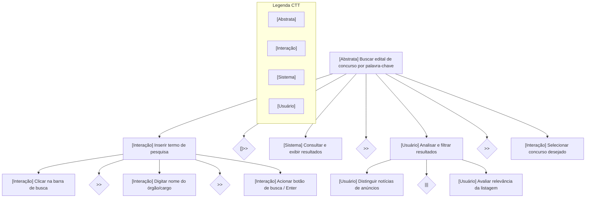
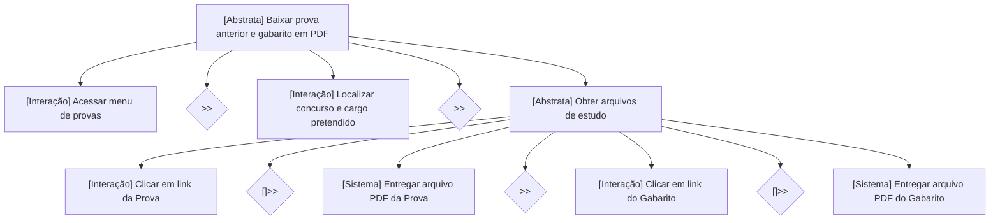
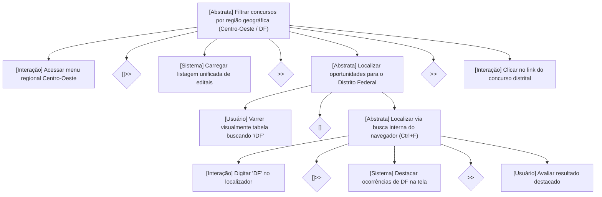
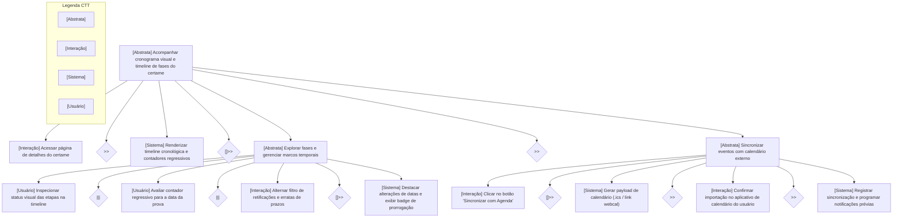
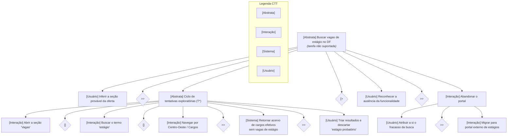

<b>Tabela de Contribuição</b>

| Membro | Contribuição |
| :--- | :--- |
| Daniel da Silva Batista | Fundamentação teórica de ConcurTaskTrees (Paternò, 1999; Barbosa e Silva, 2010), taxonomia de tipos de tarefas e operadores temporais, modelagem formal completa com diagramas e tabelas das Tarefas 01 e 02 e organização dos templates para a equipe. |
| Arthur Sismene Carvalho | Revisão dos operadores temporais de interação e modelagem CTT integral das Tarefas 05 e 06, com emprego dos operadores de iteração (`T*`), suspensão (`|>`), escolha alternativa (`[]`) e desativação (`[>`) para formalizar o ciclo de respostas e o padrão de tentativa e abandono. |
| João Vitor Sales Ibiapina | Revisão das relações temporais e estruturação das Tarefas 09 e 10. |
| Leonardo da Silva Lopes Júnior | Modelagem formal completa em CTT (árvores de tarefas e especificação de nós com operadores temporais) das Tarefas 07 e 08; refinamento da modelagem CTT das tarefas interativas propositivas (TAR-04, TAR-05 e TAR-08) com operadores formais ricos (`>>`, `[]>>`, `|||`, `[>`, `|>` e `*`) para resolução da Issue #14. |
| Pedro Rocha Ferreira Lima | Modelagem formal completa em CTT (árvores de tarefas e especificação de nós com operadores temporais) das Tarefas 03 e 04 com base no método sem usuário (DOC-02) e na persona Lucas Ferreira Rocha. |
| Gemini | Geração dos diagramas CTT em notação Mermaid e auxílio na estruturação textual do artefato em Markdown (conforme Política de Uso de IA). |

<b>Fonte:</b> Daniel da Silva Batista (2026).

# ConcurTaskTrees (CTT)

## 1. Introdução e Fundamentação Teórica

O método **ConcurTaskTrees** (CTT), concebido pelo pesquisador italiano Fabio Paternò (1999) no âmbito do CNR-ISTI e amplamente referenciado por Barbosa e Silva (2010, Cap. 8.4), é uma notação gráfica e formal desenvolvida especificamente para a Engenharia de Usabilidade e o Design de Interação. Diferentemente de métodos puramente funcionais, o CTT destaca-se por modelar com precisão as relações temporais e a concorrência entre as atividades, além de distinguir claramente a responsabilidade de execução entre o ser humano e a máquina.

No CTT, as tarefas são decompostas hierarquicamente em uma árvore estrita e categorizadas segundo quatro papéis fundamentais de execução (*Taxonomia Quadripartite*):

* **Tarefa de Usuário (*User Task*):** Atividade puramente cognitiva ou sensorial executada internamente pelo indivíduo (ex.: avaliar a relevância de uma listagem ou tomar uma decisão mental), sem interação direta com o dispositivo.
* **Tarefa do Sistema (*System Task*):** Processamento automatizado realizado pelo software (ex.: consultar banco de dados, filtrar registros ou gerar arquivo PDF), sem intervenção humana no momento da execução.
* **Tarefa de Interação (*Interaction Task*):** Ação direta de diálogo físico entre usuário e máquina (ex.: clicar em um hiperlink, digitar um termo em um campo de texto ou acionar um botão).
* **Tarefa Abstrata (*Abstract Task*):** Nó de composição ou objetivo de alto nível que engloba subconjuntos de tarefas de tipos heterogêneos.

A grande potência do CTT reside em sua gramática de **operadores temporais formais**, que expressam a lógica dinâmica de execução entre tarefas irmãs situadas no mesmo nível hierárquico, conforme sintetizado na Tabela 1:

<b>Tabela 1: Operadores Temporais de Relação entre Tarefas no CTT</b>

| Operador | Nome Formal | Significado Semântico |
| :---: | :--- | :--- |
| `T1 >> T2` | **Ativação Sequencial (*Enabling*)** | A tarefa `T2` só pode ser iniciada após a conclusão bem-sucedida de `T1`. |
| `T1 []>> T2` | **Ativação com Passagem de Informação** | `T1` habilita `T2` e transfere os dados produzidos para a entrada de `T2`. |
| `T1 [] T2` | **Escolha Alternativa (*Choice*)** | O usuário pode optar por executar `T1` OU `T2`; ao iniciar uma, a outra é descartada. |
| `T1 \|\|\| T2` | **Interleaving (Concorrência)** | `T1` e `T2` podem ser executadas em qualquer ordem ou alternadamente sem interferência. |
| `T1 [> T2` | **Desativação (*Deactivation*)** | A execução de `T2` interrompe definitivamente a execução de `T1`. |
| `T1 \|> T2` | **Suspensão e Retomada** | `T1` é temporariamente suspensa por `T2` e retoma sua execução após o término de `T2`. |
| `T*` | **Iteração** | A tarefa `T` é executada repetidas vezes até que uma condição de parada seja satisfeita. |

<b>Fonte:</b> Daniel da Silva Batista (2026).

---

## 2. Matriz de Tarefas do PCI Concursos

A equipe consolidou a matriz com as dez tarefas avaliadas no portal, mapeando a distribuição individual entre os integrantes:

<b>Tabela 2: Matriz de Tarefas Mapeadas para CTT</b>

| ID | Descrição da Tarefa | Responsável |
| :---: | :--- | :--- |
| **TAR-01** | Buscar edital de concurso por palavra-chave ou órgão | Daniel da Silva Batista |
| **TAR-02** | Baixar caderno de provas anteriores e gabarito oficial em PDF | Daniel da Silva Batista |
| **TAR-03** | Filtrar concursos por região geográfica (Centro-Oeste / DF) | Pedro Rocha Ferreira Lima |
| **TAR-04** | Acompanhar cronograma visual e timeline interativa de fases do certame com alertas de retificação | Pedro Rocha Ferreira Lima |
| **TAR-05** | Realizar simulado de questões online interativo com feedback automático de gabarito e diagnóstico de desempenho | Arthur Sismene Carvalho |
| **TAR-06** | Buscar oportunidades de estágio de nível superior no DF | Arthur Sismene Carvalho |
| **TAR-07** | Acessar videoaulas e dicas teóricas de disciplinas | Leonardo da Silva Lopes Júnior |
| **TAR-08** | Cadastrar e parametrizar alertas inteligentes de editais por e-mail com filtros avançados multicritério | Leonardo da Silva Lopes Júnior |
| **TAR-09** | Consultar vagas reservadas para cotas e pessoas com deficiência (PcD) | João Vitor Sales Ibiapina |
| **TAR-10** | Acompanhar notícias de homologação e convocações de aprovados | João Vitor Sales Ibiapina |

<b>Fonte:</b> Daniel da Silva Batista e Leonardo da Silva Lopes Júnior (2026).

---

## 3. Modelagem Detalhada das Tarefas (Daniel da Silva Batista)

### 3.1 Tarefa 01: Buscar edital de concurso por palavra-chave ou órgão (TAR-01)

A representação em árvore de tarefas CTT para a Tarefa 01 é apresentada no diagrama da Figura 1 a seguir, e a especificação formal de seus nós, tipos e operadores temporais é apresentada na Tabela 3.

#### Diagrama de Árvore CTT (Figura 1)

<b>Figura 1:</b> Representação em Árvore CTT da Tarefa 01

```mermaid
flowchart TD
    subgraph Legenda ["Legenda CTT"]
        direction LR
        L_Abs["[Abstrata]"]
        L_Int["[Interação]"]
        L_Sis["[Sistema]"]
        L_Usu["[Usuário]"]
    end

    Root["[Abstrata] Buscar edital de concurso por palavra-chave"]
    
    Sub1["[Interação] Inserir termo de pesquisa"]
    Op1{"[]>>"}
    Sub2["[Sistema] Consultar e exibir resultados"]
    Op2{">>"}
    Sub3["[Usuário] Analisar e filtrar resultados"]
    Op3{">>"}
    Sub4["[Interação] Selecionar concurso desejado"]

    Root --> Sub1
    Root --> Op1
    Root --> Sub2
    Root --> Op2
    Root --> Sub3
    Root --> Op3
    Root --> Sub4

    %% Decomposição de Sub1
    Sub1_1["[Interação] Clicar na barra de busca"]
    Sub1_Op{">>"}
    Sub1_2["[Interação] Digitar nome do órgão/cargo"]
    Sub1_Op2{">>"}
    Sub1_3["[Interação] Acionar botão de busca / Enter"]
    Sub1 --> Sub1_1
    Sub1 --> Sub1_Op
    Sub1 --> Sub1_2
    Sub1 --> Sub1_Op2
    Sub1 --> Sub1_3

    %% Decomposição de Sub3
    Sub3_1["[Usuário] Distinguir notícias de anúncios"]
    Sub3_Op{"|||"}
    Sub3_2["[Usuário] Avaliar relevância da listagem"]
    Sub3 --> Sub3_1
    Sub3 --> Sub3_Op
    Sub3 --> Sub3_2
```

<b>Fonte:</b> Gerado por Inteligência Artificial (Gemini) e revisado pelos autores (2026).

#### Tabela de Especificação dos Nós e Operadores da Tarefa 01

<b>Tabela 3: Especificação Formal dos Nós CTT da Tarefa 01</b>

| Nó / Tarefa | Tipo CTT | Operador Subsequente | Descrição da Operação |
| :--- | :---: | :---: | :--- |
| **Buscar edital por palavra-chave** | Abstrata | - | Tarefa raiz de alto nível que engloba toda a busca e localização do concurso. |
| **Inserir termo de pesquisa** | Interação | `[]>>` | O usuário digita a palavra-chave e submete os dados de texto para o sistema. |
| **Clicar na barra de busca** | Interação | `>>` | Posicionamento do cursor e foco no componente de entrada. |
| **Digitar nome do órgão/cargo** | Interação | `>>` | Entrada dos caracteres da busca (ex.: "TJDFT"). |
| **Acionar busca / Enter** | Interação | `[]>>` | Disparo do evento de submissão repassando o termo à consulta. |
| **Consultar e exibir resultados** | Sistema | `>>` | O servidor do PCI Concursos pesquisa a base e renderiza a listagem de links na tela. |
| **Analisar e filtrar resultados** | Usuário | `>>` | O usuário realiza julgamento cognitivo para distinguir os links de notícias dos anúncios publicitários. |
| **Distinguir notícias de anúncios** | Usuário | `\|\|\|` | Esforço cognitivo paralelo para ignorar banners do Google Ads. |
| **Avaliar relevância da listagem** | Usuário | `>>` | Leitura das manchetes para identificar a data e o órgão correto. |
| **Selecionar concurso desejado** | Interação | - | Clique no hiperlink do concurso selecionado para abrir a página do edital. |

<b>Fonte:</b> Daniel da Silva Batista (2026).

---

### 3.2 Tarefa 02: Baixar caderno de provas anteriores e gabarito oficial em PDF (TAR-02)

A representação em árvore da Tarefa 02 é ilustrada na Figura 2 a seguir, e sua especificação formal de nós, tipos e operadores temporais é apresentada na Tabela 4.

#### Diagrama de Árvore CTT (Figura 2)

<b>Figura 2:</b> Representação em Árvore CTT da Tarefa 02

```mermaid
flowchart TD
    Root2["[Abstrata] Baixar prova anterior e gabarito em PDF"]

    N1["[Interação] Acessar menu de provas"]
    O1{">>"}
    N2["[Interação] Localizar concurso e cargo pretendido"]
    O2{">>"}
    N3["[Abstrata] Obter arquivos de estudo"]

    Root2 --> N1
    Root2 --> O1
    Root2 --> N2
    Root2 --> O2
    Root2 --> N3

    %% Decomposição de N3
    N3_1["[Interação] Clicar em link da Prova"]
    O3_1{"[]>>"}
    N3_2["[Sistema] Entregar arquivo PDF da Prova"]
    O3_2{">>"}
    N3_3["[Interação] Clicar em link do Gabarito"]
    O3_3{"[]>>"}
    N3_4["[Sistema] Entregar arquivo PDF do Gabarito"]

    N3 --> N3_1
    N3 --> O3_1
    N3 --> N3_2
    N3 --> O3_2
    N3 --> N3_3
    N3 --> O3_3
    N3 --> N3_4
```

<b>Fonte:</b> Gerado por Inteligência Artificial (Gemini) e revisado pelos autores (2026).

#### Tabela de Especificação dos Nós e Operadores da Tarefa 02

<b>Tabela 4: Especificação Formal dos Nós CTT da Tarefa 02</b>

| Nó / Tarefa | Tipo CTT | Operador Subsequente | Descrição da Operação |
| :--- | :---: | :---: | :--- |
| **Baixar prova e gabarito em PDF** | Abstrata | - | Tarefa raiz de download dos materiais de estudo em formato digital. |
| **Acessar menu de provas** | Interação | `>>` | Clique no menu lateral ou de navegação superior para abrir o catálogo. |
| **Localizar concurso e cargo** | Interação | `>>` | Seleção de filtros de banca, ano e busca textual pelo cargo pretendido. |
| **Obter arquivos de estudo** | Abstrata | - | Subtarefa composta responsável pela obtenção sequencial dos dois documentos. |
| **Clicar em link da Prova** | Interação | `[]>>` | Identificação e clique no hiperlink legítimo do caderno de questões. |
| **Entregar arquivo PDF da Prova** | Sistema | `>>` | O servidor transmite os bytes do PDF para download ou abertura no navegador. |
| **Clicar em link do Gabarito** | Interação | `[]>>` | Retorno à página e clique no hiperlink correspondente à folha de gabarito. |
| **Entregar arquivo PDF do Gabarito** | Sistema | - | O sistema dispara o download da chave de respostas oficiais. |

<b>Fonte:</b> Daniel da Silva Batista (2026).

---

## 4. Modelagem Detalhada das Tarefas (Pedro Rocha Ferreira Lima)

### 4.1 Tarefa 03: Filtrar concursos por região geográfica (Centro-Oeste / DF) (TAR-03)

A representação em árvore de tarefas CTT para a Tarefa 03 é apresentada na Figura 3, decompondo os fluxos de filtragem regional com operadores temporais de ativação com transferência de informação (`[]>>`), escolha (`[]`) e ativação sequencial (`>>`). A especificação formal dos nós é detalhada na Tabela 5.

#### Diagrama de Árvore CTT (Figura 3)

<b>Figura 3:</b> Representação em Árvore CTT da Tarefa 03

```mermaid
flowchart TD
    Root3["[Abstrata] Filtrar concursos por região geográfica (Centro-Oeste / DF)"]

    P1["[Interação] Acessar menu regional Centro-Oeste"]
    POp1{"[]>>"}
    P2["[Sistema] Carregar listagem unificada de editais"]
    POp2{">>"}
    P3["[Abstrata] Localizar oportunidades para o Distrito Federal"]
    POp3{">>"}
    P4["[Interação] Clicar no link do concurso distrital"]

    Root3 --> P1
    Root3 --> POp1
    Root3 --> P2
    Root3 --> POp2
    Root3 --> P3
    Root3 --> POp3
    Root3 --> P4

    %% Decomposição de P3 (Estratégias de Localização - Escolha [])
    P3_1["[Usuário] Varrer visualmente tabela buscando '/DF'"]
    P3_Op{"[]"}
    P3_2["[Abstrata] Localizar via busca interna do navegador (Ctrl+F)"]

    P3 --> P3_1
    P3 --> P3_Op
    P3 --> P3_2

    %% Decomposição de P3_2
    P3_2_1["[Interação] Digitar 'DF' no localizador"]
    P3_2_Op{"[]>>"}
    P3_2_2["[Sistema] Destacar ocorrências de DF na tela"]
    P3_2_Op2{">>"}
    P3_2_3["[Usuário] Avaliar resultado destacado"]

    P3_2 --> P3_2_1
    P3_2 --> P3_2_Op
    P3_2 --> P3_2_2
    P3_2 --> P3_2_Op2
    P3_2 --> P3_2_3
```

<b>Fonte:</b> Gerado por Inteligência Artificial (Gemini) e revisado por Pedro Rocha Ferreira Lima (2026), com base na Análise Documental DOC-02 e na Persona PER-02.

#### Tabela de Especificação dos Nós e Operadores da Tarefa 03

<b>Tabela 5: Especificação Formal dos Nós CTT da Tarefa 03</b>

| Nó / Tarefa | Tipo CTT | Operador Subsequente | Descrição da Operação |
| :--- | :---: | :---: | :--- |
| **Filtrar concursos por região (Centro-Oeste / DF)** | Abstrata | - | Tarefa raiz de alto nível que abrange o afunilamento geográfico até a seleção de uma vaga distrital. |
| **Acessar menu regional Centro-Oeste** | Interação | `[]>>` | O usuário clica na opção "Centro-Oeste" na navegação lateral, enviando a requisição de rota com a região selecionada. |
| **Carregar listagem unificada de editais** | Sistema | `>>` | O servidor do portal consulta a base de dados e renderiza a listagem plana englobando DF, GO, MT e MS. |
| **Localizar oportunidades para o Distrito Federal** | Abstrata | `>>` | Subtarefa complexa de triagem, onde o usuário adota uma de duas estratégias concorrentes de busca. |
| **Varrer visualmente tabela buscando '/DF'** | Usuário | `[]` | Leitura cognitiva linha por linha dos títulos procurando a sigla distrital (estratégia manual). |
| **Localizar via busca do navegador (Ctrl+F)** | Abstrata | - | Estratégia alternativa adotada para contornar a ausência de subfiltros nativos por UF no portal. |
| **Digitar 'DF' no localizador** | Interação | `[]>>` | Entrada textual da sigla no utilitário de busca do navegador. |
| **Destacar ocorrências de DF na tela** | Sistema | `>>` | O navegador renderiza o realce luminoso nas palavras coincidentes dentro do DOM da página. |
| **Avaliar resultado destacado** | Usuário | - | Julgamento cognitivo do usuário sobre o órgão público distrital identificado. |
| **Clicar no link do concurso distrital** | Interação | - | Ação física de clique sobre o título do concurso pretendido para abrir a página do edital. |

<b>Fonte:</b> Pedro Rocha Ferreira Lima (2026), com base na Análise Documental DOC-02 e na Persona PER-02.

---

### 4.2 Tarefa 04: Acompanhar cronograma visual e timeline interativa de fases do certame com alertas de retificação (TAR-04)

No âmbito do aprimoramento de escopo orientado pela **Issue #14**, a Tarefa 04 transcende a consulta passiva a documentos PDF dispersos. A interação foi modelada para contemplar uma **Timeline Interativa de Fases do Certame**, com identificação em tempo real de marcos temporais (Inscrições, Isenção, Provas, Gabaritos e Recursos), contadores regressivos dinâmicos, filtros de retificações e erratas de prazos com destaque visual, bem como a sincronização assíncrona dos eventos críticos com o calendário pessoal do usuário (`.ics` / Google Calendar / Outlook).

Essa abordagem atende às necessidades críticas do perfil de usuário e da persona **Lucas Ferreira Rocha (`PER-02`)**, cuja restrição de tempo entre faculdade e estágio demanda acompanhamento ágil e à prova de perda de prazos. A árvore de tarefas CTT é apresentada na Figura 4, e sua especificação formal de nós, tipos e operadores temporais é detalhada na Tabela 6.

#### Diagrama de Árvore CTT (Figura 4)

<b>Figura 4:</b> Representação em Árvore CTT da Tarefa 04 - Acompanhar cronograma visual e timeline interativa

```mermaid
flowchart TD
    subgraph Legenda ["Legenda CTT"]
        direction LR
        L_Abs["[Abstrata]"]
        L_Int["[Interação]"]
        L_Sis["[Sistema]"]
        L_Usu["[Usuário]"]
    end

    Root4["[Abstrata] Acompanhar cronograma visual e timeline de fases do certame"]

    Q1["[Interação] Acessar página de detalhes do certame"]
    QOp1{">>"}
    Q2["[Sistema] Renderizar timeline cronológica e contadores regressivos"]
    QOp2{"[]>>"}
    Q3["[Abstrata] Explorar fases e gerenciar marcos temporais"]
    QOp3{">>"}
    Q4["[Abstrata] Sincronizar eventos com calendário externo"]

    Root4 --> Q1
    Root4 --> QOp1
    Root4 --> Q2
    Root4 --> QOp2
    Root4 --> Q3
    Root4 --> QOp3
    Root4 --> Q4

    %% Decomposição de Q3 (Explorar fases e gerenciar marcos)
    Q3_1["[Usuário] Inspecionar status visual das etapas na timeline"]
    Q3_Op1{"|||"}
    Q3_2["[Usuário] Avaliar contador regressivo para a data da prova"]
    Q3_Op2{"|||"}
    Q3_3["[Interação] Alternar filtro de retificações e erratas de prazos"]
    Q3_Op3{"[]>>"}
    Q3_4["[Sistema] Destacar alterações de datas e exibir badge de prorrogação"]

    Q3 --> Q3_1
    Q3 --> Q3_Op1
    Q3 --> Q3_2
    Q3 --> Q3_Op2
    Q3 --> Q3_3
    Q3 --> Q3_Op3
    Q3 --> Q3_4

    %% Decomposição de Q4 (Sincronização de calendário)
    Q4_1["[Interação] Clicar no botão 'Sincronizar com Agenda'"]
    Q4_Op1{"[]>>"}
    Q4_2["[Sistema] Gerar payload de calendário (.ics / link webcal)"]
    Q4_Op2{">>"}
    Q4_3["[Interação] Confirmar importação no aplicativo de calendário do usuário"]
    Q4_Op3{">>"}
    Q4_4["[Sistema] Registrar sincronização e programar notificações prévias"]

    Q4 --> Q4_1
    Q4 --> Q4_Op1
    Q4 --> Q4_2
    Q4 --> Q4_Op2
    Q4 --> Q4_3
    Q4 --> Q4_Op3
    Q4 --> Q4_4
```

<b>Fonte:</b> Gerado por Inteligência Artificial (Gemini) e revisado por Pedro Rocha Ferreira Lima e Leonardo da Silva Lopes Júnior (2026).

#### Tabela de Especificação dos Nós e Operadores da Tarefa 04

<b>Tabela 6: Especificação Formal dos Nós CTT da Tarefa 04</b>

| Nó / Tarefa | Tipo CTT | Operador Subsequente | Descrição da Operação |
| :--- | :---: | :---: | :--- |
| **Acompanhar cronograma visual e timeline do certame** | Abstrata | - | Tarefa raiz de gerenciamento temporal e acompanhamento interativo do ciclo de vida do concurso público. |
| **Acessar página de detalhes do certame** | Interação | `>>` | Clique no título do concurso a partir da listagem geral ou busca por palavras-chave. |
| **Renderizar timeline cronológica e contadores regressivos** | Sistema | `[]>>` | O sistema extrai as datas do banco de dados e exibe a linha do tempo gráfica com estágios ativos/passados e contadores regressivos. |
| **Explorar fases e gerenciar marcos temporais** | Abstrata | `>>` | Nó de composição que reúne a inspeção cognitiva do candidato e a manipulação dos filtros de retificação. |
| **Inspecionar status visual das etapas na timeline** | Usuário | `\|\|\|` | Avaliação cognitiva das etapas (Inscrições abertas, homologação, período de recursos) baseada em código de cores e badges de status. |
| **Avaliar contador regressivo para a data da prova** | Usuário | `\|\|\|` | Julgamento cognitivo do tempo restante de estudo (dias/horas) até a aplicação da prova objetiva. |
| **Alternar filtro de retificações e erratas de prazos** | Interação | `[]>>` | Clique no alternador (toggle) para filtrar exclusivamente etapas que sofreram alteração ou prorrogação após o edital de abertura. |
| **Destacar alterações de datas e exibir badge de prorrogação** | Sistema | - | O sistema atualiza os nós da timeline em tempo real com realce em vermelho/âmbar, indicando as notas de retificação aplicadas. |
| **Sincronizar eventos com calendário externo** | Abstrata | - | Subtarefa de integração entre a plataforma de concursos e o ecossistema de produtividade pessoal do usuário. |
| **Clicar no botão 'Sincronizar com Agenda'** | Interação | `[]>>` | Acionamento do botão de ação primária para solicitar a geração do arquivo de calendário ou link de subscrição. |
| **Gerar payload de calendário (.ics / link webcal)** | Sistema | `>>` | O servidor compila os eventos das fases com horários-limite e URLs do edital em formato padrão iCalendar (RFC 5545). |
| **Confirmar importação no aplicativo de calendário** | Interação | `>>` | Interação externa do usuário na aplicação de calendário nativa (Google, Apple, Outlook) validando a inscrição dos eventos. |
| **Registrar sincronização e programar notificações prévias** | Sistema | - | Agendamento de notificações preventivas (ex.: 48h antes do encerramento das inscrições e na véspera da prova). |

<b>Fonte:</b> Pedro Rocha Ferreira Lima e Leonardo da Silva Lopes Júnior (2026).

---

## 5. Modelagem Detalhada das Tarefas (Arthur Sismene Carvalho)

### 5.1 Tarefa 05: Realizar simulado de questões online interativo com feedback automático de gabarito e diagnóstico de desempenho (TAR-05)

No escopo inicial do portal, a execução de simulados resumia-se a uma listagem estática e fragmentada de itens de múltipla escolha, sem possibilidade de parametrização da bateria nem consolidação diagnóstica de erros e acertos ao final. Em atendimento às diretrizes da **Issue #14**, a Tarefa 05 foi remodelada como uma **interação ergonômica de alta densidade pedagógica**, projetada com foco nas necessidades da persona **Thiago Mendonça Silva (`PER-01`)**, que estuda via smartphone em trajetos de transporte coletivo.

A modelagem CTT formaliza:
1. A **parametrização inicial da sessão** (disciplina, número fixo de questões e modo com temporizador regressivo);
2. O **ciclo iterativo de resposta (`T*`)**, com áreas de toque adequadas a alvos móveis ($\ge 48\times 48$ px), tolerância a falhas de conexão (*Zero Data Loss* com persistência assíncrona de estado), feedback imediato de acerto/erro com comentários didáticos e sinalização de itens para revisão;
3. O **painel consolidado de diagnóstico**, com cálculo automático da taxa de aproveitamento, tempo médio de resposta por item e visualização analítica por tópicos.

#### Diagrama de Árvore CTT (Figura 5)

<b>Figura 5:</b> Representação em Árvore CTT da Tarefa 05 - Simulado interativo com feedback e diagnóstico

```mermaid
flowchart TD
    subgraph Legenda ["Legenda CTT"]
        direction LR
        L_Abs["[Abstrata]"]
        L_Int["[Interação]"]
        L_Sis["[Sistema]"]
        L_Usu["[Usuário]"]
    end

    Root5["[Abstrata] Realizar simulado interativo com feedback e diagnóstico"]

    Sub1["[Abstrata] Parametrizar bateria de simulado"]
    Op1{"[]>>"}
    Sub2["[Sistema] Inicializar sessão e renderizar primeira questão com cronômetro"]
    Op2{">>"}
    Sub3["[Abstrata] Ciclo iterativo de resposta com feedback imediato (T*)"]
    Op3{">>"}
    Sub4["[Abstrata] Concluir bateria e analisar diagnóstico analítico"]

    Root5 --> Sub1
    Root5 --> Op1
    Root5 --> Sub2
    Root5 --> Op2
    Root5 --> Sub3
    Root5 --> Op3
    Root5 --> Sub4

    %% Decomposição de Sub1 (Parametrização)
    Sub1_1["[Interação] Selecionar disciplina e assunto pretendido"]
    Sub1_Op1{"|||"}
    Sub1_2["[Interação] Configurar quantidade de itens (ex.: bloco de 10)"]
    Sub1_Op2{"|||"}
    Sub1_3["[Interação] Ativar temporizador com contagem regressiva"]
    Sub1_Op3{">>"}
    Sub1_4["[Interação] Disparar botão 'Iniciar Simulado'"]

    Sub1 --> Sub1_1
    Sub1 --> Sub1_Op1
    Sub1 --> Sub1_2
    Sub1 --> Sub1_Op2
    Sub1 --> Sub1_3
    Sub1 --> Sub1_Op3
    Sub1 --> Sub1_4

    %% Decomposição de Sub3 (Ciclo iterativo T*)
    Sub3_1["[Usuário] Ler enunciado e alternativas com tipografia acessível"]
    Sub3_Op1{"[]>>"}
    Sub3_2["[Interação] Selecionar alternativa (área de toque >= 48px)"]
    Sub3_Op2{">>"}
    Sub3_3["[Sistema] Persistir resposta em tempo real (Zero Data Loss)"]
    Sub3_Op3{">>"}
    Sub3_4["[Interação] Confirmar resposta e solicitar validação"]
    Sub3_Op4{"[]>>"}
    Sub3_5["[Sistema] Exibir gabarito instantâneo e resolução comentada"]
    Sub3_Op5{"[>"}
    Sub3_6["[Interação] Marcar questão para revisão posterior"]

    Sub3 --> Sub3_1
    Sub3 --> Sub3_Op1
    Sub3 --> Sub3_2
    Sub3 --> Sub3_Op2
    Sub3 --> Sub3_3
    Sub3 --> Sub3_Op3
    Sub3 --> Sub3_4
    Sub3 --> Sub3_Op4
    Sub3 --> Sub3_5
    Sub3 --> Sub3_Op5
    Sub3 --> Sub3_6

    %% Decomposição de Sub4 (Diagnóstico analítico)
    Sub4_1["[Interação] Finalizar bateria de questões"]
    Sub4_Op1{"[]>>"}
    Sub4_2["[Sistema] Consolidar taxa de acertos, tempo médio e matriz de erros"]
    Sub4_Op2{">>"}
    Sub4_3["[Usuário] Analisar gráfico de desempenho e diagnóstico por matéria"]
    Sub4_Op3{"[]"}
    Sub4_4["[Interação] Reiniciar treino focado em erros ou exportar resultado"]

    Sub4 --> Sub4_1
    Sub4 --> Sub4_Op1
    Sub4 --> Sub4_2
    Sub4 --> Sub4_Op2
    Sub4 --> Sub4_3
    Sub4 --> Sub4_Op3
    Sub4 --> Sub4_4
```

<b>Fonte:</b> Gerado por Inteligência Artificial (Gemini) e revisado por Arthur Sismene Carvalho e Leonardo da Silva Lopes Júnior (2026).

#### Tabela de Especificação dos Nós e Operadores da Tarefa 05

<b>Tabela 7: Especificação Formal dos Nós CTT da Tarefa 05</b>

| Nó / Tarefa | Tipo CTT | Operador Subsequente | Descrição da Operação |
| :--- | :---: | :---: | :--- |
| **Realizar simulado interativo com feedback e diagnóstico** | Abstrata | - | Tarefa raiz que abrange a parametrização do teste, o ciclo dinâmico de resolução e a análise de desempenho do concurseiro. |
| **Parametrizar bateria de simulado** | Abstrata | `[]>>` | Nó de composição que reúne as opções de customização da sessão de estudos antes do disparo. |
| **Selecionar disciplina e assunto pretendido** | Interação | `\|\|\|` | Escolha da matéria específica no menu de opções temáticas. |
| **Configurar quantidade de itens** | Interação | `\|\|\|` | Definição da quantidade de questões a serem resolvidas (ex.: bloco ágil de 10 itens para estudo em trânsito). |
| **Ativar temporizador com contagem regressiva** | Interação | `>>` | Habilitação do cronômetro regressivo simulando a restrição de tempo real de prova de concurso. |
| **Disparar botão 'Iniciar Simulado'** | Interação | `[]>>` | Acionamento físico do início do teste, enviando os parâmetros da sessão para a API do sistema. |
| **Inicializar sessão e renderizar primeira questão** | Sistema | `>>` | O sistema aloca a sessão, embaralha as questões selecionadas e exibe a primeira tela com cronômetro ativo. |
| **Ciclo iterativo de resposta com feedback imediato** | Abstrata | `>>` | Nó iterativo (`T*`) que se repete a cada questão até a submissão final do teste. |
| **Ler enunciado e alternativas com tipografia acessível** | Usuário | `[]>>` | Leitura e interpretação cognitiva do enunciado com contraste e legibilidade adequados para dispositivos móveis. |
| **Selecionar alternativa (área de toque >= 48px)** | Interação | `>>` | Toque seguro no componente de alternativa, prevenindo toques acidentais e erros de digitação. |
| **Persistir resposta em tempo real (Zero Data Loss)** | Sistema | `>>` | Gravação assíncrona imediata da opção marcada no armazenamento local/servidor, prevenindo perda de progresso em caso de queda de rede móvel. |
| **Confirmar resposta e solicitar validação** | Interação | `[]>>` | Acionamento do botão para checagem imediata da resposta escolhida. |
| **Exibir gabarito instantâneo e resolução comentada** | Sistema | `[>` | Apresentação imediata do status (Correto/Incorreto) acompanhado de comentário detalhado do professor especialista. |
| **Marcar questão para revisão posterior** | Interação | - | Sinalização opcional de dúvida (flag) para permitir reanálise antes da finalização do simulado. |
| **Concluir bateria e analisar diagnóstico analítico** | Abstrata | - | Subtarefa de fechamento da sessão e processamento dos resultados pedagógicos. |
| **Finalizar bateria de questões** | Interação | `[]>>` | Submissão do simulado após a resposta da última questão ou esgotamento do tempo. |
| **Consolidar taxa de acertos, tempo médio e matriz de erros** | Sistema | `>>` | O motor de processamento compila os resultados, classifica os tópicos de maior dificuldade e gera o sumário estatístico. |
| **Analisar gráfico de desempenho e diagnóstico** | Usuário | `[]` | Avaliação cognitiva do estudante sobre sua proficiência e áreas que necessitam de reforço. |
| **Reiniciar treino focado em erros ou exportar resultado** | Interação | - | Escolha do usuário entre gerar novo simulado adaptativo apenas com as questões erradas ou exportar relatório em PDF. |

<b>Fonte:</b> Arthur Sismene Carvalho e Leonardo da Silva Lopes Júnior (2026).

---

### 5.2 Tarefa 06: Buscar oportunidades de estágio de nível superior no DF (TAR-06)

!!! warning "Tarefa não suportada pelo sistema"
    Conforme registrado na [modelagem HTA da TAR-06](hta.md#52-tarefa-06-buscar-oportunidades-de-estagio-de-nivel-superior-no-df-tar-06) e fundamentado na [Análise Documental `DOC-03`](../perfil-de-usuario.md#53-analise-documental-03-responsavel-arthur-sismene-carvalho), o PCI Concursos **não indexa vagas de estágio**. A árvore CTT a seguir modela, portanto, um **padrão de tentativa e abandono**.

    A notação de Paternò (1999) é particularmente adequada a essa situação por dois recursos formais: o operador de **escolha alternativa** (`[]`), que expressa as hipóteses mutuamente excludentes que o usuário testa, e o operador de **desativação** (`[>`), que formaliza o momento em que o reconhecimento da ausência da funcionalidade interrompe definitivamente o ciclo exploratório. A modelagem evidencia ainda um desequilíbrio revelador: as tarefas de sistema do fluxo apenas **retornam acervo incompatível**, sem jamais comunicar a limitação de escopo.

#### Diagrama de Árvore CTT (Figura 6)

<b>Figura 6:</b> Representação em Árvore CTT da Tarefa 06 (padrão de tentativa e abandono)

```mermaid
flowchart TD
    subgraph Legenda ["Legenda CTT"]
        direction LR
        L_Abs["[Abstrata]"]
        L_Int["[Interação]"]
        L_Sis["[Sistema]"]
        L_Usu["[Usuário]"]
    end

    Root["[Abstrata] Buscar vagas de estágio no DF<br><i>(tarefa não suportada)</i>"]

    Sub1["[Usuário] Inferir a seção provável da oferta"]
    Op1{">>"}
    Sub2["[Abstrata] Ciclo de tentativas exploratórias (T*)"]
    Op2{"[>"}
    Sub3["[Usuário] Reconhecer a ausência da funcionalidade"]
    Op3{">>"}
    Sub4["[Interação] Abandonar o portal"]

    Root --> Sub1
    Root --> Op1
    Root --> Sub2
    Root --> Op2
    Root --> Sub3
    Root --> Op3
    Root --> Sub4

    %% Decomposição de Sub2 - hipóteses alternativas
    Sub2_A["[Interação] Abrir a seção 'Vagas'"]
    Sub2_OpA{"[]"}
    Sub2_B["[Interação] Buscar o termo 'estágio'"]
    Sub2_OpB{"[]"}
    Sub2_C["[Interação] Navegar por Centro-Oeste / Cargos"]
    Sub2_OpC{">>"}
    Sub2_D["[Sistema] Retornar acervo de cargos efetivos<br>sem vagas de estágio"]
    Sub2_OpD{">>"}
    Sub2_E["[Usuário] Triar resultados e descartar<br>'estágio probatório'"]

    Sub2 --> Sub2_A
    Sub2 --> Sub2_OpA
    Sub2 --> Sub2_B
    Sub2 --> Sub2_OpB
    Sub2 --> Sub2_C
    Sub2 --> Sub2_OpC
    Sub2 --> Sub2_D
    Sub2 --> Sub2_OpD
    Sub2 --> Sub2_E

    %% Decomposição de Sub4
    Sub4_1["[Usuário] Atribuir a si o fracasso da busca"]
    Sub4_Op{">>"}
    Sub4_2["[Interação] Migrar para portal externo de estágios"]
    Sub4 --> Sub4_1
    Sub4 --> Sub4_Op
    Sub4 --> Sub4_2
```

<b>Fonte:</b> Arthur Sismene Carvalho (2026), com base nas estatísticas da ABRES e na Persona PER-03.

#### Tabela de Especificação dos Nós e Operadores da Tarefa 06

<b>Tabela 8: Especificação Formal dos Nós CTT da Tarefa 06</b>

| Nó / Tarefa | Tipo CTT | Operador Subsequente | Descrição da Operação |
| :--- | :---: | :---: | :--- |
| **Buscar vagas de estágio no DF** | Abstrata | - | Tarefa raiz cujo objetivo não é atingível no sistema avaliado, por ausência da funcionalidade correspondente. |
| **Inferir a seção provável da oferta** | Usuário | `>>` | Operação exclusivamente cognitiva: o usuário formula hipóteses de localização a partir do seu modelo mental de que o maior portal de oportunidades públicas cobriria estágio. |
| **Ciclo de tentativas exploratórias** | Abstrata | `[>` | Nó iterativo (`T*`) que agrupa as hipóteses testadas. É **desativado** pelo reconhecimento da ausência da funcionalidade, e não concluído com êxito. |
| **Abrir a seção "Vagas"** | Interação | `[]` | Primeira hipótese testada, em escolha alternativa com as demais. A seção indexa somente cargos efetivos. |
| **Buscar o termo "estágio"** | Interação | `[]` | Segunda hipótese. A busca textual é tecnicamente bem-sucedida e semanticamente inútil, por colisão com *estágio probatório*. |
| **Navegar por Centro-Oeste / Cargos** | Interação | `>>` | Terceira hipótese. O filtro geográfico e a taxonomia de mais de trezentos cargos operam sobre acervo que não contém o tipo de oportunidade buscada. |
| **Retornar acervo de cargos efetivos sem vagas de estágio** | Sistema | `>>` | **Nó crítico da modelagem:** a única tarefa de sistema do fluxo devolve resultados formalmente válidos e materialmente inúteis, **sem em nenhum momento comunicar a limitação de escopo do portal**. |
| **Triar resultados e descartar "estágio probatório"** | Usuário | — | Esforço cognitivo desperdiçado. Como o usuário é iniciante no domínio e desconhece a distinção entre as duas acepções do termo, a triagem é lenta e inicialmente conduz à falsa impressão de sucesso. |
| **Reconhecer a ausência da funcionalidade** | Usuário | `>>` | Conclusão cognitiva que **desativa** (`[>`) o ciclo de tentativas, alcançada apenas por exaustão das hipóteses e não por informação fornecida pelo sistema. |
| **Abandonar o portal** | Interação | - | Encerramento da interação sem cumprimento do objetivo. |
| **Atribuir a si o fracasso da busca** | Usuário | `>>` | Consequência mais grave do fluxo: na ausência de comunicação explícita de escopo, o usuário conclui que "não soube procurar", com prejuízo à autoconfiança — violação da heurística de visibilidade do estado do sistema (Nielsen, 1993). |
| **Migrar para portal externo de estágios** | Interação | - | Perda de retenção de um usuário que tenderia a converter-se em concurseiro pleno nos anos subsequentes. |

<b>Fonte:</b> Arthur Sismene Carvalho (2026), com base nas estatísticas da ABRES e na Persona PER-03.

---

## 6. Modelagem Detalhada das Tarefas (Leonardo da Silva Lopes Júnior)

### 6.1 Tarefa 07: Acessar videoaulas e dicas didáticas de disciplinas (TAR-07)

A Tarefa 07 formaliza o diálogo interativo e as restrições temporais envolvidas no consumo de conteúdos audiovisuais pedagógicos disponibilizados pelo PCI Concursos. O modelo reflete a realidade de uso da persona primária **Renata Cristina Freitas (`PER-04`)**, que estuda em janelas reduzidas de tempo (intervalos de trabalho ou deslocamentos) em dispositivo móvel sob rede celular. A fundamentação empírica e documental deriva da Análise Documental [`DOC-04`](../perfil-de-usuario.md#54-analise-documental-04-responsavel-leonardo-da-silva-lopes-junior) (Cetic.br, 2024; ABED, 2024), que revela a centralidade do smartphone como terminal de microaprendizagem, onde o usuário busca assimilar conceitos em vídeos curtos e objetivos.

Na árvore CTT da Tarefa 07 (Figura 7), destacam-se a passagem de informação entre a seleção da disciplina e a renderização do catálogo (`[]>>`), a concorrência entre a assimilação cognitiva do usuário e o streaming de vídeo (`|||`), a desativação do vídeo por ajustes de velocidade ou rotação (`[>`) e a modelagem formal das tarefas ausentes de trilha pedagógica e download de material de apoio.

#### Diagrama de Árvore CTT (Figura 7)

<b>Figura 7:</b> Representação em Árvore CTT da Tarefa 07 - Acessar videoaulas e dicas didáticas

```mermaid
flowchart TD
    subgraph Legenda ["Legenda CTT"]
        direction LR
        L_Abs["[Abstrata]"]
        L_Int["[Interação]"]
        L_Sis["[Sistema]"]
        L_Usu["[Usuário]"]
    end

    Root["[Abstrata] Acessar videoaulas e dicas didáticas"]

    Sub1["[Interação] Navegar até o repositório de Aulas"]
    Op1{">>"}
    Sub2["[Sistema] Renderizar catálogo de videoaulas"]
    Op2{"[]>>"}
    Sub3["[Abstrata] Selecionar a disciplina e videoaula temática"]
    Op3{">>"}
    Sub4["[Abstrata] Ciclo de reprodução e controle do vídeo (T*)"]
    Op4{">>"}
    Sub5["[Abstrata] Aprofundamento pós-aula e progressão na trilha"]

    Root --> Sub1
    Root --> Op1
    Root --> Sub2
    Root --> Op2
    Root --> Sub3
    Root --> Op3
    Root --> Sub4
    Root --> Op4
    Root --> Sub5

    %% Decomposição de Sub3
    Sub3_1["[Usuário] Escolher a disciplina básica pretendida"]
    Sub3_Op{"[]>>"}
    Sub3_2["[Interação] Clicar na matéria (ex.: Direito Constitucional)"]
    Sub3_Op2{">>"}
    Sub3_3["[Interação] Filtrar tópico por busca interna<br>(NÃO SUPORTADA)"]
    Sub3_Op3{"[]"}
    Sub3_4["[Interação] Rolar catálogo e selecionar o card da aula"]
    Sub3 --> Sub3_1
    Sub3 --> Sub3_Op
    Sub3 --> Sub3_2
    Sub3 --> Sub3_Op2
    Sub3 --> Sub3_3
    Sub3 --> Sub3_Op3
    Sub3 --> Sub3_4

    %% Decomposição de Sub4 (reprodução e ajustes)
    Sub4_1["[Interação] Acionar play no player embutido"]
    Sub4_Op{">>"}
    Sub4_2["[Sistema] Transmitir stream de mídia (YouTube)"]
    Sub4_Op2{"|||"}
    Sub4_3["[Usuário] Assimilar explicação teórica do professor"]
    Sub4_Op3{"[>"}
    Sub4_4["[Interação] Ajustar velocidade de reprodução ou tela cheia"]
    Sub4_Op4{"|||"}
    Sub4_5["[Interação] Ativar legendas do player em ambiente ruidoso"]
    Sub4 --> Sub4_1
    Sub4 --> Sub4_Op
    Sub4 --> Sub4_2
    Sub4 --> Sub4_Op2
    Sub4 --> Sub4_3
    Sub4 --> Sub4_Op3
    Sub4 --> Sub4_4
    Sub4 --> Sub4_Op4
    Sub4 --> Sub4_5

    %% Decomposição de Sub5 (operações complementares)
    Sub5_1["[Interação] Baixar resumo esquemático em PDF<br>(NÃO SUPORTADA)"]
    Sub5_Op{">>"}
    Sub5_2["[Interação] Avançar para próxima aula da trilha<br>(NÃO SUPORTADA)"]
    Sub5_Op2{">>"}
    Sub5_3["[Sistema] Registrar progresso no histórico do aluno<br>(NÃO SUPORTADA)"]
    Sub5 --> Sub5_1
    Sub5 --> Sub5_Op
    Sub5 --> Sub5_2
    Sub5 --> Sub5_Op2
    Sub5 --> Sub5_3
```

<b>Fonte:</b> Leonardo da Silva Lopes Júnior (2026), com base na Análise Documental DOC-04 e na Persona PER-04.

#### Tabela de Especificação dos Nós e Operadores da Tarefa 07

<b>Tabela 9: Especificação Formal dos Nós CTT da Tarefa 07</b>

| Nó / Tarefa | Tipo CTT | Operador Subsequente | Descrição da Operação |
| :--- | :---: | :---: | :--- |
| **Acessar videoaulas e dicas didáticas** | Abstrata | - | Tarefa raiz que engloba a navegação, a seleção da matéria, o controle da reprodução audiovisual e a busca de complementos didáticos. |
| **Navegar até o repositório de Aulas** | Interação | `>>` | O usuário clica no item "Aulas" no menu superior ou lateral de navegação do portal. |
| **Renderizar catálogo de videoaulas** | Sistema | `[]>>` | O servidor consulta o acervo e exibe as categorias de matérias com miniaturas e títulos das aulas, repassando o catálogo à tela do usuário. |
| **Selecionar disciplina e videoaula temática** | Abstrata | `>>` | Nó de composição que engloba a escolha cognitiva da matéria e o acionamento do vídeo específico. |
| **Escolher disciplina básica pretendida** | Usuário | `[]>>` | Julgamento cognitivo sobre qual disciplina estudar (ex.: Direito Constitucional), transferindo a intenção para a ação na interface. |
| **Clicar na matéria** | Interação | `>>` | Acionamento físico do link da disciplina na listagem para carregar as respectivas aulas. |
| **Filtrar tópico por busca interna** | Interação | `[]` | **Tarefa pretendida pelo usuário e inexistente no portal.** A ausência de campo de busca interno impede a localização rápida de tópicos específicos de edital (ex.: "Artigo 5º"). |
| **Rolar catálogo e selecionar card da aula** | Interação | `>>` | Ação física de varredura vertical e toque sobre o card da videoaula desejada em alternativa à busca direta. |
| **Ciclo de reprodução e controle do vídeo** | Abstrata | `>>` | Nó iterativo (`T*`) que modela a execução audiovisual da aula e as eventuais intervenções ergonômicas de reprodução. |
| **Acionar play no player embutido** | Interação | `>>` | Clique no botão de reprodução do reprodutor incorporado (YouTube). |
| **Transmitir stream de mídia** | Sistema | `\|\|\|` | O servidor de streaming transfere o fluxo de áudio e vídeo de forma contínua para o dispositivo do estudante. |
| **Assimilar explicação teórica do professor** | Usuário | `[>` | Processamento cognitivo de escuta ativa e compreensão dos preceitos teóricos expostos na videoaula. |
| **Ajustar velocidade de reprodução ou tela cheia** | Interação | `\|\|\|` | Ação física sobre os controles do player para acelerar o vídeo (1.25x/1.5x) ou rotacionar o aparelho para modo paisagem, desativando temporariamente o foco de escuta pura. |
| **Ativar legendas do player em ambiente ruidoso** | Interação | `>>` | Acionamento das legendas para garantir acessibilidade comunicacional em locais com barulho ambiente (ex.: copa ou transporte público). |
| **Aprofundamento pós-aula e progressão na trilha** | Abstrata | — | Nó que agrupa as expectativas de fixação e continuidade pedagógica do concurseiro. |
| **Baixar resumo esquemático em PDF** | Interação | `>>` | **Tarefa esperada pelo estudante e não suportada.** O portal não fornece anexos em PDF, resumos ou slides vinculados às videoaulas para estudo offline. |
| **Avançar para próxima aula da trilha** | Interação | `>>` | **Tarefa não suportada.** Ausência de navegação sequencial pedagógica ("Próxima Aula") entre módulos de uma mesma matéria. |
| **Registrar progresso no histórico do aluno** | Sistema | — | **Tarefa de sistema esperada e ausente.** O sistema não armazena quais aulas já foram assistidas nem a porcentagem de conclusão do conteúdo programático. |

<b>Fonte:</b> Leonardo da Silva Lopes Júnior (2026), com base na Análise Documental DOC-04 e na Persona PER-04.

---

### 6.2 Tarefa 08: Cadastrar e parametrizar alertas inteligentes de editais por e-mail com filtros avançados multicritério (TAR-08)

Em atendimento às diretrizes ergonômicas e pedagógicas da **Issue #14**, a Tarefa 08 formaliza a interação na **Central de Alertas Inteligentes de Editais**, superando o modelo rudimentar de subscrição de newsletters genéricas que sobrecarregavam a caixa postal com certames dispersos e irrelevantes (*infoxicação*). A tarefa atende primordialmente às necessidades da persona **Renata Cristina Freitas (`PER-04`)**, que, em virtude de sua extensa rotina de 44 horas semanais no setor privado, depende de comunicações assíncronas altamente assertivas para não perder janelas de inscrição no Distrito Federal e entorno. A fundamentação apoia-se nos dados da Análise Documental [`DOC-04`](../perfil-de-usuario.md#54-analise-documental-04-responsavel-leonardo-da-silva-lopes-junior) (Comscore, 2024; TIC Domicílios, 2024).

A modelagem CTT formaliza:
1. A **parametrização multicritério concorrente (`|||`)** de filtros avançados (delimitação por UF/região, carreira/órgão e periodicidade de recebimento);
2. A **validação segura de consentimento em conformidade com a LGPD**, com verificação sintática instantânea de e-mail e autenticação criptográfica por *Double Opt-In*;
3. O **disparo automatizado de boletins segmentados** com cards estruturados de oportunidades;
4. O **painel de autoatendimento e governança de privacidade**, que viabiliza o ajuste dinâmico de filtros, a pausa temporária de envios ou o cancelamento definitivo com um clique (*opt-out* instantâneo).

#### Diagrama de Árvore CTT (Figura 8)

<b>Figura 8:</b> Representação em Árvore CTT da Tarefa 08 - Central de Alertas Inteligentes com filtros avançados

```mermaid
flowchart TD
    subgraph Legenda ["Legenda CTT"]
        direction LR
        L_Abs["[Abstrata]"]
        L_Int["[Interação]"]
        L_Sis["[Sistema]"]
        L_Usu["[Usuário]"]
    end

    Root8["[Abstrata] Cadastrar e gerenciar alertas inteligentes com filtros e LGPD"]

    Sub1["[Interação] Acessar Central de Alertas Inteligentes"]
    Op1{">>"}
    Sub2["[Abstrata] Parametrizar filtros multicritério de monitoramento"]
    Op2{"[]>>"}
    Sub3["[Abstrata] Fornecer dados e efetivar autenticação Double Opt-In"]
    Op3{">>"}
    Sub4["[Sistema] Disparar digest segmentado de editais"]
    Op4{"[]>>"}
    Sub5["[Abstrata] Gerenciar preferências de alertas e direitos de privacidade"]

    Root8 --> Sub1
    Root8 --> Op1
    Root8 --> Sub2
    Root8 --> Op2
    Root8 --> Sub3
    Root8 --> Op3
    Root8 --> Sub4
    Root8 --> Op4
    Root8 --> Sub5

    %% Decomposição de Sub2 (Filtros multicritério concorrentes)
    Sub2_1["[Interação] Selecionar localidade e UF pretendida (DF/Entorno)"]
    Sub2_Op1{"|||"}
    Sub2_2["[Interação] Filtrar carreira, área de atuação e escolaridade"]
    Sub2_Op2{"|||"}
    Sub2_3["[Interação] Definir periodicidade de notificação"]
    Sub2_Op3{">>"}
    Sub2_4["[Interação] Submeter configuração de monitoramento"]

    Sub2 --> Sub2_1
    Sub2 --> Sub2_Op1
    Sub2 --> Sub2_2
    Sub2 --> Sub2_Op2
    Sub2 --> Sub2_3
    Sub2 --> Sub2_Op3
    Sub2 --> Sub2_4

    %% Decomposição de Sub3 (Validação e Double Opt-In)
    Sub3_1["[Interação] Digitar e-mail com validação sintática em tempo real"]
    Sub3_Op1{"|||"}
    Sub3_2["[Interação] Aceitar termos de consentimento e privacidade (LGPD)"]
    Sub3_Op2{"[]>>"}
    Sub3_3["[Sistema] Emitir token temporário de validação criptográfica"]
    Sub3_Op3{">>"}
    Sub3_4["[Interação] Confirmar token de validação via link seguro (Double Opt-In)"]
    Sub3_Op4{">>"}
    Sub3_5["[Sistema] Ativar perfil de monitoramento personalizado"]

    Sub3 --> Sub3_1
    Sub3 --> Sub3_Op1
    Sub3 --> Sub3_2
    Sub3 --> Sub3_Op2
    Sub3 --> Sub3_3
    Sub3 --> Sub3_Op3
    Sub3 --> Sub3_4
    Sub3 --> Sub3_Op4
    Sub3 --> Sub3_5

    %% Decomposição de Sub5 (Gestão e LGPD)
    Sub5_1["[Usuário] Avaliar relevância dos cards de oportunidades no digest"]
    Sub5_Op1{"[]"}
    Sub5_2["[Interação] Acessar painel de autoatendimento para editar filtros"]
    Sub5_Op2{"[]"}
    Sub5_3["[Interação] Solicitar descadastramento imediato (opt-out em 1 clique)"]
    Sub5_Op3{">>"}
    Sub5_4["[Sistema] Excluir registros cadastrais da base e confirmar remoção"]

    Sub5 --> Sub5_1
    Sub5 --> Sub5_Op1
    Sub5 --> Sub5_2
    Sub5 --> Sub5_Op2
    Sub5 --> Sub5_3
    Sub5 --> Sub5_Op3
    Sub5 --> Sub5_4
```

<b>Fonte:</b> Gerado por Inteligência Artificial (Gemini) e revisado por Leonardo da Silva Lopes Júnior (2026).

#### Tabela de Especificação dos Nós e Operadores da Tarefa 08

<b>Tabela 10: Especificação Formal dos Nós CTT da Tarefa 08</b>

| Nó / Tarefa | Tipo CTT | Operador Subsequente | Descrição da Operação |
| :--- | :---: | :---: | :--- |
| **Cadastrar e gerenciar alertas inteligentes** | Abstrata | - | Tarefa raiz de gerenciamento proativo de avisos de editais com filtros de afinidade e conformidade de privacidade. |
| **Acessar Central de Alertas Inteligentes** | Interação | `>>` | O usuário navega até a seção dedicada de alertas através do menu ou banner de chamada na página inicial. |
| **Parametrizar filtros multicritério de monitoramento** | Abstrata | `[]>>` | Nó de composição que reúne a parametrização dos critérios de busca, transferindo os dados de configuração para a etapa de cadastro. |
| **Selecionar localidade e UF pretendida (DF/Entorno)** | Interação | `\|\|\|` | Seleção de múltiplos estados e municípios de interesse (foco no DF e cidades satélites). |
| **Filtrar carreira, área de atuação e escolaridade** | Interação | `\|\|\|` | Marcação de filtros por cargos (ex.: Tribunais, Gestão Pública) e exigência de escolaridade mínima. |
| **Definir periodicidade de notificação** | Interação | `>>` | Escolha da cadência de envio dos alertas (imediata por edital, resumo diário às 19h ou boletim semanal aos sábados). |
| **Submeter configuração de monitoramento** | Interação | `>>` | Disparo da confirmação dos parâmetros para abertura do bloco de validação de dados de contato. |
| **Fornecer dados e efetivar autenticação Double Opt-In** | Abstrata | `>>` | Subtarefa de verificação de autenticidade do usuário e garantia de consentimento livre e informado sob a LGPD. |
| **Digitar e-mail com validação sintática em tempo real** | Interação | `\|\|\|` | Preenchimento do endereço eletrônico com checagem inline de formato (`usuario@dominio.com`), prevenindo erros tipográficos. |
| **Aceitar termos de consentimento e privacidade (LGPD)** | Interação | `[]>>` | Marcação obrigatória de checkbox com leitura clara das finalidades de tratamento de dados pessoais. |
| **Emitir token temporário de validação criptográfica** | Sistema | `>>` | O servidor gera um hash de verificação de curta duração e despacha a mensagem de confirmação para a caixa postal indicada. |
| **Confirmar token de validação via link seguro** | Interação | `>>` | O usuário abre a mensagem no seu cliente de correio e clica no link único de ativação (*Double Opt-In*). |
| **Ativar perfil de monitoramento personalizado** | Sistema | - | O sistema valida a autenticidade do contato, grava o perfil no banco e exibe tela de boas-vindas com resumo dos filtros ativos. |
| **Disparar digest segmentado de editais** | Sistema | `[]>>` | Processamento assíncrono em lote que compara novos certames cadastrados com a matriz de preferências e envia o resumo personalizado. |
| **Gerenciar preferências e direitos de privacidade** | Abstrata | - | Nó de composição para manutenção contínua da assinatura ou encerramento do vínculo de comunicações. |
| **Avaliar relevância dos cards no digest** | Usuário | `[]` | Leitura cognitiva rápida dos resumos recebidos para identificar editais promissores. |
| **Acessar painel de autoatendimento para editar filtros** | Interação | `[]` | Navegação direta para reconfiguração de UFs, carreiras ou alteração da periodicidade de recebimento. |
| **Solicitar descadastramento imediato (opt-out em 1 clique)** | Interação | `>>` | Acionamento de botão visível e inequívoco no cabeçalho/rodapé do e-mail para revogação imediata do consentimento. |
| **Excluir registros cadastrais da base e confirmar remoção** | Sistema | - | O sistema purgeia o endereço e parâmetros da base de envios ativos e emite mensagem de confirmação de exclusão em respeito à LGPD. |

<b>Fonte:</b> Leonardo da Silva Lopes Júnior (2026), com base na Análise Documental DOC-04 e na Persona PER-04.

---

## 7. Estrutura para Modelagem das Tarefas 09 e 10 (João Vitor Sales Ibiapina)

As Tarefas 09 e 10 serão modeladas na sequência pelo integrante responsável, mantendo a notação rigorosa de ConcurTaskTrees (Paternò, 1999) e detalhando a interação humano-máquina:

* **Tarefas 09 e 10 (João Vitor Sales Ibiapina):** Modelagem de varredura de tabelas de vagas de PcD (TAR-09) e acompanhamento de editais de resultado definitivo (TAR-10).

---

## 8. Bibliografia

> BARBOSA, S. D. J.; SILVA, B. S. *Interação Humano-Computador*. Rio de Janeiro: Elsevier, 2010.  
> MORI, Giulio; PATERNÒ, Fabio; SANTORO, Carmen. *CTTE: Support for Developing and Analyzing Task Models for Interactive System Design*. IEEE Transactions on Software Engineering, v. 28, n. 8, p. 797-813, 2002.  
> NIELSEN, Jakob. *Usability Engineering*. San Francisco: Morgan Kaufmann, 1993.  
> PATERNÒ, Fabio. *Model-Based Design and Evaluation of Human-Computer Interfaces*. London: Springer-Verlag, 1999.

## 9. Histórico de Versões

| Versão | Data | Descrição | Autor(es) | Revisor(es) |
| :---: | :---: | :--- | :---: | :---: |
| `1.0` | 21/09/2026 | Fundamentação de CTT (Paternò; Barbosa & Silva), taxonomia de tarefas e operadores temporais, matriz das 10 tarefas, modelagem formal completa das Tarefas 01 e 02 (diagramas e tabelas de nós). | Daniel da Silva Batista | Pedro Rocha Ferreira Lima |
| `1.1` | 27/09/2026 | Inclusão da modelagem CTT completa das Tarefas 03 e 04 (árvores de tarefas e especificações de nós formais) baseadas na Análise Documental (DOC-02) e persona Lucas Ferreira Rocha. | Pedro Rocha Ferreira Lima | Daniel da Silva Batista |
| `1.2` | 27/09/2026 | Modelagem CTT completa das Tarefas 05 e 06 (Figuras 5 e 6, Tabelas 7 e 8), com formalização do ciclo iterativo de respostas, da suspensão não recuperável por perda de conexão e do padrão de tentativa e abandono da TAR-06 pelo operador de desativação. | Arthur Sismene Carvalho | Daniel da Silva Batista |
| `1.3` | 28/09/2026 | Modelagem CTT completa das Tarefas 07 e 08 (Figuras 7 e 8, Tabelas 9 e 10), formalizando ciclo audiovisual em viewport móvel e disparo assíncrono de alertas de vagas, fundamentadas em DOC-04 e na persona Renata Cristina Freitas (PER-04). | Leonardo da Silva Lopes Júnior | Daniel da Silva Batista |
| `1.4` | 06/10/2026 | Enriquecimento do escopo ergonômico das tarefas no CTT (Issue #14): remodelagem formal da TAR-04 (timeline interativa e sincronização com calendário), TAR-05 (simulados parametrizados, feedback imediato e diagnóstico analítico) e TAR-08 (central de alertas inteligentes com filtros multicritério e Double Opt-In sob a LGPD), alinhando operadores temporais (>>, []>>, \|\|\|, [>, \|>, *) às diretrizes do Grupo 06. | Leonardo da Silva Lopes Júnior | Daniel da Silva Batista |

