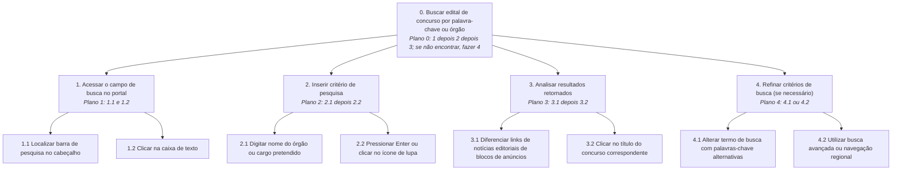
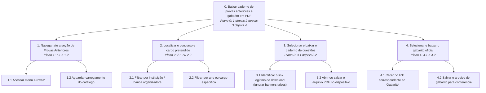

<b>Tabela de Contribuição</b>

| Membro | Contribuição |
| :--- | :--- |
| Daniel da Silva Batista | Fundamentação teórica de HTA (Annett & Duncan, 1967; Barbosa e Silva, 2010), estruturação da matriz de tarefas, modelagem formal completa com diagramas e tabelas das Tarefas 01 e 02 e organização dos templates para a equipe. |
| Arthur Sismene Carvalho | Revisão da decomposição funcional e estruturação das Tarefas 05 e 06. |
| Leonardo da Silva Lopes Júnior | Revisão das operações e planos condicionais das Tarefas 07 e 08. |
| Pedro Rocha Ferreira Lima | Definição dos critérios de análise de problemas e estruturação das Tarefas 03 e 04. |

Fonte: Daniel da Silva Batista (2026).

# Análise Hierárquica de Tarefas (HTA)

## 1. Introdução e Fundamentação Teórica

A **Análise Hierárquica de Tarefas** (*Hierarchical Task Analysis* - HTA), desenvolvida originalmente por Annett e Duncan (1967) e amplamente detalhada por Barbosa e Silva (2010, Cap. 8.4), é um dos métodos clássicos e mais consolidados de análise de tarefas em Interação Humano-Computador. A técnica baseia-se na decomposição funcional de alto nível dos objetivos de um usuário em subobjetivos menores e, sucessivamente, em **operações** elementares — que correspondem às ações físicas e cognitivas concretas executadas para alcançar cada estado desejado.

### Elementos Estruturais da Notação HTA:
* **Objetivos e Subobjetivos:** Estados finais que a pessoa deseja atingir no sistema (ex.: "Baixar edital em PDF").
* **Operações:** Unidades básicas de comportamento físico ou cognitivo necessárias para atingir um subobjetivo (ex.: "Digitar nome do órgão no campo de busca").
* **Planos:** Instruções lógicas e condicionais que determinam a ordem, a frequência e as circunstâncias em que os subobjetivos e operações devem ser executados (ex.: "Plano 0: Fazer 1; depois 2; se erro, repetir 1; senão fazer 3").
* **Identificação de Problemas e Recomendações:** A análise em IHC expande a representação funcional para mapear barreiras de usabilidade, falhas ergonômicas e propor recomendações de reprojeto para cada etapa da tarefa.

---

## 2. Matriz de Atribuição das Tarefas

Para cobrir a amplitude do portal **PCI Concursos** e assegurar a contribuição individual balanceada no grupo, foram selecionadas 10 tarefas centrais, distribuídas aos 5 membros:

<b>Tabela 1: Matriz de Distribuição das Tarefas para HTA</b>

| ID | Nome da Tarefa | Membro Responsável |
| :---: | :--- | :--- |
| **TAR-01** | Buscar edital de concurso por palavra-chave ou órgão | **Daniel da Silva Batista** |
| **TAR-02** | Baixar caderno de provas anteriores e gabarito oficial em PDF | **Daniel da Silva Batista** |
| **TAR-03** | Filtrar concursos abertos na região Centro-Oeste / DF | Pedro Rocha Ferreira Lima |
| **TAR-04** | Consultar retificações de edital e prorrogações de cronograma | Pedro Rocha Ferreira Lima |
| **TAR-05** | Realizar simulado de questões online no navegador | Arthur Sismene Carvalho |
| **TAR-06** | Buscar oportunidades de estágio de nível superior no DF | Arthur Sismene Carvalho |
| **TAR-07** | Acessar videoaulas e dicas de disciplinas para estudo | Leonardo da Silva Lopes Júnior |
| **TAR-08** | Cadastrar endereço de e-mail para alerta de novos concursos | Leonardo da Silva Lopes Júnior |
| **TAR-09** | Consultar vagas reservadas para cotas e pessoas com deficiência (PcD) | João Vitor |
| **TAR-10** | Acompanhar notícias de homologação e convocações de aprovados | João Vitor |

Fonte: Daniel da Silva Batista (2026).

---

## 3. Modelagem Detalhada das Tarefas (Daniel da Silva Batista)

### 3.1 Tarefa 01: Buscar edital de concurso por palavra-chave ou órgão (TAR-01)

A decomposição hierárquica de objetivos e planos da Tarefa 01 é ilustrada na Figura 1 a seguir, e a especificação detalhada de suas operações, problemas de usabilidade identificados e recomendações de design é apresentada na Tabela 2.

#### Diagrama de Decomposição HTA (Figura 1)

<b>Figura 1: Diagrama HTA da Tarefa 01 - Buscar edital por palavra-chave</b>

Fonte: Daniel da Silva Batista (2026).

#### Tabela HTA: Objetivos, Operações, Problemas e Recomendações

<b>Tabela 2: Análise HTA da Tarefa 01</b>

| Objetivos / Operações | Relações / Planos | Problemas Identificados | Recomendações de Usabilidade |
| :--- | :--- | :--- | :--- |
| **0. Buscar edital de concurso por palavra-chave ou órgão** | **Plano 0:** Executar 1, 2 e 3 em sequência. Se a listagem não trouxer o resultado esperado, executar 4. | O mecanismo de busca interna depende de busca textual com baixa tolerância a erros ortográficos ou sinônimos. | Implementar algoritmo de busca semântica com autocompletar e sugestões de correção ortográfica. |
| **1. Acessar o campo de busca no portal** | **Plano 1:** Executar 1.1 e 1.2. | A barra de busca no topo divide espaço com anúncios gráficos piscantes, dificultando a localização visual imediata. | Centralizar a barra de pesquisa no topo com contraste visual elevado e destacar o ícone de lupa. |
| **1.1 Localizar barra de pesquisa** | Ação visual | Dificuldade de percepção para usuários com baixa visão. | Garantir contraste mínimo 4.5:1 (WCAG AA). |
| **1.2 Clicar na caixa de texto** | Ação física | Falta de foco visual (`outline`) destacado ao clicar. | Adicionar indicação visual clara de foco ativo. |
| **2. Inserir critério de pesquisa** | **Plano 2:** Executar 2.1 e 2.2. | Ausência de dicas de contexto ou *placeholders* explicativos na caixa. | Inserir *placeholder* dinâmico: *"Ex: TJDFT, Banco do Brasil, Analista..."*. |
| **2.1 Digitar termo pretendido** | Operação cognitiva/física | Ao digitar siglas, o sistema pode não correlacionar com o nome por extenso. | Adicionar dicionário de sinônimos de órgãos públicos. |
| **2.2 Pressionar Enter ou clicar na lupa** | Ação física | O clique na lupa às vezes aciona recarregamento completo sem transição suave. | Adicionar indicador visual de carregamento (*spinner*). |
| **3. Analisar resultados retornados** | **Plano 3:** Executar 3.1 e 3.2. | A página de resultados mescla anúncios do Google Ads que imitam manchetes de notícias de concursos. | Separar rigorosamente blocos patrocinados de resultados orgânicos com rótulo "Publicidade". |
| **3.1 Diferenciar notícias de anúncios** | Operação cognitiva | Alta carga cognitiva e propensão ao clique errôneo por usuários leigos. | Adicionar borda e fundo diferenciado aos cards de notícias oficiais. |
| **3.2 Clicar no link do concurso** | Ação física | Área de clique restrita apenas ao texto do hiperlink em azul claro. | Tornar todo o card do concurso clicável (*hit area* expandida). |
| **4. Refinar critérios de busca** | **Plano 4:** Executar 4.1 ou 4.2 se necessário. | A interface não oferece filtros de faceta rápidos (por estado, status ou escolaridade) na tela de resultados. | Adicionar filtros laterais interativos (Estado, Escolaridade, Salário). |

Fonte: Daniel da Silva Batista (2026).

---

### 3.2 Tarefa 02: Baixar caderno de provas anteriores e gabarito oficial em PDF (TAR-02)

A decomposição da Tarefa 02 é apresentada no diagrama da Figura 2, e sua correspondente análise detalhada de operações e problemas é fornecida na Tabela 3.

#### Diagrama de Decomposição HTA (Figura 2)

<b>Figura 2: Diagrama HTA da Tarefa 02 - Download de provas anteriores e gabaritos</b>

Fonte: Daniel da Silva Batista (2026).

#### Tabela HTA: Objetivos, Operações, Problemas e Recomendações

<b>Tabela 3: Análise HTA da Tarefa 02</b>

| Objetivos / Operações | Relações / Planos | Problemas Identificados | Recomendações de Usabilidade |
| :--- | :--- | :--- | :--- |
| **0. Baixar caderno de provas anteriores e gabarito em PDF** | **Plano 0:** Executar 1, 2, 3 e 4. | A fragmentação entre prova e gabarito em links distintos obriga o usuário a idas e vindas de navegação. | Disponibilizar botão único com opção *"Baixar Prova + Gabarito (.zip ou pacote)"*. |
| **1. Navegar até a seção de Provas** | **Plano 1:** Executar 1.1 e 1.2. | O link do menu "Provas" é minúsculo e fica agrupado em uma coluna de dezenas de outros links no rodapé/lateral. | Destacar a seção de Provas no menu de navegação primário superior. |
| **2. Localizar concurso e cargo** | **Plano 2:** Executar 2.1 ou 2.2. | A listagem de provas é exibida em ordem alfabética estática gigantesca, sem paginação clara ou filtros reativos. | Implementar tabela reativa com paginação, ordenação por ano e busca instantânea. |
| **3. Selecionar e baixar a prova** | **Plano 3:** Executar 3.1 e 3.2. | **Problema Crítico de Segurança e Usabilidade:** Presença de anúncios com falsos botões "Download", enganando usuários. | Isolar a área de download legítimo em uma caixa protegida de anúncios imediatos, com selo de arquivo verificado. |
| **3.1 Identificar link de download real** | Operação cognitiva | O link legítimo é um texto azul sem ícone indicador de PDF (`.pdf`), com peso visual infinitamente menor que os anúncios. | Inserir ícone universal de PDF vermelho acompanhado do peso do arquivo (ex.: `[PDF] Prova_Analista_TI.pdf (1.8 MB)`). |
| **3.2 Salvar arquivo PDF** | Ação física | Dependendo da configuração do navegador, o PDF é aberto na mesma aba, perdendo o contexto da página do concurso. | Forçar abertura em nova guia (`target="_blank"`) ou disparar o download direto com atributo `download`. |
| **4. Baixar o gabarito oficial** | **Plano 4:** Executar 4.1 e 4.2. | Se o gabarito tiver retificações (anulação de questões), o portal nem sempre indica claramente a versão final. | Indicar textualmente: *"Gabarito Definitivo (Pós-Recurso)"* ao lado do link. |

Fonte: Daniel da Silva Batista (2026).

---

## 4. Estrutura para Validação das Tarefas 03 a 10 pelos Demais Integrantes

As demais tarefas modeladas pela equipe seguirão exatamente a mesma notação formal (diagrama Mermaid decomposto + tabela analítica de problemas e recomendações), integrando os achados empíricos das entrevistas gravadas:

* **Tarefas 03 e 04 (Pedro Rocha):** Modelagem de filtragem regional (Centro-Oeste) e verificação de cronogramas/retificações.
* **Tarefas 05 e 06 (Arthur Sismene):** Modelagem de simulados online com feedback de acertos e busca de estágios/trainees.
* **Tarefas 07 e 08 (Leonardo Lopes):** Modelagem do acesso a módulos audiovisuais de disciplinas e submissão de cadastro em mala direta/newsletter de editais.
* **Tarefas 09 e 10 (João Vitor):** Modelagem da checagem de vagas reservadas a PcD/idosos e conferência de portarias de nomeação.

---

## 5. Bibliografia

> ANNETT, John; DUNCAN, Keith D. *Task Analysis and Training Design*. Journal of Occupational Psychology, v. 41, p. 211-221, 1967.  
> BARBOSA, S. D. J.; SILVA, B. S. *Interação Humano-Computador*. Rio de Janeiro: Elsevier, 2010.  
> DIAPER, Dan; STANTON, Neville. *The Handbook of Task Analysis for Human-Computer Interaction*. Mahwah: Lawrence Erlbaum Associates, 2004.

## 6. Histórico de Versões

| Versão | Data | Descrição | Autor(es) | Revisor(es) |
| :---: | :---: | :--- | :---: | :---: |
| `1.0` | 21/09/2026 | Fundamentação de HTA (Annett & Duncan; Barbosa & Silva), matriz das 10 tarefas, modelagem completa das Tarefas 01 e 02 (diagramas Mermaid e tabelas com problemas/recomendações). | Daniel da Silva Batista | Pedro Rocha Ferreira Lima |

