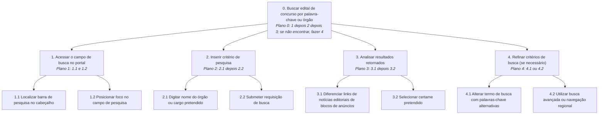
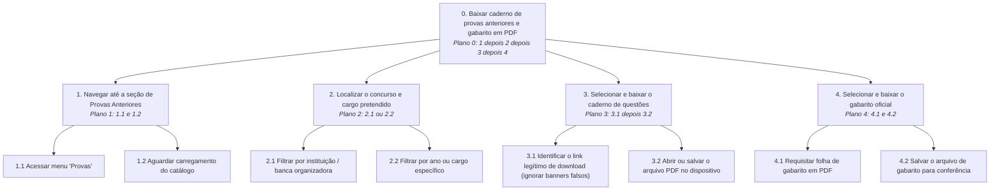
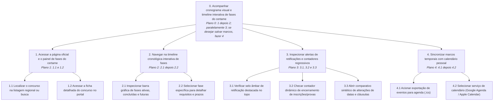
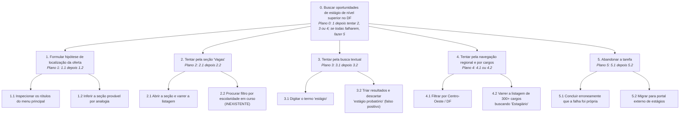

<b>Tabela de Contribuição</b>

| Membro | Contribuição |
| :--- | :--- |
| Daniel da Silva Batista | Fundamentação teórica de HTA (Annett & Duncan, 1967; Barbosa e Silva, 2010), estruturação da matriz de tarefas, modelagem formal completa com diagramas e tabelas das Tarefas 01 e 02 e organização dos templates para a equipe. |
| Arthur Sismene Carvalho | Revisão da decomposição funcional e modelagem HTA integral das Tarefas 05 e 06 (diagramas e tabelas analíticas), incluindo a caracterização da TAR-06 como tarefa não suportada e o levantamento da colisão terminológica de "estágio". |
| João Vitor Sales Ibiapina | Revisão da decomposição hierárquica e estruturação das Tarefas 09 e 10. |
| Leonardo da Silva Lopes Júnior | Modelagem formal completa em HTA (diagramas de decomposição e tabelas analíticas com problemas e recomendações de usabilidade) das Tarefas 07 e 08, fundamentadas em DOC-04 e na persona Renata Cristina Freitas (PER-04); estruturação da Seção 2.1 de enquadramento ergonômico e níveis de complexidade, e refinamento do escopo de tarefas interativas propositivas (TAR-04, TAR-05 e TAR-08) (Issue #14). |
| Pedro Rocha Ferreira Lima | Modelagem formal completa em HTA (diagramas e tabelas analíticas com problemas e recomendações) das Tarefas 03 e 04 com base no método sem usuário (DOC-02) e na persona Lucas Ferreira Rocha. |
| Gemini | Geração dos diagramas HTA em notação Mermaid e auxílio na estruturação textual do artefato em Markdown (conforme Política de Uso de IA). |

<b>Fonte:</b> Daniel da Silva Batista (2026).

# Análise Hierárquica de Tarefas (HTA)

## 1. Introdução e Fundamentação Teórica

A **Análise Hierárquica de Tarefas** (*Hierarchical Task Analysis* - HTA), desenvolvida originalmente por Annett e Duncan (1967) e amplamente detalhada por Barbosa e Silva (2010, Cap. 8.4), é um dos métodos clássicos e mais consolidados de análise de tarefas em Interação Humano-Computador. A técnica baseia-se na decomposição funcional de alto nível dos objetivos de um usuário em subobjetivos menores e, sucessivamente, em **operações** elementares — que correspondem às ações físicas e cognitivas concretas executadas para alcançar cada estado desejado.

No HTA, a execução dos subobjetivos e operações é rigorosamente regida por **planos**, que especificam as condições lógicas, sequenciais ou alternativas sob as quais as ações devem ser realizadas (por exemplo: sequências estritas, decisões condicionais do tipo "se... então", repetições cíclicas ou execuções paralelas). Essa abordagem permite identificar gargalos cognitivos, erros operacionais recorrentes e propor recomendações ergonômicas de design de interface centradas na eficácia e satisfação do usuário.

### Elementos Estruturais da Notação HTA:
* **Objetivos e Subobjetivos:** Estados finais que a pessoa deseja atingir no sistema (ex.: "Baixar edital em PDF").
* **Operações:** Unidades básicas de comportamento físico ou cognitivo necessárias para atingir um subobjetivo (ex.: "Digitar nome do órgão no campo de busca").
* **Planos:** Instruções lógicas e condicionais que determinam a ordem, a frequência e as circunstâncias em que os subobjetivos e operações devem ser executados (ex.: "Plano 0: Fazer 1; depois 2; se erro, repetir 1; senão fazer 3").
* **Identificação de Problemas e Recomendações:** A análise em IHC expande a representação funcional para mapear barreiras de usabilidade, falhas ergonômicas e propor recomendações de reprojeto para cada etapa da tarefa.

---

## 2. Matriz de Tarefas do PCI Concursos

Com base nos três perfis de usuário delineados na pesquisa de requisitos e no escopo funcional do portal **PCI Concursos**, foram selecionadas **dez tarefas representativas** para a avaliação empírica e modelagem formal. Cada integrante da equipe é responsável pela condução e especificação aprofundada de duas tarefas complementares, articulando o diagrama de decomposição com a análise crítica de usabilidade.

### 2.1 Enquadramento Ergonômico e Níveis de Complexidade das Tarefas

Em conformidade com as recomendações do professor da disciplina (SALES, 2026) e as diretrizes ergonômicas de Annett e Duncan (1967), Diaper (2003) e Barbosa e Silva (2010), uma análise de tarefas consistente em IHC não pode se restringir a procedimentos meramente operacionais e rasos (como simples cliques para download de arquivos ou leituras passivas de tabelas estáticas). A literatura prescreve que o valor da análise reside em mapear o raciocínio cognitivo, os processos de tomada de decisão, o tratamento de incertezas e os ciclos interativos homem-máquina.

Para assegurar essa profundidade — alinhando-se ao rigor demonstrado na delimitação de tarefas do Grupo 06 —, o Grupo 07 organizou as tarefas em **três níveis de complexidade funcional**:

* **Nível 1 — Tarefas de Acesso e Recuperação da Informação (TAR-01 a TAR-03):** Representam os fluxos de consulta inicial, recuperação documental e filtragem macro de certames;
* **Nível 2 — Tarefas Interativas Ricas e Engajamento Cognitivo (TAR-04, TAR-05 e TAR-08):** Constituem funcionalidades bidirecionais de alta relevância ergonômica:
  - **`TAR-04` (Cronograma Visual e Timeline Interativa de Fases):** Supera a leitura dispersa de textos longos ao prover uma linha do tempo dinâmica de fases com contadores regressivos (*countdowns*), alertas visuais de retificação e integração com calendários digitais (.ics / Google Agenda);
  - **`TAR-05` (Sistema de Simulados Online Interativo):** Provê um motor avaliativo com parametrização de filtros (disciplina, banca, volume de questões, temporizador regressivo), áreas de toque móveis adaptadas ($\ge 48\text{px}$), feedback formativo imediato por alternativa, gabarito oficial comentado e consolidação estatística com tolerância a oscilações de sinal (*Zero Data Loss*);
  - **`TAR-08` (Central de Alertas Inteligentes e Parametrizados por E-mail):** Substitui a captura cega e passiva de newsletters por um configurador proativo com filtros avançados multicritério (UF com prioridade DF, escolaridade, carreiras e remuneração), validação sintática em tempo real no cliente, dupla confirmação de consentimento (*Double Opt-In*) e gerenciamento autônomo de descadastro com 1 clique (LGPD).
* **Nível 3 — Tarefas Propositivas e Superação de Lacunas de IHC (TAR-06, TAR-07, TAR-09 e TAR-10):** Tratam de tarefas que expandem o escopo do portal para atender demandas reprimidas (como a inclusão de estágios de nível superior no DF e reprojeto de videoaulas com *Modo Foco*).

A Tabela 1 a seguir consolida a matriz geral de tarefas da equipe:

<b>Tabela 1: Matriz Geral de Tarefas Avaliadas</b>

| ID | Descrição da Tarefa | Integrante Responsável |
| :---: | :--- | :--- |
| **TAR-01** | Buscar edital de concurso por palavra-chave ou órgão | Daniel da Silva Batista |
| **TAR-02** | Baixar caderno de provas anteriores e gabarito oficial em PDF | Daniel da Silva Batista |
| **TAR-03** | Filtrar concursos por região geográfica (Centro-Oeste / DF) | Pedro Rocha Ferreira Lima |
| **TAR-04** | Acompanhar cronograma visual e timeline interativa de fases do certame com alertas de retificação | Pedro Rocha Ferreira Lima |
| **TAR-05** | Realizar simulado de questões online interativo com feedback automático de gabarito e diagnóstico de desempenho | Arthur Sismene Carvalho |
| **TAR-06** | Buscar oportunidades de estágio de nível superior no DF | Arthur Sismene Carvalho |
| **TAR-07** | Acessar videoaulas e dicas teóricas de disciplinas | Leonardo da Silva Lopes Júnior |
| **TAR-08** | Cadastrar e parametrizar alertas inteligentes de editais por e-mail com filtros avançados multicritério | Leonardo da Silva Lopes Júnior |
| **TAR-09** | Consultar vagas reservadas para cotas e pessoas com deficiência (PcD) | João Vitor Sales Ibiapina |
| **TAR-10** | Acompanhar notícias de homologação e convocações de aprovados | João Vitor Sales Ibiapina |

<b>Fonte:</b> Daniel da Silva Batista e Leonardo da Silva Lopes Júnior (2026).

---

## 3. Modelagem Detalhada das Tarefas (Daniel da Silva Batista)

### 3.1 Tarefa 01: Buscar edital de concurso por palavra-chave ou órgão (TAR-01)

A decomposição hierárquica de objetivos e planos da Tarefa 01 é ilustrada na Figura 1 a seguir, e a especificação detalhada de suas operações, problemas de usabilidade identificados e recomendações de design é apresentada na Tabela 2.

#### Diagrama de Decomposição HTA (Figura 1)

<b>Figura 1:</b> Diagrama HTA da Tarefa 01 - Buscar edital por palavra-chave

```mermaid
flowchart TD
    T0["0. Buscar edital de concurso por palavra-chave ou órgão<br><i>Plano 0: 1 depois 2 depois 3; se não encontrar, fazer 4</i>"]
    
    T1["1. Acessar o campo de busca no portal<br><i>Plano 1: 1.1 e 1.2</i>"]
    T11["1.1 Localizar barra de pesquisa no cabeçalho"]
    T12["1.2 Posicionar foco no campo de pesquisa"]
    
    T2["2. Inserir critério de pesquisa<br><i>Plano 2: 2.1 depois 2.2</i>"]
    T21["2.1 Digitar nome do órgão ou cargo pretendido"]
    T22["2.2 Submeter requisição de busca"]
    
    T3["3. Analisar resultados retornados<br><i>Plano 3: 3.1 depois 3.2</i>"]
    T31["3.1 Diferenciar links de notícias editoriais de blocos de anúncios"]
    T32["3.2 Selecionar certame pretendido"]
    
    T4["4. Refinar critérios de busca (se necessário)<br><i>Plano 4: 4.1 ou 4.2</i>"]
    T41["4.1 Alterar termo de busca com palavras-chave alternativas"]
    T42["4.2 Utilizar busca avançada ou navegação regional"]

    T0 --> T1
    T0 --> T2
    T0 --> T3
    T0 --> T4
    
    T1 --> T11
    T1 --> T12
    
    T2 --> T21
    T2 --> T22
    
    T3 --> T31
    T3 --> T32
    
    T4 --> T41
    T4 --> T42
```

<b>Fonte:</b> Gerado por Inteligência Artificial (Gemini) e revisado pelos autores (2026).

#### Tabela HTA: Objetivos, Operações, Problemas e Recomendações

<b>Tabela 2: Análise HTA da Tarefa 01</b>

| Objetivos / Operações | Relações / Planos | Problemas Identificados | Recomendações de Usabilidade |
| :--- | :--- | :--- | :--- |
| **0. Buscar edital de concurso por palavra-chave ou órgão** | **Plano 0:** Executar 1, 2 e 3 em sequência. Se a listagem não trouxer o resultado esperado, executar 4. | O mecanismo de busca interna depende de busca textual com baixa tolerância a erros ortográficos ou sinônimos. | Implementar algoritmo de busca semântica com autocompletar e sugestões de correção ortográfica. |
| **1. Acessar o campo de busca no portal** | **Plano 1:** Executar 1.1 e 1.2. | A barra de busca no topo divide espaço com anúncios gráficos piscantes, dificultando a localização visual imediata. | Centralizar a barra de pesquisa no topo com contraste visual elevado e destacar o ícone de lupa. |
| **1.1 Localizar barra de pesquisa** | Ação visual | Dificuldade de percepção para usuários com baixa visão. | Garantir contraste mínimo 4.5:1 (WCAG AA). |
| **1.2 Posicionar foco no campo de busca** | Operação de interface | Falta de foco visual (`outline`) destacado no elemento ativo. | Adicionar indicação visual clara de foco ativo. |
| **2. Inserir critério de pesquisa** | **Plano 2:** Executar 2.1 e 2.2. | Ausência de dicas de contexto ou *placeholders* explicativos na caixa. | Inserir *placeholder* dinâmico: *"Ex: TJDFT, Banco do Brasil, Analista..."*. |
| **2.1 Digitar termo pretendido** | Operação cognitiva/física | Ao digitar siglas, o sistema pode não correlacionar com o nome por extenso. | Adicionar dicionário de sinônimos de órgãos públicos. |
| **2.2 Submeter requisição de busca** | Operação de interface | O disparo de busca às vezes aciona recarregamento síncrono completo sem transição suave. | Adicionar indicador visual de carregamento (*spinner*). |
| **3. Analisar resultados retornados** | **Plano 3:** Executar 3.1 e 3.2. | A página de resultados mescla anúncios do Google Ads que imitam manchetes de notícias de concursos. | Separar rigorosamente blocos patrocinados de resultados orgânicos com rótulo "Publicidade". |
| **3.1 Diferenciar notícias de anúncios** | Operação cognitiva | Alta carga cognitiva e propensão ao clique errôneo por usuários leigos. | Adicionar borda e fundo diferenciado aos cards de notícias oficiais. |
| **3.2 Selecionar certame pretendido** | Operação de interface | Área interativa restrita apenas ao texto do hiperlink em azul claro. | Tornar todo o card do concurso clicável (*hit area* expandida). |
| **4. Refinar critérios de busca** | **Plano 4:** Executar 4.1 ou 4.2 se necessário. | A interface não oferece filtros de faceta rápidos (por estado, status ou escolaridade) na tela de resultados. | Adicionar filtros laterais interativos (Estado, Escolaridade, Salário). |

<b>Fonte:</b> Daniel da Silva Batista (2026).

---

### 3.2 Tarefa 02: Baixar caderno de provas anteriores e gabarito oficial em PDF (TAR-02)

A decomposição da Tarefa 02 é apresentada no diagrama da Figura 2, e sua correspondente análise detalhada de operações e problemas é fornecida na Tabela 3.

#### Diagrama de Decomposição HTA (Figura 2)

<b>Figura 2:</b> Diagrama HTA da Tarefa 02 - Download de provas anteriores e gabaritos

```mermaid
flowchart TD
    T0["0. Baixar caderno de provas anteriores e gabarito em PDF<br><i>Plano 0: 1 depois 2 depois 3 depois 4</i>"]
    
    T1["1. Navegar até a seção de Provas Anteriores<br><i>Plano 1: 1.1 e 1.2</i>"]
    T11["1.1 Acessar menu 'Provas'"]
    T12["1.2 Aguardar carregamento do catálogo"]
    
    T2["2. Localizar o concurso e cargo pretendido<br><i>Plano 2: 2.1 ou 2.2</i>"]
    T21["2.1 Filtrar por instituição / banca organizadora"]
    T22["2.2 Filtrar por ano ou cargo específico"]
    
    T3["3. Selecionar e baixar o caderno de questões<br><i>Plano 3: 3.1 depois 3.2</i>"]
    T31["3.1 Identificar o link legítimo de download (ignorar banners falsos)"]
    T32["3.2 Abrir ou salvar o arquivo PDF no dispositivo"]
    
    T4["4. Selecionar e baixar o gabarito oficial<br><i>Plano 4: 4.1 e 4.2</i>"]
    T41["4.1 Requisitar folha de gabarito em PDF"]
    T42["4.2 Salvar o arquivo de gabarito para conferência"]

    T0 --> T1
    T0 --> T2
    T0 --> T3
    T0 --> T4
    
    T1 --> T11
    T1 --> T12
    
    T2 --> T21
    T2 --> T22
    
    T3 --> T31
    T3 --> T32
    
    T4 --> T41
    T4 --> T42
```

<b>Fonte:</b> Gerado por Inteligência Artificial (Gemini) e revisado pelos autores (2026).

#### Tabela HTA: Objetivos, Operações, Problemas e Recomendações

<b>Tabela 3: Análise HTA da Tarefa 02</b>

| Objetivos / Operações | Relações / Planos | Problemas Identificados | Recomendações de Usabilidade |
| :--- | :--- | :--- | :--- |
| **0. Baixar caderno de provas anteriores e gabarito em PDF** | **Plano 0:** Executar 1, 2, 3 e 4. | A fragmentação entre prova e gabarito em links distintos obriga o usuário a idas e vindas de navegação. | Disponibilizar botão único com opção *"Baixar Prova + Gabarito (.zip ou pacote)"*. |
| **1. Navegar até a seção de Provas** | **Plano 1:** Executar 1.1 e 1.2. | O link do menu "Provas" é minúsculo e fica agrupado em uma coluna de dezenas de outros links no rodapé/lateral. | Destacar a seção de Provas no menu de navegação primário superior. |
| **2. Localizar concurso e cargo** | **Plano 2:** Executar 2.1 ou 2.2. | A listagem de provas é exibida em ordem alfabética estática gigantesca, sem paginação clara ou filtros reativos. | Implementar tabela reativa com paginação, ordenação por ano e busca instantânea. |
| **3. Selecionar e baixar a prova** | **Plano 3:** Executar 3.1 e 3.2. | **Problema Crítico de Segurança e Usabilidade:** Presença de anúncios com falsos botões "Download", enganando usuários. | Isolar a área de download legítimo em uma caixa protegida de anúncios imediatos, com selo de arquivo verificado. |
| **3.1 Identificar link de download real** | Operação cognitiva | O link legítimo é um texto azul sem ícone indicador de PDF (`.pdf`), com peso visual infinitamente menor que os anúncios. | Inserir ícone universal de PDF vermelho acompanhado do peso do arquivo (ex.: `[PDF] Prova_Analista_TI.pdf (1.8 MB)`). |
| **3.2 Salvar arquivo PDF** | Ação física | Dependendo da configuração do navegador, o PDF é aberto na mesma aba, perdendo o contexto da página do concurso. | Forçar abertura em nova guia (`target="_blank"`) ou disparar o download direto com atributo `download`. |
| **4. Baixar o gabarito oficial** | **Plano 4:** Executar 4.1 e 4.2. | Se o gabarito tiver retificações (anulação de questões), o portal nem sempre indica claramente a versão final. | Indicar textualmente: *"Gabarito Definitivo (Pós-Recurso)"* ao lado do link. |

<b>Fonte:</b> Daniel da Silva Batista (2026).

---

## 4. Modelagem Detalhada das Tarefas (Pedro Rocha Ferreira Lima)

### 4.1 Tarefa 03: Filtrar concursos por região geográfica (Centro-Oeste / DF) (TAR-03)

A Tarefa 03 investiga o processo de busca e filtragem regional no portal PCI Concursos, foco principal da persona secundária Lucas Ferreira Rocha (`PER-02`) e respaldada pelos dados da Análise Documental (`DOC-02`), que apontam que mais de 65% das vagas do Centro-Oeste concentram-se no DF e na sua Região Integrada de Desenvolvimento (RIDE). A decomposição hierárquica é ilustrada na Figura 3, e a especificação de suas operações, problemas e recomendações é apresentada na Tabela 4.

#### Diagrama de Decomposição HTA (Figura 3)

<b>Figura 3:</b> Diagrama HTA da Tarefa 03 - Filtrar concursos por região geográfica

```mermaid
flowchart TD
    T0["0. Filtrar concursos por região geográfica (Centro-Oeste / DF)<br><i>Plano 0: 1 depois 2 depois 3; se não localizar DF facilmente, fazer 4</i>"]
    
    T1["1. Acessar menu de regiões geográficas no portal<br><i>Plano 1: 1.1 e 1.2</i>"]
    T11["1.1 Localizar bloco de navegação regional no menu lateral ou topo"]
    T12["1.2 Identificar a opção correspondente à macrorregião 'Centro-Oeste'"]
    
    T2["2. Carregar e visualizar a listagem regional unificada<br><i>Plano 2: 2.1 e 2.2</i>"]
    T21["2.1 Selecionar filtro regional Centro-Oeste"]
    T22["2.2 Aguardar carregamento da listagem com todos os estados (DF, GO, MT, MS)"]
    
    T3["3. Triar editais específicos para o Distrito Federal (DF)<br><i>Plano 3: 3.1 depois 3.2 depois 3.3</i>"]
    T31["3.1 Varrer visualmente as linhas da tabela unificada"]
    T32["3.2 Identificar a sigla '/DF' ou indicação de órgão sediado em Brasília"]
    T33["3.3 Selecionar certame do Distrito Federal"]
    
    T4["4. Refinar localização com busca textual interna (se necessário)<br><i>Plano 4: 4.1 depois 4.2</i>"]
    T41["4.1 Acionar busca na página (Ctrl+F) e digitar 'DF' ou 'Brasília'"]
    T42["4.2 Percorrer ocorrências destacadas pelo navegador na tabela"]

    T0 --> T1
    T0 --> T2
    T0 --> T3
    T0 --> T4
    
    T1 --> T11
    T1 --> T12
    
    T2 --> T21
    T2 --> T22
    
    T3 --> T31
    T3 --> T32
    T3 --> T33
    
    T4 --> T41
    T4 --> T42
```

<b>Fonte:</b> Gerado por Inteligência Artificial (Gemini) e revisado por Pedro Rocha Ferreira Lima (2026).

#### Tabela HTA: Objetivos, Operações, Problemas e Recomendações

<b>Tabela 4: Análise HTA da Tarefa 03</b>

| Objetivos / Operações | Relações / Planos | Problemas Identificados | Recomendações de Usabilidade |
| :--- | :--- | :--- | :--- |
| **0. Filtrar concursos por região geográfica (Centro-Oeste / DF)** | **Plano 0:** Executar 1, 2 e 3 em sequência. Se a varredura visual for ineficiente pela mistura de estados, executar 4. | O sistema agrupa todos os estados da macrorregião (DF, GO, MT, MS) em uma única listagem plana sem filtro dedicado por Unidade Federativa (UF). | Implementar subfiltros reativos por UF (DF, GO, MT, MS) ou abas específicas no topo da listagem regional (`RF-DOC-03`). |
| **1. Acessar menu regional no portal** | **Plano 1:** Executar 1.1 e 1.2. | Os links de regiões geográficas na barra lateral competem com múltiplos banners publicitários de largura total. | Destacar o seletor geográfico no menu de navegação primário com ícones das regiões do Brasil. |
| **1.1 Localizar bloco de navegação** | Ação visual | O seletor fica posicionado abaixo da dobra inicial em resoluções verticais menores. | Fixar a navegação de regiões no topo ou torná-la acessível via menu suspenso (*dropdown*). |
| **1.2 Identificar 'Centro-Oeste'** | Operação cognitiva | Ausência de diferenciação visual para o Distrito Federal, que possui regime e demanda administrativa atípicos. | Permitir seleção direta de capitais e do Distrito Federal no menu de navegação. |
| **2. Carregar listagem unificada** | **Plano 2:** Executar 2.1 e 2.2. | A tabela carrega centenas de editais simultaneamente sem paginação, aumentando o tempo de resposta e o consumo de dados. | Implementar paginação dinâmica (ex.: 20 a 50 certames por página) com carregamento sob demanda (*lazy loading*). |
| **2.1 Selecionar filtro Centro-Oeste** | Operação de interface | A requisição recarrega a página completa sem persistir preferências anteriores de visualização. | Utilizar carregamento assíncrono (AJAX/SPA) para atualização instantânea dos resultados. |
| **2.2 Aguardar carregamento** | Ação de espera | Ausência de feedback de progresso durante o carregamento de tabelas com grande volume de dados. | Adicionar indicador visual de carregamento (*skeleton screens* ou *spinners*). |
| **3. Triar editais para o DF** | **Plano 3:** Executar 3.1, 3.2 e 3.3. | **Sobrecarga Cognitiva Severa:** O usuário precisa ler linha por linha para descartar dezenas de certames municipais do interior de GO, MT e MS. | Disponibilizar *tag/badge* visual com cores distintas por estado (ex.: tag azul `[DF]`, verde `[GO]`, amarela `[MT]`). |
| **3.1 Varrer visualmente as linhas** | Operação cognitiva | Tipografia densa, tamanho de fonte reduzido e baixo contraste das siglas de estado na tabela. | Melhorar o respiro tipográfico, tamanho de fonte (mínimo 14px) e espaçamento entre linhas da tabela. |
| **3.2 Identificar sigla '/DF'** | Ação visual | Siglas de lotação estão no final do título do órgão, muitas vezes truncadas ou abreviadas de forma inconsistente. | Padronizar uma coluna exclusiva para a "UF / Cidade de Lotação" na tabela de certames. |
| **3.3 Selecionar certame distrital** | Operação de interface | A área ativa limita-se ao hiperlink sublinhado, gerando toques ou cliques perdidos no espaço da linha. | Tornar a linha inteira da tabela clicável (*row click* com hover destacado). |
| **4. Refinar com busca no navegador** | **Plano 4:** Executar 4.1 e 4.2 se necessário. | A necessidade de acionar recurso externo do navegador (Ctrl+F) evidencia falha de usabilidade na interface interna de busca/filtro. | Incorporar campo de filtragem rápida instantânea em tempo real (*live search*) no topo da própria tabela regional. |

<b>Fonte:</b> Pedro Rocha Ferreira Lima (2026), com base na Análise Documental DOC-02 e na Persona PER-02.

---

### 4.2 Tarefa 04: Acompanhar cronograma visual e timeline interativa de fases do certame com alertas de retificação (TAR-04)

A Tarefa 04 compreende a inspeção das publicações complementares, do cronograma de fases e dos prazos críticos de um certame, atividade essencial identificada na Análise Documental (`DOC-02`), segundo a qual até 80% dos editais sofrem retificações em suas primeiras semanas. A decomposição hierárquica é ilustrada na Figura 4, e sua especificação analítica é descrita na Tabela 5.

#### Diagrama de Decomposição HTA (Figura 4)

<b>Figura 4:</b> Diagrama HTA da Tarefa 04 - Acompanhar cronograma visual e timeline interativa de fases do certame

```mermaid
flowchart TD
    T0["0. Acompanhar cronograma visual e timeline interativa de fases do certame<br><i>Plano 0: 1 depois 2; paralelamente 3; se desejar salvar marcos, fazer 4</i>"]
    
    T1["1. Acessar a página oficial e o painel de fases do certame<br><i>Plano 1: 1.1 e 1.2</i>"]
    T11["1.1 Localizar o concurso na listagem regional ou busca"]
    T12["1.2 Acessar a ficha detalhada do concurso no portal"]
    
    T2["2. Navegar na timeline cronológica interativa de fases<br><i>Plano 2: 2.1 depois 2.2</i>"]
    T21["2.1 Inspecionar barra gráfica de fases ativas, concluídas e futuras"]
    T22["2.2 Selecionar fase específica para detalhar requisitos e prazos"]
    
    T3["3. Inspecionar alertas de retificações e contadores regressivos<br><i>Plano 3: 3.1, 3.2 e 3.3</i>"]
    T31["3.1 Verificar selo âmbar de retificação destacada no topo"]
    T32["3.2 Checar contador dinâmico de encerramento de inscrições/provas"]
    T33["3.3 Abrir comparativo sintético de alterações de datas e cláusulas"]
    
    T4["4. Sincronizar marcos temporais com calendário pessoal<br><i>Plano 4: 4.1 depois 4.2</i>"]
    T41["4.1 Acionar exportação de eventos para agenda (.ics)"]
    T42["4.2 Selecionar serviço de calendário (Google Agenda / Apple Calendar)"]

    T0 --> T1
    T0 --> T2
    T0 --> T3
    T0 --> T4
    
    T1 --> T11
    T1 --> T12
    
    T2 --> T21
    T2 --> T22
    
    T3 --> T31
    T3 --> T32
    T3 --> T33
    
    T4 --> T41
    T4 --> T42
```

<b>Fonte:</b> Pedro Rocha Ferreira Lima e Leonardo da Silva Lopes Júnior (2026), com base na Análise Documental DOC-02 e na Persona PER-02.

#### Tabela HTA: Objetivos, Operações, Problemas e Recomendações

<b>Tabela 5: Análise HTA da Tarefa 04</b>

| Objetivos / Operações | Relações / Planos | Problemas Identificados | Recomendações de Usabilidade |
| :--- | :--- | :--- | :--- |
| **0. Acompanhar cronograma visual e timeline interativa de fases do certame** | **Plano 0:** Executar 1 e 2; examinar retificações em 3; sincronizar com calendário pessoal em 4. | **Risco Crítico de Desinformação e Perda de Prazos:** Editais com retificações não exibem alertas no topo e não possuem linha do tempo de fases, obrigando à leitura de textos longos. | Projetar componente de Timeline Interativa de Fases com sinalizador visual de retificações e contadores regressivos em tempo real (`RF-DOC-04`). |
| **1. Acessar página oficial e painel de fases** | **Plano 1:** Executar 1.1 e 1.2. | O link da listagem para a página de detalhes compete com banners publicitários com aparência de botões falsos. | Padronizar botão de ação primário (*CTA*) rotulado como *"Acessar Ficha Completa do Concurso"*. |
| **1.1 Localizar concurso na listagem** | Ação visual | Siglas de UF e status do certame misturam-se sem hierarquia visual clara. | Exibir badges coloridos no card do concurso indicando status: `[Inscrições Abertas]` ou `[Retificado]`. |
| **1.2 Acessar ficha detalhada** | Ação física | Carregamento lento em conexões móveis devido a scripts de terceiros. | Otimizar tempo de resposta da página e priorizar a renderização inicial dos marcos do cronograma. |
| **2. Navegar na timeline interativa de fases** | **Plano 2:** Executar 2.1 e 2.2. | **Funcionalidade Ausente no Portal Atual:** Inexiste representação cronológica gráfica do ciclo de vida do certame (Inscrição $\rightarrow$ Isenção $\rightarrow$ Prova $\rightarrow$ Gabarito $\rightarrow$ Resultados). | Implementar barra horizontal responsiva de etapas com nós clicáveis e indicador da fase atual do certame. |
| **2.1 Inspecionar barra gráfica de fases** | Operação cognitiva | O usuário é forçado a calcular mentalmente em qual etapa o concurso se encontra. | Utilizar código de cores semântico: nós verdes (concluídos), azul vibrante (fase atual) e cinza (fases futuras). |
| **2.2 Selecionar fase específica** | Ação física | Impossibilidade de consultar detalhes de uma etapa sem ler todo o histórico de publicações. | Exibir gaveta expansível (*accordion*) com datas, links de editais e instruções ao selecionar cada nó da timeline. |
| **3. Inspecionar retificações e contadores** | **Plano 3:** Executar 3.1, 3.2 e 3.3. | Retificações aparecem como texto miúdo no rodapé da página; horários limites de pagamento da taxa não são destacados. | Implementar selo âmbar destacado no cabeçalho: `[⚠️ Retificação Publicada em DD/MM]` e contador regressivo ativo. |
| **3.1 Verificar selo de retificação** | Ação visual | Falta de visibilidade: candidato supõe que o cronograma original ainda é válido. | Posicionar o alerta com destaque no topo e com contraste auditado (WCAG 2.1 AA/AAA). |
| **3.2 Checar contador dinâmico de encerramento** | Operação cognitiva | Dúvidas sobre o horário exato limite de pagamento do boleto bancário da taxa de inscrição. | Exibir contador regressivo com dias, horas e minutos: *"Inscrições encerram-se em 2 dias e 14 horas"*. |
| **3.3 Abrir comparativo sintético de alterações** | Ação física | O candidato precisa abrir múltiplos arquivos PDF para descobrir quais cláusulas mudaram. | Disponibilizar modal de "Resumo das Alterações da Retificação" confrontando as datas anteriores com as novas. |
| **4. Sincronizar marcos com calendário pessoal** | **Plano 4:** Executar 4.1 e 4.2. | **Funcionalidade Ausente no Portal Atual:** Não há suporte para exportar datas para agendas pessoais digitais. | Adicionar botão *"Adicionar à Agenda"* com suporte a arquivos padrão `.ics` e links diretos para Google Agenda e Apple Calendar. |
| **4.1 Acionar exportação para agenda** | Operação de interface | O candidato precisa transcrever manualmente cada data para seu celular ou agenda. | Disparar geração automática de arquivo de calendário com alertas programados para 24h antes do prazo final. |
| **4.2 Selecionar serviço de calendário** | Ação física | Falta de integração com ecossistemas móveis (Android e iOS). | Oferecer opções de integração em 1 clique para Google Agenda, Outlook e Apple Calendar. |

<b>Fonte:</b> Pedro Rocha Ferreira Lima e Leonardo da Silva Lopes Júnior (2026), com base na Análise Documental DOC-02 e na Persona PER-02.

---

## 5. Modelagem Detalhada das Tarefas (Arthur Sismene Carvalho)

### 5.1 Tarefa 05: Realizar simulado de questões online interativo com feedback automático de gabarito e diagnóstico de desempenho (TAR-05)

A decomposição hierárquica da Tarefa 05 é ilustrada na Figura 5, e a especificação de suas operações, problemas e recomendações é apresentada na Tabela 6. A modelagem considera o contexto de uso da persona **PER-03 (Thiago Moraes Albuquerque)**: execução em smartphone, em deslocamento de transporte público, sob conexão celular móvel instável.

#### Diagrama de Decomposição HTA (Figura 5)

<b>Figura 5:</b> Diagrama HTA da Tarefa 05 - Realizar simulado de questões online interativo

```mermaid
flowchart TD
    T0["0. Realizar simulado online interativo com feedback automático de gabarito<br><i>Plano 0: 1 depois 2 depois 3 (iterativo) depois 4</i>"]

    T1["1. Acessar a seção de Simulados no portal<br><i>Plano 1: 1.1 depois 1.2</i>"]
    T11["1.1 Localizar o item 'Simulados' no menu de ferramentas"]
    T12["1.2 Aguardar carregamento da tela de preparação"]

    T2["2. Parametrizar a sessão de simulado interativo<br><i>Plano 2: 2.1 depois 2.2 depois 2.3</i>"]
    T21["2.1 Selecionar disciplina e banca examinadora pretendida"]
    T22["2.2 Refinar por assunto ou subtópico do edital"]
    T23["2.3 Definir volume de questões e acionar cronômetro regressivo"]

    T3["3. Responder às questões na interface mobile adaptativa<br><i>Plano 3: repetir 3.1 a 3.4 até concluir a bateria</i>"]
    T31["3.1 Ler enunciado em tipografia fluida sem zoom forçado"]
    T32["3.2 Marcar alternativa escolhida com área de toque de 48px"]
    T33["3.3 Receber feedback imediato com comentário oficial da questão"]
    T34["3.4 Avançar para a questão seguinte com persistência local (Zero Data Loss)"]

    T4["4. Concluir sessão e avaliar diagnóstico de desempenho<br><i>Plano 4: 4.1 depois 4.2</i>"]
    T41["4.1 Submeter bateria e encerrar temporizador"]
    T42["4.2 Analisar placar consolidado, tempo médio e histórico evolutivo"]

    T0 --> T1
    T0 --> T2
    T0 --> T3
    T0 --> T4

    T1 --> T11
    T1 --> T12

    T2 --> T21
    T2 --> T22
    T2 --> T23

    T3 --> T31
    T3 --> T32
    T3 --> T33
    T3 --> T34

    T4 --> T41
    T4 --> T42
```

<b>Fonte:</b> Arthur Sismene Carvalho e Leonardo da Silva Lopes Júnior (2026), com base na Análise Documental DOC-03 e na Persona PER-01.

#### Tabela HTA: Objetivos, Operações, Problemas e Recomendações

<b>Tabela 6: Análise HTA da Tarefa 05</b>

| Objetivos / Operações | Relações / Planos | Problemas Identificados | Recomendações de Usabilidade |
| :--- | :--- | :--- | :--- |
| **0. Realizar simulado online interativo com feedback automático de gabarito** | **Plano 0:** Executar 1 e 2; responder iterativamente em 3 até o fim; consolidar em 4. | O portal atual trata o simulado como mera listagem corrida estática de questões, sem temporizador, sem feedback imediato e sem placar final. | Reconceber como **motor interativo de avaliação**: parametrizar, executar com feedback formativo imediato e emitir relatório de desempenho (`RF-DOC-04`). |
| **1. Acessar a seção de Simulados** | **Plano 1:** Executar 1.1 e 1.2. | O link de simulados concorre com 15 itens sem agrupamento e compete com banners publicitários flutuantes. | Agrupar ferramentas de estudo na barra de navegação com destaque visual e ícones ilustrativos. |
| **1.1 Localizar item no menu** | Ação visual | Em tela de celular o menu exige rolagem longa e não traz ícones de identificação rápida. | Implementar barra de atalhos rápidos fixada no rodapé da visualização mobile com ícone de lápis/questões. |
| **1.2 Aguardar carregamento** | Tarefa de sistema | Blocos de propaganda causam saltos repentinos de tela (*Cumulative Layout Shift* - CLS), deslocando o conteúdo. | Reservar contêineres de altura fixa para publicidade garantindo *Zero CLS* durante o carregamento. |
| **2. Parametrizar sessão de simulado** | **Plano 2:** Executar 2.1, 2.2 e 2.3. | **Funcionalidade Inexistente no Portal Atual:** O usuário não consegue escolher quantas questões quer resolver (10, 20 ou 30) nem colocar tempo limite. | Inserir configurador prévio de sessão: filtros de disciplina, banca examinadora, quantidade de itens e modo cronometrado. |
| **2.1 Selecionar disciplina e banca** | Ação física | Listagem hierárquica longa sem campo de busca instantânea nem histórico de matérias recentes. | Adicionar busca preditiva por disciplina e chips com bancas mais frequentes (Cebraspe, FGV, FCC). |
| **2.2 Refinar por assunto** | Ação física | Contagens de questões não informam o tempo médio estimado para resolução. | Exibir estimativa de tempo (ex.: *"10 questões ≈ 15 a 20 min"*). |
| **2.3 Definir volume e cronômetro** | Ação física | Falta de controle temporal: candidatos precisam treinar ritmo de prova contra o relógio. | Disponibilizar temporizador com contagem regressiva e aviso sonoro/visual discreto aos 5 minutos finais. |
| **3. Responder questões em mobile** | **Plano 3:** Repetir 3.1 a 3.4 até concluir a bateria. | Áreas de toque muito reduzidas e instabilidade de conexão causam perda de dados em transporte público. | Assegurar alvos de toque $\ge 48\text{px}$ (WCAG 2.1 AA) e persistência local (*Zero Data Loss* via `localStorage`). |
| **3.1 Ler enunciado em tipografia fluida** | Operação cognitiva | Fontes minúsculas exigem gestos contínuos de zoom com os dedos em telas touch. | Adotar tipografia fluida com tamanho mínimo de 16px para enunciados e 14px para alternativas. |
| **3.2 Marcar alternativa (toque 48px)** | Ação física | Toques acidentais na alternativa vizinha devido ao espaçamento insuficiente entre opções. | Transformar todo o contêiner retangular da alternativa em botão clicável com feedback cromático ao toque (*active*). |
| **3.3 Receber feedback e comentário** | Tarefa de sistema | Ausência de feedback formativo: o sistema não explica a regra gramatical ou jurídica após a marcação. | Exibir caixa retrátil com o gabarito oficial e justificativa didática comentada por professores. |
| **3.4 Avançar com persistência local** | Ação física | Oscilação de rede 4G recarrega a página e descarta todas as questões já resolvidas. | Salvar estado da sessão localmente no dispositivo para retomada transparente sem perda de progresso. |
| **4. Concluir e avaliar diagnóstico** | **Plano 4:** Executar 4.1 e 4.2. | **Grave Falha de IHC:** O candidato encerra o simulado **sem saber quantas questões acertou**, frustrando o objetivo pedagógico. | Gerar relatório de fechamento com total de acertos, gráfico percentual, tempo médio por questão e histórico de estudos. |
| **4.1 Submeter bateria e encerrar** | Ação física | Falta de botão formal de encerramento; o usuário apenas sai da página. | Exibir botão de destaque *"Finalizar Simulado e Ver Resultados"* com tela de confirmação. |
| **4.2 Analisar placar consolidado** | Operação cognitiva | Ausência de métricas de aprendizado para guiar pontos fracos de estudo. | Apresentar painel com acertos, taxa de precisão por subtópico e botão *"Refazer Questões Erradas"*. |

<b>Fonte:</b> Arthur Sismene Carvalho (2026), com base nas estatísticas da ABRES e na Persona PER-03.

---

### 5.2 Tarefa 06: Buscar oportunidades de estágio de nível superior no DF (TAR-06)

!!! warning "Tarefa não suportada pelo sistema"
    A inspeção da arquitetura de informação do PCI Concursos, realizada em 27/09/2026, constatou que **o portal não dispõe de seção, filtro ou categoria dedicada a vagas de estágio**: a seção "Vagas" indexa exclusivamente cargos efetivos de concursos e processos seletivos, e nenhum dos quinze itens do menu principal contempla estágio, estagiário ou programa de trainee.

    A modelagem a seguir, portanto, não descreve um fluxo bem-sucedido, mas o **percurso exploratório de tentativa e erro** que o usuário executa antes de abandonar a tarefa. Conforme Diaper e Stanton (2004), a análise de tarefas malsucedidas constitui evidência de primeira ordem para a identificação de lacunas funcionais, pois expõe requisitos que a modelagem de fluxos bem-sucedidos é incapaz de revelar. O confronto dessa ausência com a demanda reprimida documentada em [`DOC-03`](../perfil-de-usuario.md#53-analise-documental-03-responsavel-arthur-sismene-carvalho) — mais de 18 milhões de estudantes aptos e não colocados em estágio, segundo a ABRES — qualifica o achado como lacuna de alto impacto.

#### Diagrama de Decomposição HTA (Figura 6)

<b>Figura 6:</b> Diagrama HTA da Tarefa 06 - Busca de vagas de estágio (percurso de tentativa e abandono)

```mermaid
flowchart TD
    T0["0. Buscar oportunidades de estágio de nível superior no DF<br><i>Plano 0: 1 depois tentar 2, 3 ou 4; se todas falharem, fazer 5</i>"]

    T1["1. Formular hipótese de localização da oferta<br><i>Plano 1: 1.1 depois 1.2</i>"]
    T11["1.1 Inspecionar os rótulos do menu principal"]
    T12["1.2 Inferir a seção provável por analogia"]

    T2["2. Tentar pela seção 'Vagas'<br><i>Plano 2: 2.1 depois 2.2</i>"]
    T21["2.1 Abrir a seção e varrer a listagem"]
    T22["2.2 Procurar filtro por escolaridade em curso<br>(INEXISTENTE)"]

    T3["3. Tentar pela busca textual<br><i>Plano 3: 3.1 depois 3.2</i>"]
    T31["3.1 Digitar o termo 'estágio'"]
    T32["3.2 Triar resultados e descartar<br>'estágio probatório' (falso positivo)"]

    T4["4. Tentar pela navegação regional e por cargos<br><i>Plano 4: 4.1 ou 4.2</i>"]
    T41["4.1 Filtrar por Centro-Oeste / DF"]
    T42["4.2 Varrer a listagem de 300+ cargos<br>buscando 'Estagiário'"]

    T5["5. Abandonar a tarefa<br><i>Plano 5: 5.1 depois 5.2</i>"]
    T51["5.1 Concluir erroneamente que a falha foi própria"]
    T52["5.2 Migrar para portal externo de estágios"]

    T0 --> T1
    T0 --> T2
    T0 --> T3
    T0 --> T4
    T0 --> T5

    T1 --> T11
    T1 --> T12

    T2 --> T21
    T2 --> T22

    T3 --> T31
    T3 --> T32

    T4 --> T41
    T4 --> T42

    T5 --> T51
    T5 --> T52
```

<b>Fonte:</b> Arthur Sismene Carvalho (2026), com base nas estatísticas da ABRES e na Persona PER-03.

#### Tabela HTA: Objetivos, Operações, Problemas e Recomendações

<b>Tabela 7: Análise HTA da Tarefa 06</b>

| Objetivos / Operações | Relações / Planos | Problemas Identificados | Recomendações de Usabilidade |
| :--- | :--- | :--- | :--- |
| **0. Buscar oportunidades de estágio de nível superior no DF** | **Plano 0:** Executar 1; então tentar 2, 3 e 4 em qualquer ordem, repetindo enquanto restarem hipóteses; esgotadas as alternativas, executar 5. | **Lacuna funcional:** o sistema não oferece a funcionalidade buscada, e tampouco comunica essa ausência. O usuário despende cerca de doze minutos em exploração improdutiva antes de desistir. | Criar seção dedicada a estágios, jovem aprendiz e programas de ingresso, indexando processos seletivos de agentes de integração e de órgãos públicos (**RF-DOC-03**). |
| **1. Formular hipótese de localização** | **Plano 1:** Executar 1.1 e 1.2. | Nenhum rótulo do menu comunica o escopo real de cobertura do portal, o que induz o usuário a presumir cobertura universal de oportunidades públicas. | Explicitar o escopo editorial em subtítulo ou descrição de seção (ex.: *"concursos e processos seletivos para cargos efetivos e temporários"*). |
| **1.1 Inspecionar rótulos do menu** | Operação cognitiva | Quinze itens de menu sem agrupamento semântico elevam a carga cognitiva da varredura visual. | Agrupar o menu por finalidade (Oportunidades, Estudo, Referência, Institucional). |
| **1.2 Inferir seção provável** | Operação cognitiva | O rótulo "Vagas" é semanticamente amplo e sugere abrangência que a seção não possui. | Renomear para rótulo específico (ex.: "Vagas por Cargo") ou ampliar a cobertura para corresponder à expectativa gerada. |
| **2. Tentar pela seção 'Vagas'** | **Plano 2:** Executar 2.1 e 2.2. | A seção indexa apenas cargos efetivos, pressupondo candidato já qualificado. Não há filtro por escolaridade em curso nem por modalidade de contratação. | Adicionar faceta "Nível/Escolaridade" contemplando a opção *cursando*, e faceta "Modalidade" (efetivo, temporário, estágio, aprendiz). |
| **2.1 Varrer a listagem** | Ação física/cognitiva | Listagem extensa ordenada por profissão consolidada, sem correspondência possível ao perfil estudantil. | Oferecer estado vazio orientado ao perfil quando nenhum resultado for compatível. |
| **2.2 Procurar filtro de escolaridade** | **Operação frustrada** | O filtro pretendido não existe; o usuário não dispõe de meio para restringir a busca ao seu próprio perfil. | Implementar a faceta como requisito funcional (**RF-DOC-03**). |
| **3. Tentar pela busca textual** | **Plano 3:** Executar 3.1 e 3.2. | **Colisão terminológica crítica:** no domínio de concursos, "estágio" designa majoritariamente o *estágio probatório* — período de avaliação do servidor recém-nomeado, presente em praticamente todos os editais. A busca retorna resultado tecnicamente correto e semanticamente inútil. | Desambiguar as duas acepções no mecanismo de busca, com sugestão explícita do tipo *"Você procura estágio para estudantes ou estágio probatório?"* (**RNF-DOC-03**). |
| **3.1 Digitar o termo 'estágio'** | Ação física | Ausência de autocompletar que antecipe a ambiguidade no momento da digitação. | Exibir sugestões desambiguadoras no autocompletar do campo de busca. |
| **3.2 Triar resultados** | Operação cognitiva | Usuário iniciante no domínio **não distingue as duas acepções** e inicialmente acredita ter encontrado o que buscava, o que prolonga o esforço improdutivo. | Rotular a categoria de cada resultado (ex.: *"menção em edital"* versus *"vaga aberta"*). |
| **4. Tentar pela navegação regional e por cargos** | **Plano 4:** Executar 4.1 ou 4.2. | Ambos os caminhos retornam exclusivamente cargos permanentes; a listagem de mais de trezentos cargos não contempla a entrada "Estagiário". | Incluir "Estagiário" e "Jovem Aprendiz" na taxonomia de cargos, ainda que apenas para exibir estado vazio informativo. |
| **4.1 Filtrar por Centro-Oeste / DF** | Ação física | O filtro geográfico opera corretamente, mas sobre um acervo que não contém o tipo de oportunidade buscada. | Manter o filtro e estendê-lo ao novo acervo de estágios. |
| **4.2 Varrer listagem de cargos** | Operação cognitiva | Varredura de mais de trezentos itens com alto custo de atenção e resultado nulo. | Substituir varredura manual por busca com tolerância a sinônimos na taxonomia de cargos. |
| **5. Abandonar a tarefa** | **Plano 5:** Executar 5.1 e 5.2. | **Problema mais grave do fluxo:** o sistema nunca informa que não cobre estágio, de modo que o usuário atribui a si o fracasso ("não soube procurar"), com prejuízo à autoconfiança e à percepção de competência. | Implementar estado vazio honesto e prestativo: *"Ainda não cobrimos vagas de estágio. Veja concursos de nível médio e superior com vagas para iniciantes."* |
| **5.1 Atribuir a falha a si** | Operação cognitiva | Violação direta da heurística de Nielsen (1993) de visibilidade do estado do sistema e de mensagens de erro compreensíveis. | Comunicar limitações de escopo de forma explícita e imediata. |
| **5.2 Migrar para portal externo** | Ação física | Perda de retenção de um usuário de longo prazo, que tende a converter-se em concurseiro pleno nos anos subsequentes. | Reter o usuário ofertando alternativa adjacente e cadastro de alerta para quando a cobertura de estágios for lançada. |

<b>Fonte:</b> Arthur Sismene Carvalho (2026), com base nas estatísticas da ABRES e na Persona PER-03.

---

## 6. Modelagem Detalhada das Tarefas (Leonardo da Silva Lopes Júnior)

### 6.1 Tarefa 07: Acessar videoaulas e dicas didáticas de disciplinas (TAR-07)

A Tarefa 07 investiga a navegação, seleção e consumo de conteúdos audiovisuais pedagógicos oferecidos pelo portal PCI Concursos. Esta tarefa é centrada nas demandas da persona primária **Renata Cristina Freitas (`PER-04`)**, concurseira em dupla jornada (trabalho CLT e estudos) que dispõe de janelas curtas de tempo — como intervalos de almoço e deslocamentos — para realizar sessões de microaprendizagem no smartphone. A modelagem fundamenta-se nos dados da Análise Documental [`DOC-04`](../perfil-de-usuario.md#54-analise-documental-04-responsavel-leonardo-da-silva-lopes-junior), apoiada nas pesquisas do Censo EAD.BR (ABED, 2024) e da TIC Domicílios (Cetic.br, 2024), que evidenciam o crescimento do consumo de videoaulas em telas móveis e sob conexões celulares 4G/5G.

A decomposição hierárquica da Tarefa 07 é ilustrada na Figura 7, e sua análise crítica de operações, problemas e recomendações é consolidada na Tabela 8.

#### Diagrama de Decomposição HTA (Figura 7)

<b>Figura 7:</b> Diagrama HTA da Tarefa 07 - Acessar videoaulas e dicas didáticas

```mermaid
flowchart TD
    T0["0. Acessar videoaulas e dicas didáticas de disciplinas<br><i>Plano 0: 1 depois 2 depois 3; se ruído/deslocamento, fazer 4; se buscar material escrito, tentar 5</i>"]

    T1["1. Navegar até a seção de Videoaulas no portal<br><i>Plano 1: 1.1 e 1.2</i>"]
    T11["1.1 Localizar o item 'Aulas' no menu de navegação"]
    T12["1.2 Carregar a página do repositório de aulas"]

    T2["2. Selecionar a disciplina e assunto de estudo<br><i>Plano 2: 2.1 depois 2.2; 2.3 indisponível</i>"]
    T21["2.1 Escolher a disciplina básica pretendida (ex.: Direito Constitucional)"]
    T22["2.2 Rolar a listagem e escolher a videoaula temática"]
    T23["2.3 Filtrar por tópico específico via busca interna<br>(NÃO SUPORTADO)"]

    T3["3. Reproduzir e controlar a videoaula<br><i>Plano 3: 3.1 depois 3.2 e 3.3</i>"]
    T31["3.1 Acionar o reprodutor de vídeo embutido (YouTube)"]
    T32["3.2 Rotacionar para modo paisagem (mobile) ou expandir tela cheia"]
    T33["3.3 Ajustar parâmetros de reprodução (velocidade 1.25x/1.5x e qualidade)"]

    T4["4. Adequar consumo ao ambiente e ruído externo<br><i>Plano 4: 4.1 ou 4.2</i>"]
    T41["4.1 Conectar fones de ouvido e regular volume"]
    T42["4.2 Ativar legendas do player para mitigar ruídos"]

    T5["5. Obter material complementar e trilha de continuidade<br><i>Plano 5: 5.1 e 5.2 indisponíveis</i>"]
    T51["5.1 Baixar resumo esquemático ou slides em PDF da aula<br>(NÃO SUPORTADO)"]
    T52["5.2 Avançar para a próxima aula da trilha pedagógica<br>(NÃO SUPORTADO)"]

    T0 --> T1
    T0 --> T2
    T0 --> T3
    T0 --> T4
    T0 --> T5

    T1 --> T11
    T1 --> T12

    T2 --> T21
    T2 --> T22
    T2 --> T23

    T3 --> T31
    T3 --> T32
    T3 --> T33

    T4 --> T41
    T4 --> T42

    T5 --> T51
    T5 --> T52
```

<b>Fonte:</b> Leonardo da Silva Lopes Júnior (2026), com base na Análise Documental DOC-04 e na Persona PER-04.

#### Tabela HTA: Objetivos, Operações, Problemas e Recomendações

<b>Tabela 8: Análise HTA da Tarefa 07</b>

| Objetivos / Operações | Relações / Planos | Problemas Identificados | Recomendações de Usabilidade |
| :--- | :--- | :--- | :--- |
| **0. Acessar videoaulas e dicas didáticas de disciplinas** | **Plano 0:** Executar 1, 2 e 3 em sequência. Em contextos ruidosos ou mobile, executar 4. Caso o estudante busque aprofundamento ou progressão didática contínua, tentar 5. | **Ausência de trilha pedagógica estruturada:** o sistema exibe vídeos como elementos soltos em repositório plano, sem indicação de sequência lógica, pré-requisitos, profundidade ou aderência a editais específicos. | Reestruturar a seção sob a forma de "Trilhas de Aprendizagem por Carreira e Disciplina" com indicador de progresso cumulativo (`RF-DOC-05`). |
| **1. Navegar até a seção de Videoaulas no portal** | **Plano 1:** Executar 1.1 e 1.2. | O rótulo "Aulas" compete indistintamente com outros quatorze itens no menu geral, carecendo de agrupamento semântico voltado a recursos de preparação teórica. | Agrupar as ferramentas pedagógicas (Aulas, Simulados, Provas) sob cabeçalho destacado de "Preparação e Estudos". |
| **1.1 Localizar item 'Aulas' no menu** | Ação visual | Em visualização móvel, o menu exige rolagem vertical longa e disputa visibilidade com banners flutuantes de anúncios publicitários. | Implementar barra de atalhos rápidos fixada no rodapé da visualização mobile com ícone de reprodução de vídeo e tamanho de toque acessível (WCAG 2.1). |
| **1.2 Carregar página do repositório** | Tarefa de sistema | A página carrega dezenas de scripts de rastreamento e múltiplos contêineres de vídeo simultaneamente, retardando o carregamento em redes móveis (4G/3G). | Aplicar carregamento postergado (*lazy loading*) em todos os iframes e contêineres de mídia externa (`RNF-DOC-04`). |
| **2. Selecionar disciplina e assunto de estudo** | **Plano 2:** Executar 2.1 e 2.2. A operação 2.3 é pretendida pelo usuário, mas **não é suportada pelo portal**. | A seleção limita-se a escolher uma matéria geral (ex.: Direito Constitucional); a listagem resultante é puramente cronológica e não oferece filtro temático por tópicos do edital (ex.: "Artigo 5º", "Direitos Sociais"). | Incorporar filtro temático facetado por matéria, tópico de edital, banca examinadora e professor responsável. |
| **2.1 Escolher disciplina pretendida** | Ação física | A lista de matérias não informa a quantidade de aulas disponíveis nem a data da última atualização do conteúdo. | Exibir badges informativos junto ao nome da disciplina (ex.: *"Direito Constitucional - 18 aulas atualizadas em 2026"*). |
| **2.2 Rolar listagem e escolher videoaula** | Operação cognitiva | Cards de vídeo com títulos longos truncados, miniaturas genéricas sem padronização visual e ausência de indicação do tempo de duração do vídeo. | Padronizar os cards com título completo, miniatura nítida com logo da disciplina, minutagem explícita (ex.: *"12 min"*) e nível (básico/intermediário). |
| **2.3 Filtrar por tópico específico via busca interna** | **Operação não suportada** | Inexistência de pesquisa textual interna no acervo de aulas; o estudante é forçado a uma varredura visual exaustiva em tela de smartphone. | Implementar campo de busca textual instantânea com suporte a palavras-chave de editais (`RF-DOC-05`). |
| **3. Reproduzir e controlar a videoaula** | **Plano 3:** Executar 3.1, 3.2 e 3.3. | Poluição publicitária invasiva: anúncios gráficos piscantes circundam o player de vídeo, competindo intensamente pela atenção do usuário durante a explicação teórica. | Criar "Modo Foco / Cinema" que esmaeça a interface periférica e oculte publicidade durante a reprodução da aula. |
| **3.1 Acionar reprodutor de vídeo embutido** | Ação física | O iframe do player (YouTube) concorre com scripts de sobreposição da página, podendo registrar toques acidentais em áreas promocionais externas. | Isolar o contêiner do player em camada de z-index protegida, prevenindo cliques acidentais fora do controle de mídia. |
| **3.2 Rotacionar para modo paisagem** | Ação física | **Falha de responsividade em smartphones:** ao girar o aparelho para a horizontal, elementos publicitários sobrepõem-se à barra de rolagem e aos controles de tempo do player. | Ajustar regras de responsividade CSS (`@media landscape`) para expandir o reprodutor para 100% da viewport em modo horizontal. |
| **3.3 Ajustar parâmetros de reprodução** | Ação física | O ajuste de velocidade (1.25x/1.5x) e resolução gráfica é de difícil acionamento em telas touch de dimensões reduzidas devido ao tamanho minúsculo do ícone de engrenagem nativo do iframe. | Exibir controles complementares nativos na própria página do portal para velocidade de reprodução rápida e alternância de qualidade (`RNF-DOC-04`). |
| **4. Adequar consumo ao ambiente e ruído** | **Plano 4:** Executar 4.1 ou 4.2 dependendo das condições do local de estudo. | Limitação de acessibilidade auditiva: ausência de legendas próprias revisadas; o usuário depende da transcrição automática do YouTube, que comete erros frequentes em vocabulário jurídico e termos formais. | Disponibilizar legendas revisadas por humanos e transcrição textual completa sincronizada com o vídeo (WCAG 2.1, Critério 1.2.2). |
| **4.1 Conectar fones e regular volume** | Ação física | Volume das gravações despadronizado entre diferentes disciplinas e professores, provocando saltos bruscos de pressão sonora. | Aplicar normalização de áudio em decibéis (padrão EBU R128) nas faixas de áudio das aulas hospedadas. |
| **4.2 Ativar legendas do player** | Ação física | Botão de legendas do iframe fica oculto em telas menores de 5.5 polegadas ou sob corte de janela responsiva. | Exibir botão dedicado e destacado "Ativar Legendas" na barra de controle personalizada do portal. |
| **5. Obter material complementar e trilha** | **Plano 5:** Ambas as operações 5.1 e 5.2 são pretendidas pelo estudante em rotina de concurso, mas **não são suportadas pelo sistema**. | Ao término do vídeo, a experiência encerra-se abruptamente com sugestões genéricas de terceiros geradas pelo algoritmo do YouTube, sem material em PDF de suporte nem continuidade pedagógica. | Integrar botão de download de resumo em PDF e navegação direta para a próxima aula da trilha temática (`RF-DOC-05`). |
| **5.1 Baixar resumo esquemático em PDF** | **Operação não suportada** | A indisponibilidade de materiais de apoio escritos impossibilita a revisão offline rápida em intervalos de trabalho ou viagens sem internet. | Associar a cada aula um anexo oficial para download direto com slides, esquema teórico e questões de fixação resolvidas. |
| **5.2 Avançar para a próxima aula da trilha** | **Operação não suportada** | O estudante é forçado a fechar a página, retornar à listagem geral e buscar visualmente a sequência temática do curso. | Inserir botões sequenciais *"Aula Anterior"* e *"Próxima Aula"* com histórico persistente de aulas já concluídas. |

<b>Fonte:</b> Leonardo da Silva Lopes Júnior (2026), com base na Análise Documental DOC-04 e na Persona PER-04.

---

### 6.2 Tarefa 08: Cadastrar e parametrizar alertas inteligentes de editais por e-mail com filtros avançados multicritério (TAR-08)

A Tarefa 08 compreende o processo de assinatura, parametrização avançada e recebimento de boletins informativos e notificações de novos certames e editais publicados. A tarefa responde diretamente à rotina da persona **Renata Cristina Freitas (`PER-04`)**, que, em virtude da jornada de trabalho integral de 44 horas semanais, necessita de mecanismos assíncronos e automatizados para não perder prazos de abertura de inscrições no Distrito Federal e entorno imediato. Os dados da Análise Documental [`DOC-04`](../perfil-de-usuario.md#54-analise-documental-04-responsavel-leonardo-da-silva-lopes-junior) corroboram que o e-mail segue sendo um dos canais corporativos e individuais de maior adesão no Brasil, tornando o serviço de newsletter uma ferramenta crítica para retenção e satisfação dos concurseiros ativos quando devidamente segmentado.

A decomposição hierárquica da Tarefa 08 é ilustrada na Figura 8, e a análise detalhada de seus gargalos e recomendações de design é apresentada na Tabela 9.

#### Diagrama de Decomposição HTA (Figura 8)

<b>Figura 8:</b> Diagrama HTA da Tarefa 08 - Cadastrar e parametrizar alertas inteligentes de editais por e-mail

```mermaid
flowchart TD
    T0["0. Cadastrar e parametrizar alertas inteligentes de editais por e-mail<br><i>Plano 0: 1 depois 2 depois 3; após confirmação, 4; para gestão contínua, 5</i>"]

    T1["1. Localizar a Central de Alertas Inteligentes no portal<br><i>Plano 1: 1.1 depois 1.2</i>"]
    T11["1.1 Percorrer a página inicial ou barra de serviços do portal"]
    T12["1.2 Identificar módulo de alertas com ícone destacado e contraste suave"]

    T2["2. Configurar preferências e filtros avançados multicritério<br><i>Plano 2: 2.1, 2.2 e 2.3 concorrentes; depois 2.4</i>"]
    T21["2.1 Selecionar região geográfica com foco prioritário no DF"]
    T22["2.2 Segmentar por área de carreira e nível de escolaridade"]
    T23["2.3 Definir periodicidade de notificações (instantânea, diária, semanal)"]
    T24["2.4 Inserir endereço de e-mail com validação sintática em tempo real"]

    T3["3. Submeter formulário, consentir com LGPD e validar dupla confirmação<br><i>Plano 3: 3.1 depois 3.2 depois 3.3</i>"]
    T31["3.1 Marcar caixa de consentimento explícito de privacidade (LGPD)"]
    T32["3.2 Confirmar envio do formulário de monitoramento"]
    T33["3.3 Confirmar token de validação via link seguro (Double Opt-In)"]

    T4["4. Receber notificações customizadas sem sobrecarga de spam<br><i>Plano 4: 4.1 e 4.2</i>"]
    T41["4.1 Receber boletim com card visual limpo estruturado por UF"]
    T42["4.2 Acessar edital oficial correspondente a partir do card"]

    T5["5. Gerenciar preferências ou suspender alertas<br><i>Plano 5: 5.1 ou 5.2</i>"]
    T51["5.1 Ajustar frequência ou pausar envios temporariamente"]
    T52["5.2 Efetuar descadastramento imediato em 1 clique (One-Click Unsubscribe)"]

    T0 --> T1
    T0 --> T2
    T0 --> T3
    T0 --> T4
    T0 --> T5

    T1 --> T11
    T1 --> T12

    T2 --> T21
    T2 --> T22
    T2 --> T23
    T2 --> T24

    T3 --> T31
    T3 --> T32
    T3 --> T33

    T4 --> T41
    T4 --> T42

    T5 --> T51
    T5 --> T52
```

<b>Fonte:</b> Leonardo da Silva Lopes Júnior (2026), com base na Análise Documental DOC-04 e na Persona PER-04.

#### Tabela HTA: Objetivos, Operações, Problemas e Recomendações

<b>Tabela 9: Análise HTA da Tarefa 08</b>

| Objetivos / Operações | Relações / Planos | Problemas Identificados | Recomendações de Usabilidade |
| :--- | :--- | :--- | :--- |
| **0. Cadastrar e parametrizar alertas inteligentes de editais por e-mail** | **Plano 0:** Executar 1, 2 e 3 em sequência. Confirmar recebimento em 4. Gerenciar preferências ou descadastrar em 5. | **Sobrecarga informativa (infoxicação):** o sistema oferece apenas uma captura universal e indiscriminada, disparando boletins diários densos com centenas de concursos de todo o Brasil, gerando frustração em concurseiros focados em seleções locais ou cargos específicos. | Converter o formulário em uma "Central de Alertas Personalizados de Vagas", permitindo seleção por UF, nível de escolaridade e carreira pretendida (`RF-DOC-06`). |
| **1. Localizar formulário de cadastro de alertas** | **Plano 1:** Executar 1.1 e 1.2. | O bloco de cadastro de newsletter não possui posição fixa nem destaque visual de peso, situando-se próximo ao rodapé em meio a propagandas contextuais. | Posicionar o componente de assinatura com contraste visual suave no topo ou na barra lateral de serviços, sob o título claro *"Alertas de Concursos por E-mail"*. |
| **1.1 Percorrer página em busca do módulo** | Ação visual | Confusão perceptual: usuários confundem o campo de newsletter com a caixa de pesquisa do site devido à similaridade de estilo visual. | Adicionar ícone universal de envelope e rotular explicitamente o campo como *"Digite seu e-mail para receber vagas"*. |
| **1.2 Identificar a caixa de captura** | Operação cognitiva | **Conformidade com a LGPD e privacidade:** ausência de indicação explícita sobre a finalidade de uso do endereço eletrônico e inexistência de termo de consentimento prévio. | Incluir caixa de consentimento informada (opt-in explícito) com link direto para a Política de Privacidade e Proteção de Dados (`RNF-DOC-05`). |
| **2. Configurar preferências de notificação** | **Plano 2:** Executar 2.1. As operações 2.2 e 2.3 são objetivos centrais do usuário, mas **não são suportadas pelo sistema**. | O formulário aceita unicamente o endereço de e-mail, sem possibilitar nenhum tipo de parametrização geográfica, de remuneração ou de formação acadêmica. | Adicionar seletores dinâmicos de preferências: Unidade Federativa (UF), Nível de Escolaridade (Médio/Técnico/Superior) e Carreira (Jurídica, Fiscal, Administrativa, etc.) (`RF-DOC-06`). |
| **2.1 Inserir e-mail válido** | Ação física | O campo não executa validação sintática imediata em tempo real (*client-side*), permitindo submeter e-mails incompletos ou com erros tipográficos óbvios (ex.: falta de `@` ou domínio incorreto). | Implementar validação imediata no navegador via HTML5 (`type="email"`) e regex com mensagem de ajuda explicativa. |
| **2.2 Segmentar alertas por região/UF** | **Operação não suportada** | Usuários residentes no Distrito Federal recebem compulsivamente vagas de conselhos municipais de regiões distantes sem qualquer relevância para seu perfil. | Tornar a seleção de estado/UF um parâmetro configurável obrigatório ou opcional na inscrição (`RF-DOC-06`). |
| **2.3 Segmentar alertas por escolaridade ou carreira** | **Operação não suportada** | Concurseiros com nível superior em Direito/Administração recebem alertas de cargos operacionais elementares, elevando o ruído cognitivo. | Permitir a seleção múltipla de áreas profissionais desejadas para entrega de conteúdo sob medida (`RF-DOC-06`). |
| **3. Submeter formulário e verificar confirmação** | **Plano 3:** Executar 3.1 e 3.2. | Feedback visual precário e frágil: a confirmação é exibida como uma simples linha de texto cinza, sem confirmação segura em duas etapas (*double opt-in*). | Adicionar modal comemorativo de cadastro e implementar fluxo seguro de confirmação por e-mail (*double opt-in* com link de validação). |
| **3.1 Confirmar cadastro de alertas** | Operação de interface | O botão não exibe estado de carregamento (*loading spinner*), levando o usuário a múltiplos cliques na incerteza de envio. | Adicionar animação de carregamento e desabilitar o botão temporariamente após o primeiro acionamento. |
| **3.2 Avaliar mensagem de feedback** | Operação cognitiva | O usuário não é orientado sobre a periodicidade das mensagens (diária, semanal) nem sobre quando receberá a primeira edição. | Comunicar com precisão: *"Cadastro confirmado! Você receberá nosso boletim diário às 07h da manhã com as vagas selecionadas"*. |
| **4. Acessar caixa de entrada e validar boletim** | **Plano 4:** Executar 4.1 e 4.2. | O e-mail recebido consiste em uma listagem longa e corrida em texto quase puro, sem hierarquia visual, sem sumário de destaques e sem formatação responsiva para leitura rápida em celulares. | Desenhar template HTML moderno de e-mail com cartões estruturados (Órgão, Vagas, Salário, Prazo Final) e destaques de editais do DF no topo. |
| **4.1 Abrir provedor de correio eletrônico** | Ação física | Risco de desvio das mensagens para a pasta de Spam ou Lixo Eletrônico devido à ausência de orientações de inclusão do remetente na lista de confiáveis. | Orientar o usuário na mensagem de confirmação: *"Adicione nosso remetente aos seus contatos para garantir a entrega"*. |
| **4.2 Triar editais pertinentes no boletim** | Operação cognitiva | **Custo cognitivo severo de triagem:** o usuário é obrigado a ler linha a linha de uma mensagem extensa para verificar se há alguma vaga em sua cidade. | Organizar o conteúdo do boletim com seções bem demarcadas por estado e links diretos para a página de inscrição oficial. |
| **5. Gerenciar preferências ou descadastrar** | **Plano 5:** Executar 5.1. A operação 5.2 não é suportada pelo sistema. | **Políticas de saída restritivas:** o e-mail não permite pausar envios nem ajustar a frequência (ex.: migrar de diário para semanal), oferecendo apenas o cancelamento total e definitivo. | Implementar central do assinante com opções de pausar envio por 30 dias, alternar para resumo semanal ou trocar as áreas de interesse (`RF-DOC-07`). |
| **5.1 Acionar link de cancelamento definitivo** | Operação de interface | O link de cancelamento é apresentado em fonte minúscula (8px) no rodapé do e-mail, contrariando boas práticas de usabilidade e diretrizes de descadastramento rápido. | Disponibilizar botão claro e visível de descadastramento com um único clique (*one-click unsubscribe*, padrão RFC 8058). |
| **5.2 Ajustar frequência de envio** | **Operação não suportada** | Inexistência de seletor de periodicidade; concurseiros com caixas postais lotadas não conseguem receber resumos consolidados aos finais de semana. | Oferecer opção de escolha: Diário, Semanal (às sextas-feiras) ou Apenas Grandes Editais (`RF-DOC-07`). |

<b>Fonte:</b> Leonardo da Silva Lopes Júnior (2026), com base na Análise Documental DOC-04 e na Persona PER-04.

---

## 7. Estrutura para Validação das Tarefas 09 e 10 (João Vitor Sales Ibiapina)

As demais tarefas modeladas pela equipe seguirão a mesma notação formal (diagrama Mermaid decomposto + tabela analítica de problemas e recomendações), sob responsabilidade de João Vitor Sales Ibiapina:

* **Tarefas 09 e 10 (João Vitor Sales Ibiapina):** Modelagem da checagem de vagas reservadas a PcD/idosos (TAR-09) e conferência de portarias de homologação e nomeação (TAR-10).

---

## 8. Bibliografia

> ANNETT, John; DUNCAN, Keith D. *Task Analysis and Training Design*. Journal of Occupational Psychology, v. 41, p. 211-221, 1967.  
> BARBOSA, S. D. J.; SILVA, B. S. *Interação Humano-Computador*. Rio de Janeiro: Elsevier, 2010.  
> DIAPER, Dan; STANTON, Neville. *The Handbook of Task Analysis for Human-Computer Interaction*. Mahwah: Lawrence Erlbaum Associates, 2004.  
> NIELSEN, Jakob. *Usability Engineering*. San Francisco: Morgan Kaufmann, 1993.  
> W3C. *Web Content Accessibility Guidelines (WCAG) 2.1*. World Wide Web Consortium, 2018. Disponível em: <https://www.w3.org/TR/WCAG21/>.

## 9. Histórico de Versões

| Versão | Data | Descrição | Autor(es) | Revisor(es) |
| :---: | :---: | :--- | :---: | :---: |
| `1.0` | 21/09/2026 | Fundamentação de HTA (Annett & Duncan; Barbosa & Silva), matriz das 10 tarefas, modelagem completa das Tarefas 01 e 02 (diagramas Mermaid e tabelas com problemas/recomendações). | Daniel da Silva Batista | Pedro Rocha Ferreira Lima |
| `1.1` | 27/09/2026 | Inclusão da modelagem HTA completa das Tarefas 03 e 04 (diagramas Mermaid e tabelas com problemas e recomendações ergonômicas) baseadas na Análise Documental (DOC-02) e persona Lucas Ferreira Rocha. | Pedro Rocha Ferreira Lima | Daniel da Silva Batista |
| `1.2` | 27/09/2026 | Modelagem HTA completa das Tarefas 05 e 06 (Figuras 5 e 6, Tabelas 6 e 7), com registro da TAR-06 como tarefa não suportada pelo sistema, identificação da colisão terminológica "estágio/estágio probatório" e inclusão das referências Nielsen (1993) e WCAG 2.1. | Arthur Sismene Carvalho | Daniel da Silva Batista |
| `1.3` | 28/09/2026 | Modelagem HTA completa das Tarefas 07 e 08 (Figuras 7 e 8, Tabelas 8 e 9), detalhando consumo de videoaulas sob restrição móvel e formulário de alertas de vagas, fundamentadas em DOC-04 e na persona Renata Cristina Freitas (PER-04). | Leonardo da Silva Lopes Júnior | Daniel da Silva Batista |
| `1.4` | 06/10/2026 | Inclusão da Seção 2.1 de enquadramento ergonômico e níveis de complexidade das tarefas, enriquecimento de TAR-04 (timeline de fases), TAR-05 (simulado online interativo) e TAR-08 (central de alertas inteligentes com LGPD) (Issue #14). | Leonardo da Silva Lopes Júnior | Daniel da Silva Batista |

