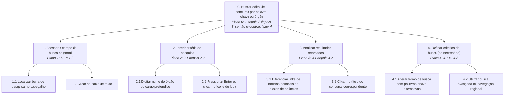
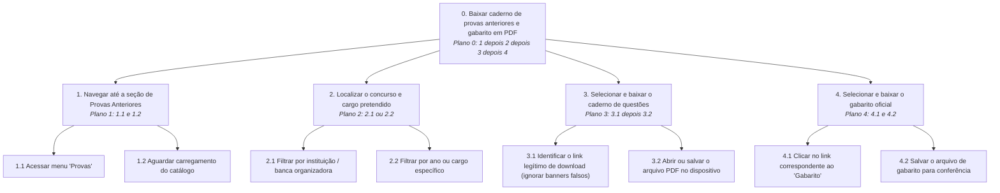
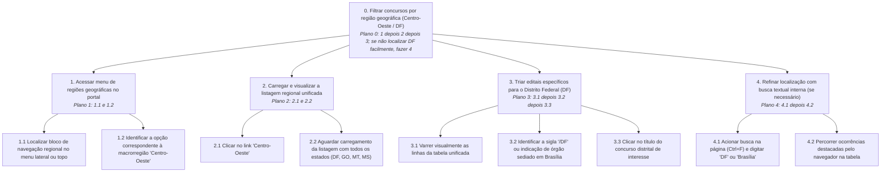
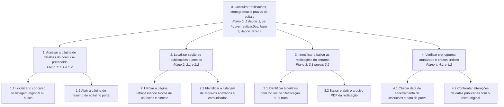
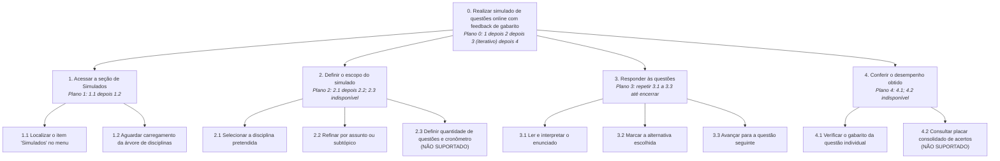
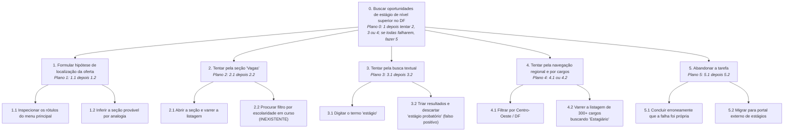

<b>Tabela de Contribuição</b>

| Membro | Contribuição |
| :--- | :--- |
| Daniel da Silva Batista | Fundamentação teórica de HTA (Annett & Duncan, 1967; Barbosa e Silva, 2010), estruturação da matriz de tarefas, modelagem formal completa com diagramas e tabelas das Tarefas 01 e 02 e organização dos templates para a equipe. |
| Arthur Sismene Carvalho | Revisão da decomposição funcional e modelagem HTA integral das Tarefas 05 e 06 (diagramas e tabelas analíticas), incluindo a caracterização da TAR-06 como tarefa não suportada e o levantamento da colisão terminológica de "estágio". |
| João Vitor Sales Ibiapina | Revisão da decomposição hierárquica e estruturação das Tarefas 09 e 10. |
| Leonardo da Silva Lopes Júnior | Revisão das operações e planos condicionais das Tarefas 07 e 08. |
| Pedro Rocha Ferreira Lima | Modelagem formal completa em HTA (diagramas e tabelas analíticas com problemas e recomendações) das Tarefas 03 e 04 com base no método sem usuário (DOC-02) e na persona Lucas Ferreira Rocha. |
| Gemini | Geração dos diagramas HTA em notação Mermaid e auxílio na estruturação textual do artefato em Markdown (conforme Política de Uso de IA). |

<b>Fonte:</b> Daniel da Silva Batista (2026).

# Análise Hierárquica de Tarefas (HTA)

## 1. Introdução e Fundamentação Teórica

A **Análise Hierárquica de Tarefas** (*Hierarchical Task Analysis* - HTA), desenvolvida originalmente por Annett e Duncan (1967) e amplamente detalhada por Barbosa e Silva (2010, Cap. 8.4), é um dos métodos clássicos e mais consolidados de análise de tarefas em Interação Humano-Computador. A técnica baseia-se na decomposição funcional de alto nível dos objetivos de um usuário em subobjetivos menores e, sucessivamente, em **operações** elementares — que correspondem às ações físicas e cognitivas concretas executadas para alcançar cada estado desejado.

No HTA, a execução dos subobjetivos e operações é rigorosamente regida por **planos**, que especificam as condições lógicas, sequenciais ou alternativas sob as quais as ações devem ser realizadas (por exemplo: sequências estritas, decisões condicionais do tipo "se... então", repetições cíclicas ou execuções paralelas). Essa abordagem permite identificar gargalos cognitivos, erros operacionais recorrentes e propor recomendações ergonômicas de design de interface centradas na eficácia e satisfação do usuário.

### Elementos Estruturais da Notação HTA:
* **Objetivos e Subobjetivos:** Estados finais que a pessoa deseja atingir no sistema (ex.: "Baixar edital em PDF").
* **Operações:** Unidades básicas de comportamento físico ou cognitivo necessárias para atingir um subobjetivo (ex.: "Digitar nome do órgão no campo de busca").
* **Planos:** Instruções lógicas e condicionais que determinam a ordem, a frequência e as circunstâncias em que os subobjetivos e operações devem ser executados (ex.: "Plano 0: Fazer 1; depois 2; se erro, repetir 1; senão fazer 3").
* **Identificação de Problemas e Recomendações:** A análise em IHC expande a representação funcional para mapear barreiras de usabilidade, falhas ergonômicas e propor recomendações de reprojeto para cada etapa da tarefa.

---

## 2. Matriz de Tarefas do PCI Concursos

Com base nos três perfis de usuário delineados na pesquisa de requisitos e no escopo funcional do portal **PCI Concursos**, foram selecionadas **dez tarefas representativas** para a avaliação empírica e modelagem formal. Cada integrante da equipe é responsável pela condução e especificação aprofundada de duas tarefas complementares, articulando o diagrama de decomposição com a análise crítica de usabilidade.

A Tabela 1 a seguir consolida a matriz geral de tarefas da equipe:

<b>Tabela 1: Matriz Geral de Tarefas Avaliadas</b>

| ID | Descrição da Tarefa | Integrante Responsável |
| :---: | :--- | :--- |
| **TAR-01** | Buscar edital de concurso por palavra-chave ou órgão | Daniel da Silva Batista |
| **TAR-02** | Baixar caderno de provas anteriores e gabarito oficial em PDF | Daniel da Silva Batista |
| **TAR-03** | Filtrar concursos por região geográfica (Centro-Oeste / DF) | Pedro Rocha Ferreira Lima |
| **TAR-04** | Consultar retificações, cronogramas e datas de prova | Pedro Rocha Ferreira Lima |
| **TAR-05** | Realizar simulado de questões online com feedback de gabarito | Arthur Sismene Carvalho |
| **TAR-06** | Buscar oportunidades de estágio de nível superior no DF | Arthur Sismene Carvalho |
| **TAR-07** | Acessar videoaulas e dicas teóricas de disciplinas | Leonardo da Silva Lopes Júnior |
| **TAR-08** | Cadastrar e configurar recebimento de alertas de vagas por e-mail | Leonardo da Silva Lopes Júnior |
| **TAR-09** | Consultar vagas reservadas para cotas e pessoas com deficiência (PcD) | João Vitor Sales Ibiapina |
| **TAR-10** | Acompanhar notícias de homologação e convocações de aprovados | João Vitor Sales Ibiapina |

<b>Fonte:</b> Daniel da Silva Batista (2026).

---

## 3. Modelagem Detalhada das Tarefas (Daniel da Silva Batista)

### 3.1 Tarefa 01: Buscar edital de concurso por palavra-chave ou órgão (TAR-01)

A decomposição hierárquica de objetivos e planos da Tarefa 01 é ilustrada na Figura 1 a seguir, e a especificação detalhada de suas operações, problemas de usabilidade identificados e recomendações de design é apresentada na Tabela 2.

#### Diagrama de Decomposição HTA (Figura 1)

<b>Figura 1:</b> Diagrama HTA da Tarefa 01 - Buscar edital por palavra-chave

```mermaid
flowchart TD
    T0["0. Buscar edital de concurso por palavra-chave ou órgão<br><i>Plano 0: 1 depois 2 depois 3; se não encontrar, fazer 4</i>"]
    
    T1["1. Acessar o campo de busca no portal<br><i>Plano 1: 1.1 e 1.2</i>"]
    T11["1.1 Localizar barra de pesquisa no cabeçalho"]
    T12["1.2 Clicar na caixa de texto"]
    
    T2["2. Inserir critério de pesquisa<br><i>Plano 2: 2.1 depois 2.2</i>"]
    T21["2.1 Digitar nome do órgão ou cargo pretendido"]
    T22["2.2 Pressionar Enter ou clicar no ícone de lupa"]
    
    T3["3. Analisar resultados retornados<br><i>Plano 3: 3.1 depois 3.2</i>"]
    T31["3.1 Diferenciar links de notícias editoriais de blocos de anúncios"]
    T32["3.2 Clicar no título do concurso correspondente"]
    
    T4["4. Refinar critérios de busca (se necessário)<br><i>Plano 4: 4.1 ou 4.2</i>"]
    T41["4.1 Alterar termo de busca com palavras-chave alternativas"]
    T42["4.2 Utilizar busca avançada ou navegação regional"]

    T0 --> T1
    T0 --> T2
    T0 --> T3
    T0 --> T4
    
    T1 --> T11
    T1 --> T12
    
    T2 --> T21
    T2 --> T22
    
    T3 --> T31
    T3 --> T32
    
    T4 --> T41
    T4 --> T42
```

<b>Fonte:</b> Gerado por Inteligência Artificial (Gemini) (2026).

#### Tabela HTA: Objetivos, Operações, Problemas e Recomendações

<b>Tabela 2: Análise HTA da Tarefa 01</b>

| Objetivos / Operações | Relações / Planos | Problemas Identificados | Recomendações de Usabilidade |
| :--- | :--- | :--- | :--- |
| **0. Buscar edital de concurso por palavra-chave ou órgão** | **Plano 0:** Executar 1, 2 e 3 em sequência. Se a listagem não trouxer o resultado esperado, executar 4. | O mecanismo de busca interna depende de busca textual com baixa tolerância a erros ortográficos ou sinônimos. | Implementar algoritmo de busca semântica com autocompletar e sugestões de correção ortográfica. |
| **1. Acessar o campo de busca no portal** | **Plano 1:** Executar 1.1 e 1.2. | A barra de busca no topo divide espaço com anúncios gráficos piscantes, dificultando a localização visual imediata. | Centralizar a barra de pesquisa no topo com contraste visual elevado e destacar o ícone de lupa. |
| **1.1 Localizar barra de pesquisa** | Ação visual | Dificuldade de percepção para usuários com baixa visão. | Garantir contraste mínimo 4.5:1 (WCAG AA). |
| **1.2 Clicar na caixa de texto** | Ação física | Falta de foco visual (`outline`) destacado ao clicar. | Adicionar indicação visual clara de foco ativo. |
| **2. Inserir critério de pesquisa** | **Plano 2:** Executar 2.1 e 2.2. | Ausência de dicas de contexto ou *placeholders* explicativos na caixa. | Inserir *placeholder* dinâmico: *"Ex: TJDFT, Banco do Brasil, Analista..."*. |
| **2.1 Digitar termo pretendido** | Operação cognitiva/física | Ao digitar siglas, o sistema pode não correlacionar com o nome por extenso. | Adicionar dicionário de sinônimos de órgãos públicos. |
| **2.2 Pressionar Enter ou clicar na lupa** | Ação física | O clique na lupa às vezes aciona recarregamento completo sem transição suave. | Adicionar indicador visual de carregamento (*spinner*). |
| **3. Analisar resultados retornados** | **Plano 3:** Executar 3.1 e 3.2. | A página de resultados mescla anúncios do Google Ads que imitam manchetes de notícias de concursos. | Separar rigorosamente blocos patrocinados de resultados orgânicos com rótulo "Publicidade". |
| **3.1 Diferenciar notícias de anúncios** | Operação cognitiva | Alta carga cognitiva e propensão ao clique errôneo por usuários leigos. | Adicionar borda e fundo diferenciado aos cards de notícias oficiais. |
| **3.2 Clicar no link do concurso** | Ação física | Área de clique restrita apenas ao texto do hiperlink em azul claro. | Tornar todo o card do concurso clicável (*hit area* expandida). |
| **4. Refinar critérios de busca** | **Plano 4:** Executar 4.1 ou 4.2 se necessário. | A interface não oferece filtros de faceta rápidos (por estado, status ou escolaridade) na tela de resultados. | Adicionar filtros laterais interativos (Estado, Escolaridade, Salário). |

<b>Fonte:</b> Daniel da Silva Batista (2026).

---

### 3.2 Tarefa 02: Baixar caderno de provas anteriores e gabarito oficial em PDF (TAR-02)

A decomposição da Tarefa 02 é apresentada no diagrama da Figura 2, e sua correspondente análise detalhada de operações e problemas é fornecida na Tabela 3.

#### Diagrama de Decomposição HTA (Figura 2)

<b>Figura 2:</b> Diagrama HTA da Tarefa 02 - Download de provas anteriores e gabaritos

```mermaid
flowchart TD
    T0["0. Baixar caderno de provas anteriores e gabarito em PDF<br><i>Plano 0: 1 depois 2 depois 3 depois 4</i>"]
    
    T1["1. Navegar até a seção de Provas Anteriores<br><i>Plano 1: 1.1 e 1.2</i>"]
    T11["1.1 Acessar menu 'Provas'"]
    T12["1.2 Aguardar carregamento do catálogo"]
    
    T2["2. Localizar o concurso e cargo pretendido<br><i>Plano 2: 2.1 ou 2.2</i>"]
    T21["2.1 Filtrar por instituição / banca organizadora"]
    T22["2.2 Filtrar por ano ou cargo específico"]
    
    T3["3. Selecionar e baixar o caderno de questões<br><i>Plano 3: 3.1 depois 3.2</i>"]
    T31["3.1 Identificar o link legítimo de download (ignorar banners falsos)"]
    T32["3.2 Abrir ou salvar o arquivo PDF no dispositivo"]
    
    T4["4. Selecionar e baixar o gabarito oficial<br><i>Plano 4: 4.1 e 4.2</i>"]
    T41["4.1 Clicar no link correspondente ao 'Gabarito'"]
    T42["4.2 Salvar o arquivo de gabarito para conferência"]

    T0 --> T1
    T0 --> T2
    T0 --> T3
    T0 --> T4
    
    T1 --> T11
    T1 --> T12
    
    T2 --> T21
    T2 --> T22
    
    T3 --> T31
    T3 --> T32
    
    T4 --> T41
    T4 --> T42
```

<b>Fonte:</b> Gerado por Inteligência Artificial (Gemini) (2026).

#### Tabela HTA: Objetivos, Operações, Problemas e Recomendações

<b>Tabela 3: Análise HTA da Tarefa 02</b>

| Objetivos / Operações | Relações / Planos | Problemas Identificados | Recomendações de Usabilidade |
| :--- | :--- | :--- | :--- |
| **0. Baixar caderno de provas anteriores e gabarito em PDF** | **Plano 0:** Executar 1, 2, 3 e 4. | A fragmentação entre prova e gabarito em links distintos obriga o usuário a idas e vindas de navegação. | Disponibilizar botão único com opção *"Baixar Prova + Gabarito (.zip ou pacote)"*. |
| **1. Navegar até a seção de Provas** | **Plano 1:** Executar 1.1 e 1.2. | O link do menu "Provas" é minúsculo e fica agrupado em uma coluna de dezenas de outros links no rodapé/lateral. | Destacar a seção de Provas no menu de navegação primário superior. |
| **2. Localizar concurso e cargo** | **Plano 2:** Executar 2.1 ou 2.2. | A listagem de provas é exibida em ordem alfabética estática gigantesca, sem paginação clara ou filtros reativos. | Implementar tabela reativa com paginação, ordenação por ano e busca instantânea. |
| **3. Selecionar e baixar a prova** | **Plano 3:** Executar 3.1 e 3.2. | **Problema Crítico de Segurança e Usabilidade:** Presença de anúncios com falsos botões "Download", enganando usuários. | Isolar a área de download legítimo em uma caixa protegida de anúncios imediatos, com selo de arquivo verificado. |
| **3.1 Identificar link de download real** | Operação cognitiva | O link legítimo é um texto azul sem ícone indicador de PDF (`.pdf`), com peso visual infinitamente menor que os anúncios. | Inserir ícone universal de PDF vermelho acompanhado do peso do arquivo (ex.: `[PDF] Prova_Analista_TI.pdf (1.8 MB)`). |
| **3.2 Salvar arquivo PDF** | Ação física | Dependendo da configuração do navegador, o PDF é aberto na mesma aba, perdendo o contexto da página do concurso. | Forçar abertura em nova guia (`target="_blank"`) ou disparar o download direto com atributo `download`. |
| **4. Baixar o gabarito oficial** | **Plano 4:** Executar 4.1 e 4.2. | Se o gabarito tiver retificações (anulação de questões), o portal nem sempre indica claramente a versão final. | Indicar textualmente: *"Gabarito Definitivo (Pós-Recurso)"* ao lado do link. |

<b>Fonte:</b> Daniel da Silva Batista (2026).

---

## 4. Modelagem Detalhada das Tarefas (Pedro Rocha Ferreira Lima)

### 4.1 Tarefa 03: Filtrar concursos por região geográfica (Centro-Oeste / DF) (TAR-03)

A Tarefa 03 investiga o processo de busca e filtragem regional no portal PCI Concursos, foco principal da persona secundária Lucas Ferreira Rocha (`PER-02`) e respaldada pelos dados da Análise Documental (`DOC-02`), que apontam que mais de 65% das vagas do Centro-Oeste concentram-se no DF e na sua Região Integrada de Desenvolvimento (RIDE). A decomposição hierárquica é ilustrada na Figura 3, e a especificação de suas operações, problemas e recomendações é apresentada na Tabela 4.

#### Diagrama de Decomposição HTA (Figura 3)

<b>Figura 3:</b> Diagrama HTA da Tarefa 03 - Filtrar concursos por região geográfica

```mermaid
flowchart TD
    T0["0. Filtrar concursos por região geográfica (Centro-Oeste / DF)<br><i>Plano 0: 1 depois 2 depois 3; se não localizar DF facilmente, fazer 4</i>"]
    
    T1["1. Acessar menu de regiões geográficas no portal<br><i>Plano 1: 1.1 e 1.2</i>"]
    T11["1.1 Localizar bloco de navegação regional no menu lateral ou topo"]
    T12["1.2 Identificar a opção correspondente à macrorregião 'Centro-Oeste'"]
    
    T2["2. Carregar e visualizar a listagem regional unificada<br><i>Plano 2: 2.1 e 2.2</i>"]
    T21["2.1 Clicar no link 'Centro-Oeste'"]
    T22["2.2 Aguardar carregamento da listagem com todos os estados (DF, GO, MT, MS)"]
    
    T3["3. Triar editais específicos para o Distrito Federal (DF)<br><i>Plano 3: 3.1 depois 3.2 depois 3.3</i>"]
    T31["3.1 Varrer visualmente as linhas da tabela unificada"]
    T32["3.2 Identificar a sigla '/DF' ou indicação de órgão sediado em Brasília"]
    T33["3.3 Clicar no título do concurso distrital de interesse"]
    
    T4["4. Refinar localização com busca textual interna (se necessário)<br><i>Plano 4: 4.1 depois 4.2</i>"]
    T41["4.1 Acionar busca na página (Ctrl+F) e digitar 'DF' ou 'Brasília'"]
    T42["4.2 Percorrer ocorrências destacadas pelo navegador na tabela"]

    T0 --> T1
    T0 --> T2
    T0 --> T3
    T0 --> T4
    
    T1 --> T11
    T1 --> T12
    
    T2 --> T21
    T2 --> T22
    
    T3 --> T31
    T3 --> T32
    T3 --> T33
    
    T4 --> T41
    T4 --> T42
```

<b>Fonte:</b> Gerado por Inteligência Artificial (Gemini) e revisado por Pedro Rocha Ferreira Lima (2026).

#### Tabela HTA: Objetivos, Operações, Problemas e Recomendações

<b>Tabela 4: Análise HTA da Tarefa 03</b>

| Objetivos / Operações | Relações / Planos | Problemas Identificados | Recomendações de Usabilidade |
| :--- | :--- | :--- | :--- |
| **0. Filtrar concursos por região geográfica (Centro-Oeste / DF)** | **Plano 0:** Executar 1, 2 e 3 em sequência. Se a varredura visual for ineficiente pela mistura de estados, executar 4. | O sistema agrupa todos os estados da macrorregião (DF, GO, MT, MS) em uma única listagem plana sem filtro dedicado por Unidade Federativa (UF). | Implementar subfiltros reativos por UF (DF, GO, MT, MS) ou abas específicas no topo da listagem regional (`RF-DOC-03`). |
| **1. Acessar menu regional no portal** | **Plano 1:** Executar 1.1 e 1.2. | Os links de regiões geográficas na barra lateral competem com múltiplos banners publicitários de largura total. | Destacar o seletor geográfico no menu de navegação primário com ícones das regiões do Brasil. |
| **1.1 Localizar bloco de navegação** | Ação visual | O seletor fica posicionado abaixo da dobra inicial em resoluções verticais menores. | Fixar a navegação de regiões no topo ou torná-la acessível via menu suspenso (*dropdown*). |
| **1.2 Identificar 'Centro-Oeste'** | Operação cognitiva | Ausência de diferenciação visual para o Distrito Federal, que possui regime e demanda administrativa atípicos. | Permitir seleção direta de capitais e do Distrito Federal no menu de navegação. |
| **2. Carregar listagem unificada** | **Plano 2:** Executar 2.1 e 2.2. | A tabela carrega centenas de editais simultaneamente sem paginação, aumentando o tempo de resposta e o consumo de dados. | Implementar paginação dinâmica (ex.: 20 a 50 certames por página) com carregamento sob demanda (*lazy loading*). |
| **2.1 Clicar em 'Centro-Oeste'** | Ação física | O clique recarrega a página completa sem persistir preferências anteriores de visualização. | Utilizar carregamento assíncrono (AJAX/SPA) para atualização instantânea dos resultados. |
| **2.2 Aguardar carregamento** | Ação de espera | Ausência de feedback de progresso durante o carregamento de tabelas com grande volume de dados. | Adicionar indicador visual de carregamento (*skeleton screens* ou *spinners*). |
| **3. Triar editais para o DF** | **Plano 3:** Executar 3.1, 3.2 e 3.3. | **Sobrecarga Cognitiva Severa:** O usuário precisa ler linha por linha para descartar dezenas de certames municipais do interior de GO, MT e MS. | Disponibilizar *tag/badge* visual com cores distintas por estado (ex.: tag azul `[DF]`, verde `[GO]`, amarela `[MT]`). |
| **3.1 Varrer visualmente as linhas** | Operação cognitiva | Tipografia densa, tamanho de fonte reduzido e baixo contraste das siglas de estado na tabela. | Melhorar o respiro tipográfico, tamanho de fonte (mínimo 14px) e espaçamento entre linhas da tabela. |
| **3.2 Identificar sigla '/DF'** | Ação visual | Siglas de lotação estão no final do título do órgão, muitas vezes truncadas ou abreviadas de forma inconsistente. | Padronizar uma coluna exclusiva para a "UF / Cidade de Lotação" na tabela de certames. |
| **3.3 Clicar no concurso distrital** | Ação física | A área clicável limita-se ao hiperlink sublinhado, gerando cliques perdidos no espaço da linha. | Tornar a linha inteira da tabela clicável (*row click* com hover destacado). |
| **4. Refinar com busca no navegador** | **Plano 4:** Executar 4.1 e 4.2 se necessário. | A necessidade de acionar recurso externo do navegador (Ctrl+F) evidencia falha de usabilidade na interface interna de busca/filtro. | Incorporar campo de filtragem rápida instantânea em tempo real (*live search*) no topo da própria tabela regional. |

<b>Fonte:</b> Pedro Rocha Ferreira Lima (2026).

---

### 4.2 Tarefa 04: Consultar retificações, cronogramas e prazos de editais (TAR-04)

A Tarefa 04 compreende a inspeção das publicações complementares e prazos de um certame, atividade crucial identificada na Análise Documental (`DOC-02`), segundo a qual até 80% dos editais sofrem retificações em suas primeiras três semanas. A decomposição hierárquica é mostrada na Figura 4, e sua especificação analítica é descrita na Tabela 5.

#### Diagrama de Decomposição HTA (Figura 4)

<b>Figura 4:</b> Diagrama HTA da Tarefa 04 - Consultar retificações, cronogramas e prazos

```mermaid
flowchart TD
    T0["0. Consultar retificações, cronogramas e prazos de editais<br><i>Plano 0: 1 depois 2; se houver retificações, fazer 3; depois fazer 4</i>"]
    
    T1["1. Acessar a página de detalhes do concurso pretendido<br><i>Plano 1: 1.1 e 1.2</i>"]
    T11["1.1 Localizar o concurso na listagem regional ou busca"]
    T12["1.2 Abrir a página de resumo do edital no portal"]
    
    T2["2. Localizar seção de publicações e anexos<br><i>Plano 2: 2.1 e 2.2</i>"]
    T21["2.1 Rolar a página ultrapassando blocos de anúncios e síntese"]
    T22["2.2 Identificar a listagem de arquivos anexados e comunicados"]
    
    T3["3. Identificar e baixar as retificações do certame<br><i>Plano 3: 3.1 depois 3.2</i>"]
    T31["3.1 Identificar hiperlinks com rótulos de 'Retificação' ou 'Errata'"]
    T32["3.2 Baixar e abrir o arquivo PDF da retificação"]
    
    T4["4. Verificar cronograma atualizado e prazos críticos<br><i>Plano 4: 4.1 e 4.2</i>"]
    T41["4.1 Checar data de encerramento de inscrições e data da prova"]
    T42["4.2 Confrontar alterações de datas publicadas com o texto original"]

    T0 --> T1
    T0 --> T2
    T0 --> T3
    T0 --> T4
    
    T1 --> T11
    T1 --> T12
    
    T2 --> T21
    T2 --> T22
    
    T3 --> T31
    T3 --> T32
    
    T4 --> T41
    T4 --> T42
```

<b>Fonte:</b> Gerado por Inteligência Artificial (Gemini) e revisado por Pedro Rocha Ferreira Lima (2026).

#### Tabela HTA: Objetivos, Operações, Problemas e Recomendações

<b>Tabela 5: Análise HTA da Tarefa 04</b>

| Objetivos / Operações | Relações / Planos | Problemas Identificados | Recomendações de Usabilidade |
| :--- | :--- | :--- | :--- |
| **0. Consultar retificações, cronogramas e prazos de editais** | **Plano 0:** Executar 1 e 2. Se existirem comunicados/erratas, executar 3; finalizar com 4. | **Risco Crítico de Desinformação:** Concursos com editais alterados não exibem aviso em destaque na listagem nem no cabeçalho do concurso. | Implementar selo de alerta visual no topo da página: *"Edital com Retificação Publicada em DD/MM/AAAA"* (`RF-DOC-04`). |
| **1. Acessar página de detalhes do concurso** | **Plano 1:** Executar 1.1 e 1.2. | O link da listagem para a página de detalhes compete com anúncios externos com aparência idêntica a botões de navegação. | Padronizar botão de ação claro (*CTA - Call to Action*) com o texto *"Ver Detalhes do Concurso"*. |
| **2. Localizar seção de publicações e anexos** | **Plano 2:** Executar 2.1 e 2.2. | A área de downloads e comunicados fica no fim da página, exigindo rolagem extensa em meio a anúncios intercalados. | Adicionar sumário com âncoras no topo (*Jump links*: "Resumo", "Cronograma", "Arquivos e Retificações"). |
| **3. Identificar e baixar as retificações** | **Plano 3:** Executar 3.1 e 3.2. | As retificações aparecem como simples linhas de texto azul no rodapé, sem destaque cronológico ou resumo de conteúdo. | Apresentar um painel de "Histórico de Atualizações do Certame" ordenado por data decrescente. |
| **3.1 Identificar hiperlinks de retificação** | Operação cognitiva | Falta de informação sobre o objeto da alteração: o usuário não sabe se a retificação mudou datas, requisitos ou vagas sem abrir o PDF. | Incluir breve descrição sintética ao lado do link: *(Ex.: "Retificação 01: Prorrogação de inscrições e alteração de conteúdo de Informática")*. |
| **3.2 Baixar arquivo PDF da retificação** | Ação física | O PDF muitas vezes é aberto na mesma aba, fazendo o usuário perder a visualização dos dados cadastrais do certame. | Abrir links de anexos oficiais obrigatoriamente em nova aba (`target="_blank"`) e fornecer botão explícito de download. |
| **4. Verificar cronograma e prazos críticos** | **Plano 4:** Executar 4.1 e 4.2. | Não existe um cronograma visual ou barra de progresso das fases do concurso (Inscrições $\rightarrow$ Isenção $\rightarrow$ Homologação $\rightarrow$ Prova). | Implementar componente de linha do tempo (*timeline* interativa) com indicação do status atual do certame. |
| **4.1 Checar encerramento de inscrições** | Operação cognitiva | O horário limite para pagamento da taxa de inscrição frequentemente não é destacado, gerando perdas de prazo. | Exibir contador regressivo ou destaque em caixa de alerta: *"Inscrições encerram-se em X dias (às 23h59)"*. |
| **4.2 Confrontar alterações de datas** | Operação cognitiva | O usuário é forçado a cruzar manualmente duas versões de documentos PDF para descobrir o novo prazo de prova. | Exibir tabela comparativa automática de alterações de cronograma diretamente na interface web. |

<b>Fonte:</b> Pedro Rocha Ferreira Lima (2026).

---

## 5. Modelagem Detalhada das Tarefas (Arthur Sismene Carvalho)

### 5.1 Tarefa 05: Realizar simulado de questões online com feedback de gabarito (TAR-05)

A decomposição hierárquica da Tarefa 05 é ilustrada na Figura 5, e a especificação de suas operações, problemas e recomendações é apresentada na Tabela 6. A modelagem considera o contexto de uso predominante da persona **PER-03 (Lucas Andrade Ferreira)**: execução em smartphone, em deslocamento, sob conexão instável.

#### Diagrama de Decomposição HTA (Figura 5)

<b>Figura 5:</b> Diagrama HTA da Tarefa 05 - Realizar simulado de questões online

```mermaid
flowchart TD
    T0["0. Realizar simulado de questões online com feedback de gabarito<br><i>Plano 0: 1 depois 2 depois 3 (iterativo) depois 4</i>"]

    T1["1. Acessar a seção de Simulados<br><i>Plano 1: 1.1 depois 1.2</i>"]
    T11["1.1 Localizar o item 'Simulados' no menu"]
    T12["1.2 Aguardar carregamento da árvore de disciplinas"]

    T2["2. Definir o escopo do simulado<br><i>Plano 2: 2.1 depois 2.2; 2.3 indisponível</i>"]
    T21["2.1 Selecionar a disciplina pretendida"]
    T22["2.2 Refinar por assunto ou subtópico"]
    T23["2.3 Definir quantidade de questões e cronômetro<br>(NÃO SUPORTADO)"]

    T3["3. Responder às questões<br><i>Plano 3: repetir 3.1 a 3.3 até encerrar</i>"]
    T31["3.1 Ler e interpretar o enunciado"]
    T32["3.2 Marcar a alternativa escolhida"]
    T33["3.3 Avançar para a questão seguinte"]

    T4["4. Conferir o desempenho obtido<br><i>Plano 4: 4.1; 4.2 indisponível</i>"]
    T41["4.1 Verificar o gabarito da questão individual"]
    T42["4.2 Consultar placar consolidado de acertos<br>(NÃO SUPORTADO)"]

    T0 --> T1
    T0 --> T2
    T0 --> T3
    T0 --> T4

    T1 --> T11
    T1 --> T12

    T2 --> T21
    T2 --> T22
    T2 --> T23

    T3 --> T31
    T3 --> T32
    T3 --> T33

    T4 --> T41
    T4 --> T42
```

<b>Fonte:</b> Arthur Sismene Carvalho (2026).

#### Tabela HTA: Objetivos, Operações, Problemas e Recomendações

<b>Tabela 6: Análise HTA da Tarefa 05</b>

| Objetivos / Operações | Relações / Planos | Problemas Identificados | Recomendações de Usabilidade |
| :--- | :--- | :--- | :--- |
| **0. Realizar simulado de questões online com feedback de gabarito** | **Plano 0:** Executar 1 e 2 em sequência; repetir 3 até o encerramento da sessão; então executar 4. | A tarefa não é tratada pelo sistema como uma **sessão de estudo** com início, escopo e encerramento definidos, mas como navegação avulsa por um repositório de questões, o que impede o fechamento do ciclo diagnóstico pretendido pelo usuário. | Reconceber o fluxo como sessão: configurar, executar, encerrar e relatar desempenho, preservando o estado em caso de interrupção. |
| **1. Acessar a seção de Simulados** | **Plano 1:** Executar 1.1 e 1.2. | O item "Simulados" concorre com outros quatorze rótulos no menu principal, sem hierarquia visual que distinga ferramentas interativas de seções de conteúdo editorial. | Agrupar as ferramentas de estudo (Simulados, Provas, Aulas, Apostilas) em bloco visualmente destacado do menu. |
| **1.1 Localizar item no menu** | Ação visual | Em viewport móvel o menu é colapsado e exige rolagem extensa; o rótulo não possui ícone de apoio ao reconhecimento. | Fixar barra de navegação inferior no mobile com as quatro ferramentas de estudo mais acessadas e respectivos ícones. |
| **1.2 Aguardar carregamento** | Tarefa de sistema | O carregamento tardio dos blocos publicitários desloca o conteúdo já renderizado, provocando toque em alvo indesejado (*layout shift*). | Reservar previamente o espaço dos contêineres de anúncio (`min-height`) para manter CLS próximo de zero. |
| **2. Definir o escopo do simulado** | **Plano 2:** Executar 2.1 e 2.2. A operação 2.3 é pretendida pelo usuário, mas **não é suportada pelo sistema**. | A seleção ocorre sobre uma árvore extensa de assuntos com volumes muito elevados por tópico (Direito Administrativo com mais de 7.000 questões), sem que o usuário possa delimitar uma sessão exequível no tempo de que dispõe. | Inserir configurador prévio de sessão com disciplina, quantidade de questões (10/20/50), nível de dificuldade, banca e cronômetro opcional. |
| **2.1 Selecionar disciplina** | Ação física | Lista hierárquica longa, sem campo de filtro instantâneo nem histórico de disciplinas recentes. | Adicionar busca incremental por disciplina e atalho para os últimos assuntos praticados. |
| **2.2 Refinar por assunto** | Ação física | A contagem de questões por assunto é informativa, mas não orienta sobre o tempo estimado de resolução. | Exibir estimativa de duração (ex.: *"10 questões ≈ 15 min"*) ao lado de cada opção. |
| **2.3 Definir quantidade e cronômetro** | **Operação não suportada** | Ausência completa de parametrização da sessão: o usuário não controla a extensão do exercício, inviabilizando o estudo em janelas curtas de tempo. | Implementar a parametrização como requisito funcional (**RF-DOC-04**). |
| **3. Responder às questões** | **Plano 3:** Repetir 3.1, 3.2 e 3.3 iterativamente até esgotar o escopo ou interromper por fator externo. | O progresso da sessão não é persistido: recarregamento de página ou queda de conexão descarta todas as respostas já registradas. | Persistir o progresso localmente (`localStorage`) e sincronizar ao restabelecer conexão. |
| **3.1 Ler e interpretar enunciado** | Operação cognitiva | Corpo tipográfico reduzido em telas pequenas obriga ampliação por gesto de pinça a cada questão. | Adotar tipografia fluida com mínimo de 16 px em mobile e largura de linha controlada. |
| **3.2 Marcar alternativa** | Ação física | Áreas de toque das alternativas inferiores ao mínimo recomendado, gerando marcação acidental em uso com uma única mão e em veículo em movimento. | Garantir alvos de toque de no mínimo 44 × 44 px (WCAG 2.1, critério 2.5.5) e tornar todo o bloco da alternativa clicável. |
| **3.3 Avançar para a seguinte** | Ação física | Ausência de indicador de posição na sequência (ex.: "questão 4 de 10"), impedindo a percepção de progresso. | Inserir barra de progresso e contador de posição fixos no topo da sessão. |
| **4. Conferir o desempenho obtido** | **Plano 4:** Executar 4.1 por questão. A operação 4.2 é o objetivo central do usuário, mas **não é suportada**. | O retorno é pontual e por questão, nunca agregado. O usuário encerra a sessão **sem saber quantas questões acertou**, frustrando o propósito diagnóstico da tarefa. | Apresentar relatório de encerramento com total de acertos, percentual por assunto, tempo médio por questão e histórico evolutivo entre sessões. |
| **4.1 Verificar gabarito individual** | Tarefa de sistema | O gabarito informa apenas a alternativa correta, sem justificativa, o que limita o valor pedagógico para usuário iniciante no domínio. | Incorporar comentário explicativo da questão e referência ao dispositivo legal ou regra gramatical aplicável. |
| **4.2 Consultar placar consolidado** | **Operação não suportada** | Inexistência de consolidação de resultados e de histórico de desempenho. | Implementar placar e histórico como requisito funcional (**RF-DOC-04**). |

<b>Fonte:</b> Arthur Sismene Carvalho (2026).

---

### 5.2 Tarefa 06: Buscar oportunidades de estágio de nível superior no DF (TAR-06)

!!! warning "Tarefa não suportada pelo sistema"
    A inspeção da arquitetura de informação do PCI Concursos, realizada em 27/09/2026, constatou que **o portal não dispõe de seção, filtro ou categoria dedicada a vagas de estágio**: a seção "Vagas" indexa exclusivamente cargos efetivos de concursos e processos seletivos, e nenhum dos quinze itens do menu principal contempla estágio, estagiário ou programa de trainee.

    A modelagem a seguir, portanto, não descreve um fluxo bem-sucedido, mas o **percurso exploratório de tentativa e erro** que o usuário executa antes de abandonar a tarefa. Conforme Diaper e Stanton (2004), a análise de tarefas malsucedidas constitui evidência de primeira ordem para a identificação de lacunas funcionais, pois expõe requisitos que a modelagem de fluxos bem-sucedidos é incapaz de revelar. O confronto dessa ausência com a demanda reprimida documentada em [`DOC-03`](../perfil-de-usuario.md#53-analise-documental-03-responsavel-arthur-sismene-carvalho) — mais de 18 milhões de estudantes aptos e não colocados em estágio, segundo a ABRES — qualifica o achado como lacuna de alto impacto.

#### Diagrama de Decomposição HTA (Figura 6)

<b>Figura 6:</b> Diagrama HTA da Tarefa 06 - Busca de vagas de estágio (percurso de tentativa e abandono)

```mermaid
flowchart TD
    T0["0. Buscar oportunidades de estágio de nível superior no DF<br><i>Plano 0: 1 depois tentar 2, 3 ou 4; se todas falharem, fazer 5</i>"]

    T1["1. Formular hipótese de localização da oferta<br><i>Plano 1: 1.1 depois 1.2</i>"]
    T11["1.1 Inspecionar os rótulos do menu principal"]
    T12["1.2 Inferir a seção provável por analogia"]

    T2["2. Tentar pela seção 'Vagas'<br><i>Plano 2: 2.1 depois 2.2</i>"]
    T21["2.1 Abrir a seção e varrer a listagem"]
    T22["2.2 Procurar filtro por escolaridade em curso<br>(INEXISTENTE)"]

    T3["3. Tentar pela busca textual<br><i>Plano 3: 3.1 depois 3.2</i>"]
    T31["3.1 Digitar o termo 'estágio'"]
    T32["3.2 Triar resultados e descartar<br>'estágio probatório' (falso positivo)"]

    T4["4. Tentar pela navegação regional e por cargos<br><i>Plano 4: 4.1 ou 4.2</i>"]
    T41["4.1 Filtrar por Centro-Oeste / DF"]
    T42["4.2 Varrer a listagem de 300+ cargos<br>buscando 'Estagiário'"]

    T5["5. Abandonar a tarefa<br><i>Plano 5: 5.1 depois 5.2</i>"]
    T51["5.1 Concluir erroneamente que a falha foi própria"]
    T52["5.2 Migrar para portal externo de estágios"]

    T0 --> T1
    T0 --> T2
    T0 --> T3
    T0 --> T4
    T0 --> T5

    T1 --> T11
    T1 --> T12

    T2 --> T21
    T2 --> T22

    T3 --> T31
    T3 --> T32

    T4 --> T41
    T4 --> T42

    T5 --> T51
    T5 --> T52
```

<b>Fonte:</b> Arthur Sismene Carvalho (2026).

#### Tabela HTA: Objetivos, Operações, Problemas e Recomendações

<b>Tabela 7: Análise HTA da Tarefa 06</b>

| Objetivos / Operações | Relações / Planos | Problemas Identificados | Recomendações de Usabilidade |
| :--- | :--- | :--- | :--- |
| **0. Buscar oportunidades de estágio de nível superior no DF** | **Plano 0:** Executar 1; então tentar 2, 3 e 4 em qualquer ordem, repetindo enquanto restarem hipóteses; esgotadas as alternativas, executar 5. | **Lacuna funcional:** o sistema não oferece a funcionalidade buscada, e tampouco comunica essa ausência. O usuário despende cerca de doze minutos em exploração improdutiva antes de desistir. | Criar seção dedicada a estágios, jovem aprendiz e programas de ingresso, indexando processos seletivos de agentes de integração e de órgãos públicos (**RF-DOC-03**). |
| **1. Formular hipótese de localização** | **Plano 1:** Executar 1.1 e 1.2. | Nenhum rótulo do menu comunica o escopo real de cobertura do portal, o que induz o usuário a presumir cobertura universal de oportunidades públicas. | Explicitar o escopo editorial em subtítulo ou descrição de seção (ex.: *"concursos e processos seletivos para cargos efetivos e temporários"*). |
| **1.1 Inspecionar rótulos do menu** | Operação cognitiva | Quinze itens de menu sem agrupamento semântico elevam a carga cognitiva da varredura visual. | Agrupar o menu por finalidade (Oportunidades, Estudo, Referência, Institucional). |
| **1.2 Inferir seção provável** | Operação cognitiva | O rótulo "Vagas" é semanticamente amplo e sugere abrangência que a seção não possui. | Renomear para rótulo específico (ex.: "Vagas por Cargo") ou ampliar a cobertura para corresponder à expectativa gerada. |
| **2. Tentar pela seção 'Vagas'** | **Plano 2:** Executar 2.1 e 2.2. | A seção indexa apenas cargos efetivos, pressupondo candidato já qualificado. Não há filtro por escolaridade em curso nem por modalidade de contratação. | Adicionar faceta "Nível/Escolaridade" contemplando a opção *cursando*, e faceta "Modalidade" (efetivo, temporário, estágio, aprendiz). |
| **2.1 Varrer a listagem** | Ação física/cognitiva | Listagem extensa ordenada por profissão consolidada, sem correspondência possível ao perfil estudantil. | Oferecer estado vazio orientado ao perfil quando nenhum resultado for compatível. |
| **2.2 Procurar filtro de escolaridade** | **Operação frustrada** | O filtro pretendido não existe; o usuário não dispõe de meio para restringir a busca ao seu próprio perfil. | Implementar a faceta como requisito funcional (**RF-DOC-03**). |
| **3. Tentar pela busca textual** | **Plano 3:** Executar 3.1 e 3.2. | **Colisão terminológica crítica:** no domínio de concursos, "estágio" designa majoritariamente o *estágio probatório* — período de avaliação do servidor recém-nomeado, presente em praticamente todos os editais. A busca retorna resultado tecnicamente correto e semanticamente inútil. | Desambiguar as duas acepções no mecanismo de busca, com sugestão explícita do tipo *"Você procura estágio para estudantes ou estágio probatório?"* (**RNF-DOC-03**). |
| **3.1 Digitar o termo 'estágio'** | Ação física | Ausência de autocompletar que antecipe a ambiguidade no momento da digitação. | Exibir sugestões desambiguadoras no autocompletar do campo de busca. |
| **3.2 Triar resultados** | Operação cognitiva | Usuário iniciante no domínio **não distingue as duas acepções** e inicialmente acredita ter encontrado o que buscava, o que prolonga o esforço improdutivo. | Rotular a categoria de cada resultado (ex.: *"menção em edital"* versus *"vaga aberta"*). |
| **4. Tentar pela navegação regional e por cargos** | **Plano 4:** Executar 4.1 ou 4.2. | Ambos os caminhos retornam exclusivamente cargos permanentes; a listagem de mais de trezentos cargos não contempla a entrada "Estagiário". | Incluir "Estagiário" e "Jovem Aprendiz" na taxonomia de cargos, ainda que apenas para exibir estado vazio informativo. |
| **4.1 Filtrar por Centro-Oeste / DF** | Ação física | O filtro geográfico opera corretamente, mas sobre um acervo que não contém o tipo de oportunidade buscada. | Manter o filtro e estendê-lo ao novo acervo de estágios. |
| **4.2 Varrer listagem de cargos** | Operação cognitiva | Varredura de mais de trezentos itens com alto custo de atenção e resultado nulo. | Substituir varredura manual por busca com tolerância a sinônimos na taxonomia de cargos. |
| **5. Abandonar a tarefa** | **Plano 5:** Executar 5.1 e 5.2. | **Problema mais grave do fluxo:** o sistema nunca informa que não cobre estágio, de modo que o usuário atribui a si o fracasso ("não soube procurar"), com prejuízo à autoconfiança e à percepção de competência. | Implementar estado vazio honesto e prestativo: *"Ainda não cobrimos vagas de estágio. Veja concursos de nível médio e superior com vagas para iniciantes."* |
| **5.1 Atribuir a falha a si** | Operação cognitiva | Violação direta da heurística de Nielsen (1993) de visibilidade do estado do sistema e de mensagens de erro compreensíveis. | Comunicar limitações de escopo de forma explícita e imediata. |
| **5.2 Migrar para portal externo** | Ação física | Perda de retenção de um usuário de longo prazo, que tende a converter-se em concurseiro pleno nos anos subsequentes. | Reter o usuário ofertando alternativa adjacente e cadastro de alerta para quando a cobertura de estágios for lançada. |

<b>Fonte:</b> Arthur Sismene Carvalho (2026).

---

## 6. Estrutura para Validação das Tarefas 07 a 10 pelos Demais Integrantes

As demais tarefas modeladas pela equipe seguirão exatamente a mesma notação formal (diagrama Mermaid decomposto + tabela analítica de problemas e recomendações), integrando os achados empíricos das entrevistas gravadas:

* **Tarefas 07 e 08 (Leonardo da Silva Lopes Júnior):** Modelagem do acesso a módulos audiovisuais de disciplinas e submissão de cadastro em mala direta/newsletter de editais.
* **Tarefas 09 e 10 (João Vitor Sales Ibiapina):** Modelagem da checagem de vagas reservadas a PcD/idosos e conferência de portarias de nomeação.

---

## 7. Bibliografia

> ANNETT, John; DUNCAN, Keith D. *Task Analysis and Training Design*. Journal of Occupational Psychology, v. 41, p. 211-221, 1967.  
> BARBOSA, S. D. J.; SILVA, B. S. *Interação Humano-Computador*. Rio de Janeiro: Elsevier, 2010.  
> DIAPER, Dan; STANTON, Neville. *The Handbook of Task Analysis for Human-Computer Interaction*. Mahwah: Lawrence Erlbaum Associates, 2004.  
> NIELSEN, Jakob. *Usability Engineering*. San Francisco: Morgan Kaufmann, 1993.  
> W3C. *Web Content Accessibility Guidelines (WCAG) 2.1*. World Wide Web Consortium, 2018. Disponível em: <https://www.w3.org/TR/WCAG21/>.

## 8. Histórico de Versões

| Versão | Data | Descrição | Autor(es) | Revisor(es) |
| :---: | :---: | :--- | :---: | :---: |
| `1.0` | 21/09/2026 | Fundamentação de HTA (Annett & Duncan; Barbosa & Silva), matriz das 10 tarefas, modelagem completa das Tarefas 01 e 02 (diagramas Mermaid e tabelas com problemas/recomendações). | Daniel da Silva Batista | Pedro Rocha Ferreira Lima |
| `1.1` | 27/09/2026 | Inclusão da modelagem HTA completa das Tarefas 03 e 04 (diagramas Mermaid e tabelas com problemas e recomendações ergonômicas) baseadas na Análise Documental (DOC-02) e persona Lucas Ferreira Rocha. | Pedro Rocha Ferreira Lima | Daniel da Silva Batista |
| `1.2` | 27/09/2026 | Modelagem HTA completa das Tarefas 05 e 06 (Figuras 5 e 6, Tabelas 6 e 7), com registro da TAR-06 como tarefa não suportada pelo sistema, identificação da colisão terminológica "estágio/estágio probatório" e inclusão das referências Nielsen (1993) e WCAG 2.1. | Arthur Sismene Carvalho | Daniel da Silva Batista |

