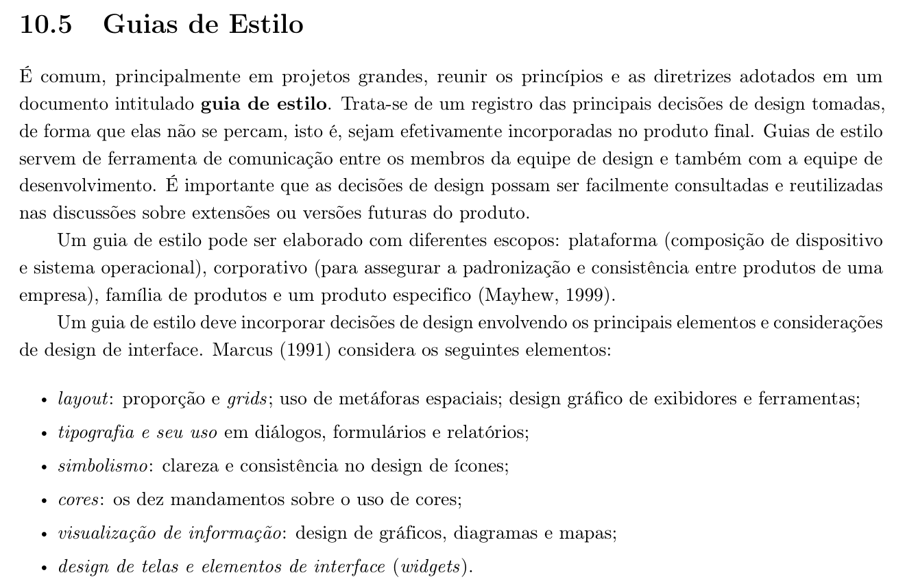
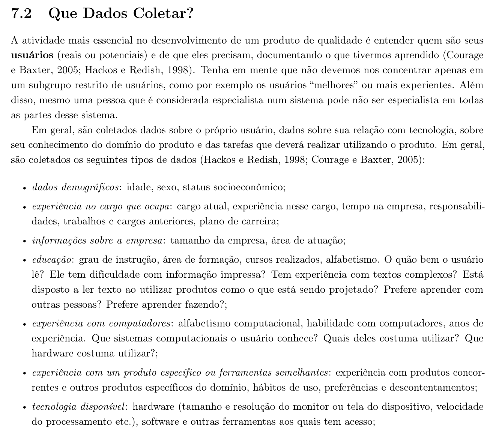

<b>Tabela de Contribuição</b>

| Membro | Contribuição |
| :--- | :--- |
| Arthur Sismene Carvalho | Concepção do artefato, fundamentação teórica com recortes bibliográficos (Figuras 1 e 2), caracterização técnica do PCI Concursos, homologação de navegadores, definição das resoluções e dos pontos de quebra, levantamento das limitações técnicas e especificação do comportamento da interface. |
| Pedro Rocha Ferreira Lima | Revisão técnica. |
| Daniel da Silva Batista | Revisão de coerência com o Guia de Estilo. |
| Claude (Anthropic) | Auxílio na estruturação textual, e diagramação em Markdown (conforme Política de Uso de IA). |

<b>Fonte:</b> Arthur Sismene Carvalho (2026).

# Características da Plataforma

## 1. Introdução

Este artefato especifica a **plataforma técnica** sobre a qual o PCI Concursos é executado e para a qual o reprojeto do grupo deve ser dimensionado. Ele responde a quatro perguntas: que tecnologias sustentam o portal, em quais navegadores a solução será homologada, que resoluções de tela precisam ser atendidas e que limitações técnicas condicionam as decisões de design.

A delimitação da plataforma não é um detalhe de implementação. Ela antecede e restringe boa parte das decisões registradas no [Guia de Estilo](guia-de-estilo.md): a largura disponível determina o grid, a densidade de pixels determina a escala tipográfica, e a capacidade de processamento e a qualidade da rede determinam quanto peso a interface pode carregar antes de se tornar inutilizável para o seu público.

---

## 2. Fundamentação Teórica

### 2.1 Plataforma como escopo de um guia de estilo

Barbosa et al. (2021), com base em Mayhew (1999), registram que um guia de estilo pode ser elaborado com diferentes escopos, e o primeiro deles é justamente o da plataforma, entendida como a **composição entre dispositivo e sistema operacional**. É esse escopo que este artefato delimita para o PCI Concursos. A Figura 1 reproduz o trecho da literatura (Seção 10.5, p. 281) que fundamenta essa definição.

<b>Figura 1: Referência Bibliográfica — Guias de Estilo, Escopos Possíveis e Elementos de Design</b>

<b>Fonte:</b> BARBOSA et al. (2021, p. 281).

A consequência prática é que "plataforma" não se reduz ao navegador. Ela abrange o par dispositivo + sistema operacional, e um mesmo navegador se comporta de modo distinto conforme esse par — o Safari em iOS, por exemplo, impõe restrições de reprodução de mídia e de gestão de memória que o Safari em macOS não impõe.

### 2.2 Elementos de design condicionados pela plataforma

Ainda na Figura 1, Marcus (1991) enumera os elementos de design de interface que um guia de estilo deve endereçar: layout, tipografia, simbolismo, cores, visualização de informação e design de telas e *widgets*. Todos eles são sensíveis à plataforma — o *layout* depende da largura útil, a *tipografia* depende da densidade de pixels, as *cores* dependem da calibração e do modo de exibição do dispositivo, e a *visualização de informação* depende da área disponível para gráficos e tabelas.

É por isso que este artefato precede o guia de estilo na ordem lógica do projeto: sem fixar a plataforma, cada um desses seis elementos ficaria sem parâmetro para ser especificado.

### 2.3 A tecnologia disponível como atributo do usuário

A especificação da plataforma não decorre apenas do que o sistema oferece, mas também do que o usuário possui. Entre os atributos de um perfil de usuário, Barbosa et al. (2021) listam a **tecnologia disponível**, que abrange o hardware a que o usuário tem acesso — incluindo explicitamente o tamanho e a resolução da tela e a velocidade de processamento —, além do software e das demais ferramentas. A Figura 2 reproduz o trecho da literatura (Seção 7.2, p. 147) que estabelece esse atributo.

<b>Figura 2: Referência Bibliográfica — Tipos de Dados Coletados sobre o Usuário e Tecnologia Disponível</b>

<b>Fonte:</b> BARBOSA et al. (2021, p. 147).

É esse atributo que liga este artefato ao [Perfil de Usuário](../analise-de-requisitos/perfil-de-usuario.md) do grupo, no qual se registrou que **62% do público acessa predominantemente por smartphone**. A plataforma do PCI Concursos é, portanto, majoritariamente móvel, ainda que o portal tenha sido historicamente concebido para o desktop.

---

## 3. Caracterização Técnica do PCI Concursos

### 3.1 Natureza da plataforma

O PCI Concursos é uma **aplicação web de acesso público**, servida por HTTPS e consumida diretamente pelo navegador, sem instalação de aplicativo nativo obrigatória. A Tabela 1 reúne os indícios técnicos observados na inspeção do portal e o modo como cada um foi constatado.

<b>Tabela 1: Indícios Técnicos Observados no PCI Concursos</b>

| Indício | Observação | Como foi constatado |
| :--- | :--- | :--- |
| Intenção de responsividade | Presença da meta tag `viewport` com `width=device-width` | Inspeção do documento HTML da página inicial |
| Comportamento tipo aplicativo em iOS | Presença de `apple-mobile-web-app-capable: yes` | Inspeção do documento HTML da página inicial |
| Entrega de mídia por CDN | Imagens servidas a partir do domínio `cdn.pci.app.br` | Inspeção dos endereços de recurso da página inicial |
| Autenticação federada | Opção "Entrar com Google" no topo da página | Elemento visível na página inicial |
| Volume de acervo | Indicação de 268.500 provas disponíveis para download | Texto da página inicial |
| Ausência de domínio móvel separado | Não há subdomínio `m.` nem caminho `/mobile` | Inspeção dos endereços de navegação |

<b>Fonte:</b> Arthur Sismene Carvalho (2026), a partir de inspeção do portal em 06/10/2026.

Duas leituras decorrem da tabela. A primeira é que **não existe versão móvel separada**: o mesmo documento é servido a todos os dispositivos, e a adaptação, quando ocorre, é feita no cliente. A segunda é que a presença da meta tag `viewport` indica *intenção* de responsividade, o que não equivale a uma adaptação efetiva de layout — a verificação do comportamento real em cada ponto de quebra é objeto da Seção 5.

### 3.2 Modelo de entrega de conteúdo

O portal combina dois modos de entrega com exigências técnicas distintas:

1. **Conteúdo navegável em HTML** — listagens de concursos, notícias, páginas de detalhe de edital e simulados. É o conteúdo sobre o qual o guia de estilo tem controle direto.
2. **Documentos para download** — editais, retificações e provas anteriores. Esse conteúdo é produzido por bancas e órgãos externos, e o portal atua como repositório. O grupo não controla sua formatação interna, apenas o fluxo de acesso a ele.

A distinção importa porque as decisões de design do reprojeto só alcançam o primeiro grupo. Para o segundo, o que se pode especificar é o **comportamento do fluxo de obtenção** — rotulagem, indicação de tamanho e formato, e tratamento do arquivo em telas pequenas.

!!! note "Nota de verificação"
    O formato exato em que as provas e os editais são servidos não pôde ser confirmado por inspeção remota das páginas de listagem. A especificação da Seção 6.2 trata o consumo de PDF como caso de uso crítico por ser o formato usual no domínio de concursos públicos; a confirmação em campo deve ser registrada na próxima versão deste artefato.

---

## 4. Navegadores Homologados

A homologação adota o critério de **cobrir os três motores de renderização em uso relevante** — Blink, Gecko e WebKit —, de modo que uma incompatibilidade específica de motor seja detectada antes da publicação. A Tabela 2 apresenta os navegadores homologados.

<b>Tabela 2: Navegadores Homologados e Política de Versões</b>

| Navegador | Motor | Plataforma | Versões cobertas | Prioridade |
| :--- | :---: | :--- | :--- | :---: |
| Google Chrome | Blink | Android, Windows, macOS | Duas últimas versões estáveis | Alta |
| Microsoft Edge | Blink | Windows | Duas últimas versões estáveis | Média |
| Mozilla Firefox | Gecko | Windows, Android | Duas últimas versões estáveis | Média |
| Safari | WebKit | iOS, iPadOS, macOS | Duas últimas versões estáveis | Alta |

<b>Fonte:</b> Arthur Sismene Carvalho (2026).

Três decisões sustentam a tabela:

- **Chrome e Safari recebem prioridade alta** porque concentram o acesso móvel, que é o acesso majoritário do público segundo o perfil de usuário do grupo.
- **A política é de duas últimas versões estáveis**, e não de números fixos de versão, para que o artefato não envelheça a cada ciclo de lançamento dos navegadores.
- **Não há homologação de Internet Explorer.** O navegador está descontinuado, e suportá-lo exigiria renunciar a recursos de layout — notadamente *grid* e *flexbox* — dos quais o guia de estilo depende.

Fora da homologação, aplica-se **degradação graciosa**: o conteúdo permanece legível e navegável, ainda que sem os refinamentos visuais especificados no guia de estilo.

---

## 5. Resoluções e Pontos de Quebra

A especificação adota uma abordagem *mobile first*, coerente com o predomínio do acesso por smartphone registrado no perfil de usuário. A Tabela 3 define as faixas de largura atendidas.

<b>Tabela 3: Pontos de Quebra e Resoluções de Referência</b>

| Faixa | Largura | Resolução de referência | Colunas do grid | Uso predominante |
| :--- | :---: | :---: | :---: | :--- |
| Móvel compacto | 320 px a 479 px | 360 × 640 | 4 | Smartphones de entrada |
| Móvel padrão | 480 px a 767 px | 414 × 896 | 4 | Smartphones correntes |
| Tablet | 768 px a 1023 px | 768 × 1024 | 8 | Tablets e celulares na horizontal |
| Desktop padrão | 1024 px a 1439 px | 1366 × 768 | 12 | Notebooks de entrada |
| Desktop largo | 1440 px ou mais | 1920 × 1080 | 12 | Monitores externos |

<b>Fonte:</b> Arthur Sismene Carvalho (2026).

Quatro regras decorrem da tabela:

- **A largura mínima suportada é 320 px.** Abaixo disso não se garante ausência de rolagem horizontal.
- **A resolução de projeto para desktop é 1366 × 768.** É a referência de desenho para notebooks de entrada, que compõem o segundo dispositivo mais citado no perfil de usuário; larguras maiores recebem o mesmo grid com margens laterais ampliadas.
- **O conteúdo tem largura máxima de leitura.** Acima de 1440 px, a coluna principal de texto não acompanha a largura da janela, para preservar o comprimento de linha confortável definido no guia de estilo.
- **A orientação paisagem em smartphones é tratada pela faixa de tablet**, e não por uma faixa própria, evitando a multiplicação de pontos de quebra.

---

## 6. Limitações Técnicas

### 6.1 Publicidade e orçamento de desempenho

A análise de [Princípios Gerais de Projeto](../analise-de-requisitos/principios-gerais-de-projeto.md) do grupo registrou que o portal apresenta "severa sobrecarga informativa", com "volume desproporcional de blocos promocionais em banners piscantes", e que anúncios exibem "grandes botões gráficos retangulares em tons verdes chamativos" enquanto os links legítimos aparecem como "textos sublinhados azuis simples em fontes de tamanho reduzido".

Essa constatação tem duas consequências técnicas, e não apenas estéticas:

1. **Custo de carregamento.** Blocos publicitários são carregados por scripts de terceiros, fora do controle do portal, e competem por banda e por tempo de processamento com o conteúdo útil. Em conexões móveis instáveis, são eles que determinam o tempo até a primeira interação possível.
2. **Deslocamento de layout.** Anúncios que chegam depois do conteúdo empurram elementos já renderizados, provocando cliques acidentais — risco agravado em telas pequenas, onde a área de toque é reduzida.

A Tabela 4 fixa o orçamento de desempenho que decorre dessas consequências.

<b>Tabela 4: Orçamento de Desempenho Especificado para o Reprojeto</b>

| Métrica | Limite especificado | Justificativa |
| :--- | :--- | :--- |
| Peso total da página de listagem | 1,5 MB | Viabiliza o carregamento em conexão móvel limitada |
| Peso de scripts de terceiros | 30% do peso total | Impede que a publicidade domine o orçamento |
| Deslocamento cumulativo de layout | Próximo de zero após a primeira renderização | Espaço dos anúncios reservado antes do carregamento |
| Interface utilizável sem JavaScript de terceiros | Obrigatória | A falha de um script externo não pode bloquear a consulta |

<b>Fonte:</b> Arthur Sismene Carvalho (2026).

A quarta linha é a mais restritiva e a mais importante: **a consulta a concursos deve funcionar mesmo que todo o conteúdo de terceiros falhe**. Para um candidato verificando um prazo de inscrição em uma conexão ruim, essa é a diferença entre o portal servir ou não.

### 6.2 Consumo de documentos em dispositivos móveis

Editais e provas anteriores são documentos longos, paginados e diagramados para o papel. Em telas estreitas, isso produz três problemas conhecidos: texto reduzido a tamanho ilegível quando a página inteira cabe na tela, necessidade de ampliação com rolagem nos dois eixos, e consumo de dados elevado em arquivos extensos.

A especificação para o reprojeto é:

- **Informar antes de baixar.** O formato e o tamanho do arquivo devem aparecer no próprio link, para que o usuário decida com conhecimento do custo em dados.
- **Não depender de visualizador embutido.** A abertura deve ser delegada ao leitor nativo do sistema operacional, que oferece controles de ampliação e refluxo de texto melhores que os de um visualizador improvisado em página.
- **Preservar o contexto.** A abertura do documento não pode descartar a consulta em andamento, para que o retorno à listagem não exija refazer os filtros.

### 6.3 Rede e hardware do público

O perfil de usuário do grupo descreve um público que acessa predominantemente por smartphone e que inclui candidatos com menor letramento digital e usuários maduros com necessidades de acessibilidade visual. Combinados, esses dois fatos impõem restrições que a plataforma precisa absorver:

- **Não se pode pressupor conexão estável.** Operações críticas, como a consulta a um prazo, devem ser resilientes a falhas parciais de carregamento.
- **Não se pode pressupor hardware recente.** Animações e efeitos que exijam processamento gráfico intenso ficam restritos a enfeites dispensáveis, nunca a elementos funcionais.
- **Não se pode pressupor franquia de dados abundante.** O peso de cada tela é uma decisão de design, não um resíduo da implementação.

---

## 7. Comportamento Especificado da Interface

Esta seção traduz as restrições anteriores em comportamento observável, e é o núcleo da apresentação deste artefato: **como a interface precisa se comportar no computador e no celular**. A Tabela 5 detalha esse comportamento por faixa de dispositivo.

<b>Tabela 5: Comportamento Especificado por Faixa de Dispositivo</b>

| Elemento | Desktop (1024 px ou mais) | Celular (até 767 px) |
| :--- | :--- | :--- |
| Navegação principal | Barra horizontal com itens visíveis | Menu recolhido, acionado por botão com rótulo textual |
| Filtros de busca | Painel lateral persistente, sempre visível | Painel em camada sobreposta, acionado sob demanda, com filtros ativos resumidos em chips |
| Listagem de concursos | Tabela com colunas de órgão, vagas, prazo e taxa | Cartões empilhados, com prazo e taxa em destaque no topo |
| Alvos de toque | Mínimo de 24 px | Mínimo de 44 px, respeitando a precisão do dedo |
| Documentos | Abertura em nova aba | Delegação ao leitor nativo, com formato e tamanho informados antes |
| Publicidade | Espaço reservado em coluna lateral | Espaço reservado entre blocos de conteúdo, nunca sobreposto a alvos de toque |
| Tabelas longas | Exibição integral | Rolagem horizontal contida, com a primeira coluna fixa |

<b>Fonte:</b> Arthur Sismene Carvalho (2026).

O princípio que atravessa a tabela é a **paridade funcional sem paridade de layout**: nenhuma funcionalidade disponível no desktop pode estar ausente no celular, mas a forma de apresentá-la muda conforme a largura e o modo de apontamento. O caminho inverso — reduzir o celular a um desktop encolhido — é o que produz a maior parte dos problemas identificados na análise de requisitos do grupo.

---

## 8. Síntese das Características da Plataforma

A Tabela 6 consolida as especificações definidas neste artefato.

<b>Tabela 6: Síntese das Características da Plataforma</b>

| Dimensão | Especificação |
| :--- | :--- |
| Tipo de plataforma | Aplicação web pública, sem instalação obrigatória |
| Escopo do guia de estilo | Plataforma, no sentido de composição dispositivo + sistema operacional (Mayhew, 1999) |
| Sistemas operacionais | Android, iOS, iPadOS, Windows, macOS |
| Navegadores homologados | Chrome, Edge, Firefox e Safari, duas últimas versões estáveis |
| Largura mínima suportada | 320 px |
| Resolução de projeto | 360 × 640 no celular; 1366 × 768 no desktop |
| Pontos de quebra | 480 px, 768 px, 1024 px e 1440 px |
| Abordagem de layout | *Mobile first*, com paridade funcional entre faixas |
| Orçamento de página | 1,5 MB na listagem, com no máximo 30% em conteúdo de terceiros |
| Requisito de resiliência | Consulta funcional sem o JavaScript de terceiros |

<b>Fonte:</b> Arthur Sismene Carvalho (2026).

---

## 9. Bibliografia

> [1] BARBOSA, Simone D. J. et al. *Interação Humano-Computador e Experiência do Usuário*. 1. ed. Autopublicação, 2021. ISBN: 978-65-00-19677-1.  
> [2] MARCUS, Aaron. *Graphic Design for Electronic Documents and User Interfaces*. New York: ACM Press, 1991.  
> [3] MAYHEW, Deborah J. *The Usability Engineering Lifecycle: A Practitioner's Handbook for User Interface Design*. San Francisco: Morgan Kaufmann, 1999.  
> [4] PCI CONCURSOS. *Portal PCI Concursos*. Disponível em: <https://www.pciconcursos.com.br/>. Acesso em: 6 out. 2026.

---

## 10. Histórico de Versões

| Versão | Data | Descrição | Autor(es) | Revisor(es) |
| :---: | :---: | :--- | :---: | :---: |
| `1.0` | 06/10/2026 | Criação do artefato: fundamentação teórica com recortes bibliográficos (Figuras 1 e 2), caracterização técnica do portal, homologação de navegadores, pontos de quebra, limitações técnicas e comportamento especificado da interface (Item 10). | Arthur Sismene Carvalho | Pedro Rocha Ferreira Lima |

<b>Fonte:</b> Arthur Sismene Carvalho (2026).

