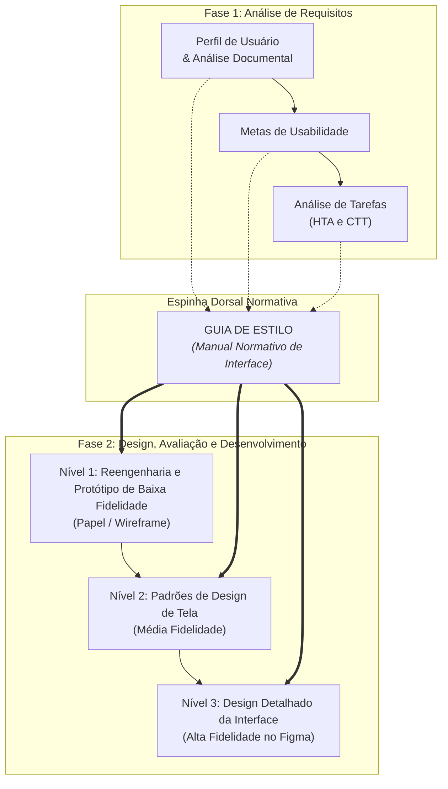

<div align="center" markdown="1">

<p align="center"><b>Tabela de Contribuição</b></p>

| Membro | Contribuição |
| :--- | :--- |
| Leonardo da Silva Lopes Júnior | Concepção, fundamentação teórica (Mayhew, 1999; Marcus, 1992), estruturação das 6 seções normativas do Guia de Estilo, definição da paleta de cores com verificação de contraste WCAG 2.1, escala tipográfica, grid responsivo, diretrizes de interação, elementos de ação (padrão antitrapaça de download) e vocabulário do domínio para o reprojeto do PCI Concursos. |
| Daniel da Silva Batista | Revisão técnica da coerência metodológica com o ciclo de Mayhew e alinhamento com as metas de usabilidade. |
| Pedro Rocha Ferreira Lima | Revisão da conformidade visual com os achados de análise de requisitos e padrões de acessibilidade. |
| Gemini | Auxílio na estruturação textual, organização dos códigos de cores, diagramação em Markdown e checagem de conformidade com o checklist de IHC (conforme Política de Uso de IA). |

<p align="center"><b>Fonte:</b> Leonardo da Silva Lopes Júnior (2026).</p>

</div>

# Guia de Estilo

## 1. Introdução

### 1.1 Propósito e Objetivos do Guia de Estilo
O presente **Guia de Estilo** constitui o manual normativo de interface para o processo de redesign e reprojeto do portal **PCI Concursos** (`pciconcursos.com.br`). Seu objetivo primordial é estabelecer um conjunto consistente, rigoroso e acessível de diretrizes visuais, estruturais e de interação humana-computador, eliminando as ambiguidades ergonômicas, a poluição visual, a armadilha de botões falsos e os ruídos de navegação identificados ao longo da etapa de Análise de Requisitos.

Como destacado por Marcus (1992) e Barbosa e Silva (2010), o design de interface não é uma atividade meramente estética, mas um compromisso de engenharia comunicacional. Uma interface coesa permite que os usuários transfiram conhecimentos adquiridos entre diferentes telas do sistema, reduzindo a carga cognitiva de processamento e aumentando significativamente a previsibilidade operacional.

### 1.2 O Guia de Estilo no Ciclo de Vida de Mayhew (1999)
No âmbito do processo metodológico adotado pela equipe — o **Ciclo de Vida da Engenharia de Usabilidade de Deborah Mayhew (1999)** —, o Guia de Estilo atua como a espinha dorsal de transição entre a **Fase 1 (Análise de Requisitos)** e a **Fase 2 (Design, Avaliação e Desenvolvimento)**, conforme ilustrado no fluxo metodológico da Figura 1:

<div align="center" markdown="1">



<p align="center"><b>Figura 1:</b> O papel articulador do Guia de Estilo no Ciclo de Mayhew. <b>Fonte:</b> Leonardo da Silva Lopes Júnior (2026), adaptado de Mayhew (1999).</p>

</div>

O Guia de Estilo documenta os acordos de design estabelecidos pela equipe para assegurar que:
1. **No Nível 1 (Prototipação de Baixa Fidelidade / Protótipo de Papel):** As decisões de reengenharia respeitem a taxonomia do vocabulário, a divisão das zonas de tela e os fluxos hierárquicos delineados no HTA e CTT.
2. **No Nível 2 (Padrões de Design de Tela / Média Fidelidade):** A grade (*grid*), os espaçamentos, a disposição espacial dos componentes e os estilos de interação mantenham uniformidade estrutural.
3. **No Nível 3 (Design Detalhado / Alta Fidelidade):** As especificações exatas de paleta de cores (com contraste auditado), tipografia fluida, iconografia vetorial e estados de botões e formulários sejam aplicadas com fidelidade de produção.

### 1.3 Público-Alvo e Forma de Utilização
Este guia destina-se a múltiplos papéis envolvidos no ciclo de vida do projeto:
* **Projetistas e Designers de Interação (UI/UX):** Como especificação mandatória de padrões visuais, grids, dimensões de toque e componentes reutilizáveis para a prototipação no Figma.
* **Desenvolvedores Front-End:** Como biblioteca viva de design tokens (variáveis de cor, espaçamentos, regras de responsividade e comportamentos de estados).
* **Avaliadores de Usabilidade:** Como instrumento de inspeção analítica e verificação heurística, confrontando os protótipos gerados com as normas aqui padronizadas.
* **Redatores e Conteudistas (UX Writers):** Como referência lexical para manutenção do tom de voz e prevenção de ambiguidades terminológicas no domínio de seleções públicas.

### 1.4 Conformidade com o Checklist da Disciplina (Itens 15, 16 e 17)
Em estrito cumprimento aos critérios de avaliação da disciplina de Interação Humano-Computador (SALES, 2026), este documento atende integralmente aos itens de verificação do Guia de Estilo:

<div align="center" markdown="1">

<p align="center"><b>Tabela 1: Conformidade com os Itens de Verificação do Guia de Estilo</b></p>

| Item do Checklist | Critério Avaliado | Onde é Atendido neste Documento |
| :---: | :--- | :--- |
| **Item 15** | *O artefato possui uma introdução contextualizando o propósito do guia, sua vinculação com a Engenharia de Usabilidade de Mayhew (1999) e seu público-alvo?* | **Seção 1 (Introdução):** Subseções 1.1, 1.2, 1.3 e diagrama metodológico da Figura 1. |
| **Item 16** | *O artefato documenta e articula os resultados das etapas anteriores de análise (perfil de usuário, personas, cenários, análise de tarefas) que fundamentaram as decisões de design?* | **Seção 2 (Resultados de Análise):** Mapeamento empírico de DOC-01 a DOC-04, Personas PER-01 a PER-04, gargalos do HTA/CTT e derivação de metas na Tabela 2. |
| **Item 17** | *O artefato estabelece detalhadamente as diretrizes de Elementos de Interface (grid, cores, tipografia), Elementos de Interação, Elementos de Ação e Vocabulário/Padrões?* | **Seções 3, 4, 5 e 6:** Especificação completa com paleta auditada por contraste WCAG, escala tipográfica modular, botões com regra antitrapaça de download e vocabulário controlado. |

<p align="center"><b>Fonte:</b> Leonardo da Silva Lopes Júnior (2026).</p>

</div>

---

## 2. Resultados de Análise: Fundamentação das Decisões de Design

O design proposto neste guia não decorre de preferências arbitrárias, mas de uma resposta direta e fundamentada aos diagnósticos empíricos e documentais levantados na [Etapa 2 (Análise de Requisitos)](../analise-de-requisitos/perfil-de-usuario.md).

### 2.1 Conexão com Perfis de Usuário e Análise Documental
Os estudos documentais demonstraram que o portal atende a um público amplo e heterogêneo sob condições tecnológicas desafiadoras:
* **DOC-01 (Demografia Geral de Concurseiros):** Usuários de diversas faixas etárias demandam previsibilidade e alta clareza na hierarquia da informação.
* **DOC-02 (Concentração Geográfica e Prazos):** Mais de 65% das oportunidades de interesse regional concentram-se no DF e RIDE, e até 80% dos editais sofrem retificações. Isso exige destaque visual imediato para estados e alertas cronológicos evidentes no cabeçalho dos certames.
* **DOC-03 (Mobile e Estudantes Universitários):** Mais de 50% dos estudantes acessam materiais por smartphones em trânsito ou redes celulares de banda limitada, exigindo layout responsivo com zero deslocamento de conteúdo (*Cumulative Layout Shift*).
* **DOC-04 (Microaprendizagem e Dupla Jornada):** Concurseiros que trabalham em regime CLT dispõem de pequenas janelas de estudo (intervalos de almoço) e dependem de notificações assíncronas segmentadas por e-mail para não perder prazos de abertura de vagas.

### 2.2 Requisitos Derivados das Personas
As quatro personas modeladas no projeto orientam diretamente as escolhas de interface:
1. **Maria Helena dos Santos (PER-01 — 53 anos, Concurseira Ativa e Cautelosa):** Apresenta fadiga visual decorrente de leitura prolongada em telas e vulnerabilidade cognitiva a anúncios que mimetizam links operacionais.  
   $\rightarrow$ *Decisão de Design:* Contraste tipográfico elevado (WCAG AAA), espaçamento generoso entre linhas e **completo isolamento cromático e espacial dos botões de download legítimos**.
2. **Lucas Ferreira Rocha (PER-02 — 24 anos, Iniciante Dinâmico):** Navega predominantemente por smartphone à procura de editais imediatos no DF.  
   $\rightarrow$ *Decisão de Design:* Filtros regionais instantâneos (*chips/pills* reativas) e sumário de prazos visíveis sem rolagem longa.
3. **Thiago Moraes Albuquerque (PER-03 — 21 anos, Estudante Universitário):** Utiliza smartphones de tela pequena em transporte público e busca simulados e oportunidades de estágio.  
   $\rightarrow$ *Decisão de Design:* Áreas de toque aumentadas (mínimo de 44x44px), modo foco para resolução de questões e desambiguação clara do vocabulário "estágio de estudante" versus "estágio probatório".
4. **Renata Cristina Freitas (PER-04 — 31 anos, Analista Administrativa CLT):** Estuda videoaulas durante intervalos de trabalho e precisa receber boletins no e-mail sem poluição de spams.  
   $\rightarrow$ *Decisão de Design:* Player de vídeo integrado sem sobreposição de banners no modo horizontal móvel e formulário de inscrição em newsletter com segmentação obrigatória por estado (UF) e carreira.

### 2.3 Metas de Usabilidade e Experiência do Usuário (Mayhew, 1999)
A Tabela 2 sintetiza as metas de usabilidade acordadas e como os padrões do guia asseguram seu atingimento:

<div align="center" markdown="1">

<p align="center"><b>Tabela 2: Metas de Usabilidade do Projeto e Soluções Normativas</b></p>

| Meta de Usabilidade | Problema Diagnosticado no PCI Atual | Solução Padronizada no Guia de Estilo |
| :--- | :--- | :--- |
| **Segurança no Uso** | Usuários clicam em anúncios com falsos botões *"DOWNLOAD"*, correndo risco de instalar malwares ou assinar serviços indesejados. | **Padrão Antitrapaça:** Botão de download de provas/editais possui identidade visual exclusiva (azul sólido com ícone de PDF e peso do arquivo) e área de respiro de no mínimo 32px livre de publicidade externa. |
| **Eficácia** | Usuários gastam até 12 minutos buscando vagas de estágio ou editais do DF sem encontrar resultados válidos por falta de filtros. | **Filtros Facetados e Desambiguação:** Seletor nativo por Unidade Federativa (UF) no topo da tabela e autocompletar com distinção semântica entre estágio estudantil e probatório. |
| **Eficiência** | Navegação lenta exigindo múltiplos recarregamentos de página (*full reload*) e rolagem exaustiva de listas não paginadas. | **Carregamento Assíncrono e Paginação:** Atualização de resultados sob demanda com resposta em menos de 200ms e paginação compacta de 20 a 50 certames por bloco. |
| **Facilidade de Aprendizado (*Learnability*)** | Menus com 15 itens desorganizados sem taxonomia lógica, confundindo ferramentas de estudo com notícias. | **Hierarquia de Navegação Semântica:** Agrupamento do menu principal em quatro categorias funcionais com ícones e rótulos concisos. |
| **Acessibilidade (WCAG 2.1 AA)** | Textos em fontes inferiores a 12px, baixo contraste de cores e áreas de clique reduzidas no mobile. | **Conformidade WCAG 2.1:** Contraste mínimo de texto de 4.5:1 (normal) e 7:1 (grande), tipografia base de 16px e alvos de toque mínimos de 44x44px. |

<p align="center"><b>Fonte:</b> Leonardo da Silva Lopes Júnior (2026).</p>

</div>

---

## 3. Elementos de Interface

### 3.1 Disposição Espacial e Sistema de Grid
Para garantir consistência e adaptabilidade fluida entre diferentes formatos de tela (smartphones, tablets, notebooks e monitores de mesa), adota-se um **sistema de grid baseado em 12 colunas** com dimensionamento modular baseado na unidade de **8 pontos (8pt Grid System)**:

<div align="center" markdown="1">

<p align="center"><b>Tabela 3: Especificações do Grid Responsivo por Dispositivo</b></p>

| Parâmetro | Mobile (Smartphone) | Tablet (Retrato/Paisagem) | Desktop (Notebook/Monitor) |
| :--- | :---: | :---: | :---: |
| **Faixa de Viewport** | 360 px a 767 px | 768 px a 1023 px | 1024 px a 1440 px+ |
| **Número de Colunas** | 4 colunas | 8 colunas | 12 colunas |
| **Margem Externa (*Margin*)** | 16 px | 24 px | 32 px (centralizado com largura máx. de 1280 px) |
| **Espaçamento entre Colunas (*Gutter*)** | 12 px | 16 px | 24 px |
| **Unidade Base de Espaçamento** | 4 px / 8 px | 8 px | 8 px |

<p align="center"><b>Fonte:</b> Leonardo da Silva Lopes Júnior (2026).</p>

</div>

#### Escala Modular de Espaçamentos (Spacing Tokens)
Todos os espaçamentos internos (*padding*) e externos (*margin*) dos componentes devem utilizar estritamente a escala de múltiplos de 8px (com exceção do token de 4px para microajustes de ícones e badges):
* `$space-xxs`: `4px` (margem mínima entre ícone e rótulo de texto)
* `$space-xs`: `8px` (padding interno de badges e botões compactos)
* `$space-sm`: `16px` (padding interno de cartões e inputs de formulário)
* `$space-md`: `24px` (gutter de colunas em desktop e respiro entre blocos de formulário)
* `$space-lg`: `32px` (distância entre seções consecutivas de conteúdo)
* `$space-xl`: `48px` (margem de respiro de títulos principais e áreas de banner)
* `$space-2xl`: `64px` (espaçamento de rodapé institucional)

#### Zonas Estruturais da Tela
A interface do novo PCI Concursos é dividida em quatro zonas funcionais bem definidas:
1. **Cabeçalho Persistente (*Header*):** Altura fixa de 64px no desktop (56px no mobile), integrando o logotipo oficial à esquerda, barra de pesquisa global centralizada com atalho `/`, e acesso rápido a perfis e alertas à direita.
2. **Barra de Navegação Primária (*Navigation Bar*):** Disposta logo abaixo do cabeçalho, categorizada em blocos semânticos: *Início*, *Concursos por Região*, *Provas & Gabaritos*, *Aulas & Dicas*, *Simulados* e *Alertas por E-mail*.
3. **Área Principal de Conteúdo (*Main Content Area*):** Largura máxima delimitada de 1280px, centralizada na janela. **Regra de layout:** Proibida a intercalação de publicidade comercial entre itens de uma mesma listagem de notícias ou tabelas de concursos.
4. **Rodapé Institucional (*Footer*):** Zonas claramente delimitadas para mapa do site, informações institucionais, link de acessibilidade, política de privacidade (LGPD) e canais de contato.

---

### 3.2 Paleta de Cores e Contraste Acessível
A paleta cromática do novo portal foi concebida para preservar a identidade visual histórica do PCI Concursos (centrada nos tons de azul), corrigindo rigorosamente os graves problemas de contraste e ilegibilidade identificados no site original.

Todas as combinações de cor para textos e fundos foram auditadas com base no algoritmo WCAG 2.1, assegurando no mínimo o nível **AA** (razão de contraste de 4.5:1 para texto normal e 3:1 para texto grande/componentes interativos) e alcançando o nível **AAA** (7:1) nos elementos de maior importância de leitura.

<div align="center" markdown="1">

<p align="center"><b>Tabela 4: Paleta Cromática Institucional e Operacional</b></p>

| Nome do Token | Código Hexadecimal | Amostra Visual | Uso Recomendado | Razão de Contraste (Fundo) | Nível WCAG |
| :--- | :---: | :---: | :--- | :---: | :---: |
| **`$color-primary-dark`** | `#003366` | <span style="background-color:#003366;color:#FFF;padding:4px 12px;border-radius:4px;font-weight:bold;">#003366</span> | Azul institucional escuro. Cabeçalhos principais, títulos H1/H2 e barras de topo. | 11.2:1 (sobre fundo branco) | **AAA** |
| **`$color-primary`** | `#0056B3` | <span style="background-color:#0056B3;color:#FFF;padding:4px 12px;border-radius:4px;font-weight:bold;">#0056B3</span> | Azul de ação principal. Botões primários legítimos, links ativos e abas selecionadas. | 7.3:1 (sobre fundo branco) | **AAA** |
| **`$color-primary-light`** | `#EBF3FA` | <span style="background-color:#EBF3FA;color:#003366;padding:4px 12px;border-radius:4px;font-weight:bold;">#EBF3FA</span> | Azul suave. Fundo de cards destacados, linhas zebradas de tabelas e estados hover suaves. | 10.5:1 (com texto escuro) | **AAA** |
| **`$color-surface-bg`** | `#F8F9FA` | <span style="background-color:#F8F9FA;color:#24292F;padding:4px 12px;border-radius:4px;border:1px solid #D0D7DE;font-weight:bold;">#F8F9FA</span> | Fundo geral da página. Garante respiro e conforto visual sem ofuscamento de branco puro. | Base | — |
| **`$color-surface-card`** | `#FFFFFF` | <span style="background-color:#FFFFFF;color:#24292F;padding:4px 12px;border-radius:4px;border:1px solid #D0D7DE;font-weight:bold;">#FFFFFF</span> | Branco puro. Superfície de cartões, modais de diálogo e caixas de formulário. | Base | — |
| **`$color-text-main`** | `#24292F` | <span style="background-color:#24292F;color:#FFF;padding:4px 12px;border-radius:4px;font-weight:bold;">#24292F</span> | Cinza escuro profundo (quase preto). Corpo de texto, parágrafos e enunciados de questões. | 13.8:1 (sobre fundo branco) | **AAA** |
| **`$color-text-muted`** | `#57606A` | <span style="background-color:#57606A;color:#FFF;padding:4px 12px;border-radius:4px;font-weight:bold;">#57606A</span> | Cinza médio. Metadados, datas de postagem, legendas, número de vagas e créditos. | 4.8:1 (sobre fundo branco) | **AA** |
| **`$color-border`** | `#D0D7DE` | <span style="background-color:#D0D7DE;color:#24292F;padding:4px 12px;border-radius:4px;font-weight:bold;">#D0D7DE</span> | Cinza claro neutro. Linhas divisórias, bordas de cards e contornos de inputs inativos. | 3.1:1 (componente UI) | **AA** |
| **`$color-success`** | `#1A7F37` | <span style="background-color:#1A7F37;color:#FFF;padding:4px 12px;border-radius:4px;font-weight:bold;">#1A7F37</span> | Verde semântico. Status *"Inscrições Abertas"*, resposta correta em simulados e confirmação. | 4.6:1 (sobre fundo branco) | **AA** |
| **`$color-warning`** | `#9A6700` | <span style="background-color:#9A6700;color:#FFF;padding:4px 12px;border-radius:4px;font-weight:bold;">#9A6700</span> | Âmbar escuro. Status *"Retificação Publicada"*, *"Últimos Dias"* e prazos em encerramento. | 4.7:1 (sobre fundo branco) | **AA** |
| **`$color-danger`** | `#CF222E` | <span style="background-color:#CF222E;color:#FFF;padding:4px 12px;border-radius:4px;font-weight:bold;">#CF222E</span> | Vermelho semântico. Status *"Inscrições Encerradas"*, gabarito incorreto e erros de formulário. | 4.9:1 (sobre fundo branco) | **AA** |

<p align="center"><b>Fonte:</b> Leonardo da Silva Lopes Júnior (2026).</p>

</div>

#### Paleta para Modo Escuro (Alto Contraste)
O portal deve suportar nativamente a alternância para Modo Escuro via token de preferência (`prefers-color-scheme: dark`) ou seletor manual na barra superior:
* Superfície de fundo: `#0D1117`
* Superfície de cartões: `#161B22`
* Bordas divisórias: `#30363D`
* Texto principal: `#E6EDF3` (contraste de 14.1:1)
* Texto secundário: `#8B949E` (contraste de 5.2:1)
* Azul primário no modo escuro: `#388BFD` (contraste de 6.1:1 sobre `#0D1117`)

---

### 3.3 Tipografia
A tipografia foi selecionada para garantir altíssima legibilidade em telas de diferentes resoluções e densidades de pixels (especialmente telas de smartphones com renderização sob luz solar).

* **Família Tipográfica Primária:** `Inter`, com fallback para fontes do sistema operacional (`-apple-system, BlinkMacSystemFont, "Segoe UI", Roboto, Helvetica, Arial, sans-serif`). A família *Inter* possui altura-x elevada, numerais tabulares claros e grande distinção entre caracteres facilmente confundíveis (como `I`, `l` e `1`).
* **Família Tipográfica Monospaçada (para códigos de vaga, datas e protocolos):** `ui-monospace, SFMono-Regular, "SF Mono", Menlo, Consolas, monospace`.

<div align="center" markdown="1">

<p align="center"><b>Tabela 5: Escala Tipográfica Modular do Sistema</b></p>

| Nível / Uso | Tamanho da Fonte | Altura de Linha (*Line Height*) | Peso (*Font Weight*) | Exemplo de Aplicação |
| :--- | :---: | :---: | :---: | :--- |
| **Título H1 (Display)** | 28 px (Mobile) / 32 px (Desktop) | 1.25 (36 px a 40 px) | Bold (700) | Nome do órgão no edital, título da página principal. |
| **Título H2 (Seção)** | 22 px (Mobile) / 24 px (Desktop) | 1.30 (28 px a 32 px) | SemiBold (600) | Títulos de categorias ("Concursos no Distrito Federal", "Aulas"). |
| **Título H3 (Subseção)** | 18 px (Mobile) / 20 px (Desktop) | 1.35 (24 px a 28 px) | SemiBold (600) | Título de cards de concursos, nomes de disciplinas. |
| **Subtítulo / Destaque** | 16 px | 1.40 (22 px) | Medium (500) | Resumo do concurso (cargos, escolaridade e remuneração). |
| **Corpo de Texto (Padrão)** | 16 px | 1.55 (24 px) | Regular (400) | Texto descritivo da notícia, enunciados de simulados, artigos. |
| **Texto Secundário / Apoio** | 14 px | 1.45 (20 px) | Regular (400) | Rótulos de campos de busca, metadados de datas e bancas. |
| **Legendas / Metadados** | 12 px | 1.40 (16 px) | Medium (500) | Badges de status ("DF", "Superior", "Inscrições Abertas"). |

<p align="center"><b>Fonte:</b> Leonardo da Silva Lopes Júnior (2026).</p>

</div>

**Regras Mandatórias de Tipografia:**
1. **Tamanho Mínimo Absoluto:** Nenhum texto legível pelo usuário (inclusive notas de rodapé de certame e termos legais) pode ter corpo inferior a **12px**.
2. **Largura Máxima de Linha de Leitura:** Em textos longos e descrições de editais, a largura do parágrafo não deve ultrapassar **75 a 80 caracteres por linha**, evitando fadiga ocular e desvio de foco visual.
3. **Alinhamento:** Todo texto de corpo deve ser **alinhado à esquerda**. O alinhamento justificado é estritamente proibido em ambientes web por criar espaçamentos irregulares (*rios brancos*) que dificultam a leitura para usuários com dislexia ou visão reduzida.

---

### 3.4 Iconografia e Logotipo

#### Padrão de Iconografia
A biblioteca de ícones adota um estilo **linear geométrico com espessura de traço uniforme de 2px** (*outline*), baseado no padrão visual *Lucide / Material Symbols*.
* **Dimensões Padronizadas:**
  * Ícones inline de texto e botões: `16 x 16 px` ou `20 x 20 px`.
  * Ícones de navegação e cartões de ferramentas: `24 x 24 px`.
  * Ícones de estados vazios e ilustrações funcionais: `48 x 48 px`.
* **Semântica Mandatória de Ícones:**
  * 🔍 **Busca:** Lupa sem detalhes internos.
  * 📄 **Download Autêntico de PDF:** Folha de documento com dobra superior e texto identificador `PDF`.
  * 📍 **Região / Localização:** Marcador de mapa (*pin*), utilizado nas tags regionais (ex.: `[📍 DF]`).
  * 📅 **Datas e Cronogramas:** Calendário de parede com indicação numérica.
  * 🔔 **Alertas e Notificações:** Sino com badge numérico.
  * ▶️ **Videoaulas:** Triângulo de reprodução circunscrito em círculo ou retângulo arredondado.
  * ⚠️ **Retificação de Edital:** Triângulo de exclamação em tom âmbar.
  * ♿ **Acessibilidade / PcD:** Símbolo internacional de acesso universal.

#### Aplicação do Logotipo do PCI Concursos
O logotipo oficial do portal deve ser exibido com área mínima de respiro igual à altura da letra inicial "P" em todas as suas margens laterais.
* Proibida a distorção proporcional da marca (estiramento horizontal ou vertical).
* No modo escuro, utiliza-se a versão monocromática branca/azul-claro (`pci_logo_white.png`), garantindo perfeito contraste contra o cabeçalho.

---

## 4. Elementos de Interação

### 4.1 Estilos de Interação Predominantes
O novo portal combina harmoniosamente três estilos de interação consagrados na literatura de IHC (Paternò, 1999; Barbosa e Silva, 2010):

1. **Manipulação Direta Reativa (Filtros e Chips):** A filtragem de concursos por região (Centro-Oeste, DF, GO) ou por área de formação não exige mais o recarregamento total da página. O usuário clica na etiqueta (*chip*) desejada e a lista é reordenada dinamicamente via requisição assíncrona com transição suave, mantendo o usuário em seu contexto original de tarefa.
2. **Preenchimento Guiado (Formulários e Busca Assistida):** Campos de pesquisa inteligente com sugestão preditiva (*autocompletar*) que apresenta os resultados agrupados por tipo (Órgãos Públicos, Disciplinas de Aulas, Bancas Examinadoras).
3. **Navegação em Camadas (Tabs e Acordeões):** Páginas de detalhamento de concursos organizam o grande volume de dados do edital em abas limpas: *"Visão Geral"*, *"Cargos e Salários"*, *"Cronograma & Retificações"* e *"Downloads Oficiais"*.

### 4.2 Aceleradores e Acessibilidade por Teclado
Para atender aos usuários frequentes (como Maria Helena e Renata) e garantir acessibilidade a pessoas com limitações motoras ou que dependem de leitores de tela:

* **Atalho Global de Busca:** Pressionar a tecla `/` em qualquer tela foca imediatamente o cursor no campo de pesquisa principal.
* **Atalho de Fechamento:** Pressionar a tecla `Esc` fecha qualquer modal aberto, menu gaveta (*drawer*) ou lista suspensa de autocompletar.
* **Navegação Sequencial por Tabulação (`Tab` e `Shift+Tab`):** Todos os componentes interativos (links, botões, campos de texto, checkboxes) possuem ordem lógica estrita no DOM (`tabindex`), percorrendo a tela de cima para baixo e da esquerda para a direita.
* **Anel de Foco Visível (*Focus Indicator*):** Componentes focados via teclado recebem um anel de contorno azul destacado de **3px com offset de 2px** (`box-shadow: 0 0 0 3px #0056B3`), eliminando a invisibilidade do foco.

### 4.3 Estados dos Componentes Interativos
Todo componente clicável deve fornecer feedback visual instantâneo para os cinco estados fundamentais:

<div align="center" markdown="1">

<p align="center"><b>Tabela 6: Matriz de Estados de Componentes Interativos</b></p>

| Estado | Comportamento Visual Padronizado | Feedback ao Usuário |
| :--- | :--- | :--- |
| **Padrão (*Default*)** | Cor institucional sólida ou contorno nítido conforme a hierarquia do componente. | O componente está disponível e pronto para uso. |
| **Passagem (*Hover*)** | Elevação de brilho/escurecimento sutil (10%), elevação de sombra de 2px para 4px e cursor em formato de mão (*pointer*). | Indica claramente que o elemento é clicável antes da ação. |
| **Foco (*Focus*)** | Anel externo azul com alto contraste de 3px, independente da cor de fundo. | Sinaliza a posição atual de navegação pelo teclado. |
| **Pressionado (*Active*)** | Redução sutil de escala visual (0.98) e escurecimento temporário de 15%. | Confirma fisicamente que o toque ou clique foi registrado. |
| **Carregando (*Loading*)** | Substituição do texto do botão por um indicador giratório (*spinner*) sutil e desativação de novos cliques. | Evita submissões repetidas e previne erros de rede. |
| **Desabilitado (*Disabled*)** | Opacidade reduzida para 45%, fundo cinza neutro e cursor em formato de bloqueio (*not-allowed*). | Comunica que a ação está temporariamente indisponível. |

<p align="center"><b>Fonte:</b> Leonardo da Silva Lopes Júnior (2026).</p>

</div>

### 4.4 Prevenção de Deslocamento de Layout (Zero CLS)
Um dos problemas mais graves relatados pelos usuários no PCI Concursos atual foi o salto involuntário de conteúdo (*layout shift*) gerado pelo carregamento tardio de propagandas comerciais, fazendo com que usuários tocassem acidentalmente em links não desejados (observado em USR-01, CEN-03 e CEN-05).

**Norma de Engenharia de Interface:**
* Todo e qualquer contêiner de anúncio, imagem ou vídeo deve ter suas dimensões de altura e largura reservadas previamente no CSS (`min-height` fixo e `aspect-ratio` definido). O layout da página deve permanecer 100% estático durante todo o processo de carregamento de scripts externos, mantendo a métrica **CLS (Cumulative Layout Shift) inferior a 0.05**.

---

## 5. Elementos de Ação

### 5.1 Hierarquia de Botões (Buttons & Actions)
Os botões do novo sistema são padronizados em quatro categorias formais, impedindo a concorrência visual desordenada:

<div align="center" markdown="1">

<p align="center"><b>Tabela 7: Hierarquia e Especificações de Botões</b></p>

| Tipo de Botão | Estilo Visual | Especificação CSS / Tokens | Exemplo de Aplicação no PCI |
| :--- | :--- | :--- | :--- |
| **Botão Primário** | Fundo azul sólido (`#0056B3`), texto branco, cantos arredondados de 6px, fonte semibold 16px. | `background: #0056B3; color: #FFF; border: none; padding: 12px 24px;` | *"Baixar Prova Oficial (PDF)"*, *"Buscar Concursos"*, *"Cadastrar Alertas"*. |
| **Botão Secundário** | Fundo transparente, borda de 1.5px em azul (`#0056B3`), texto azul, cantos arredondados de 6px. | `background: transparent; color: #0056B3; border: 1.5px solid #0056B3; padding: 12px 24px;` | *"Ver Retificações"*, *"Filtrar por Região"*, *"Refazer Questão"*. |
| **Botão Terciário (Fantasma)** | Fundo transparente, sem bordas, texto azul sublinhado no hover, padding compacto. | `background: transparent; color: #0056B3; border: none; padding: 8px 12px;` | *"Limpar Filtros"*, *"Voltar"*, *"Cancelar"*, *"Ver mais detalhes"*. |
| **Botão Destrutivo / Alerta** | Fundo vermelho sólido (`#CF222E`), texto branco, cantos de 6px. | `background: #CF222E; color: #FFF; border: none; padding: 12px 24px;` | *"Cancelar Assinatura de Alertas"*, *"Excluir Dados Salvos"*. |

<p align="center"><b>Fonte:</b> Leonardo da Silva Lopes Júnior (2026).</p>

</div>

---

### 5.2 O Padrão Antitrapaça de Download (Diretriz Crítica de Segurança e Usabilidade)
Conforme documentado nas sessões empíricas com usuários (USR-01) e nas análises de tarefas (TAR-02 e CEN-02), o portal original exibe banners de terceiros com grandes botões verdes com o texto *"DOWNLOAD"* posicionados estrategicamente ao lado do link real do arquivo. Isso induz usuários experientes e maduros a erros críticos de navegação.

Para eliminar definitivamente esse antipadrão, o novo portal institui a **Norma Mandatória Antitrapaça de Download**:

<div align="center" markdown="1">

```
+-----------------------------------------------------------------------------------+
|  [ZONA PROTEGIDA DE DOWNLOAD OFICIAL DO PCI CONCURSOS]                            |
|                                                                                   |
|   +---------------------------------------------------------------------------+   |
|   |  [PDF] Baixar Caderno de Questões Oficial (Assistente_Adm_2026.pdf)       |   |
|   |  Formato: PDF Oficial | Tamanho: 2.1 MB | Verificado: Banca Oficial       |   |
|   +---------------------------------------------------------------------------+   |
|   (Botão Primário Azul Sólido #0056B3 - Largura Total - Altura Mínima 52px)       |
|                                                                                   |
|   +---------------------------------------------------------------------------+   |
|   |  [PDF] Baixar Gabarito Definitivo Oficial (Pós-Recurso) (Gabarito.pdf)    |   |
|   |  Formato: PDF Oficial | Tamanho: 340 KB | Retificado em: 15/09/2026       |   |
|   +---------------------------------------------------------------------------+   |
|   (Botão Secundário Contornado com Ícone de Chave de Respostas)                   |
|                                                                                   |
|  * RAIO DE EXCLUSÃO PROTETIVO: Nenhum banner ou anúncio publicitário pode ser    |
|    posicionado a menos de 48px de distância vertical ou horizontal desta caixa.  |
+-----------------------------------------------------------------------------------+
```

<p align="center"><b>Figura 2:</b> Esquema do Padrão Antitrapaça de Download Seguro. <b>Fonte:</b> Leonardo da Silva Lopes Júnior (2026).</p>

</div>

**Requisitos do Padrão Antitrapaça:**
1. **Identificação Explícita do Arquivo:** O botão DEVE exibir o ícone universal de PDF, o nome do arquivo, a extensão `.pdf` e o tamanho em megabytes (ex.: `2.1 MB`).
2. **Selo de Verificação:** A caixa deve conter a etiqueta *"Arquivo Original e Verificado pelo PCI Concursos"*.
3. **Disparo Transparente:** O link deve forçar a abertura em nova aba com cabeçalho seguro ou download direto (`download="nome_arquivo.pdf"`), sem passar por páginas intermediárias de contagem regressiva comercial (*interstitials*).

---

### 5.3 Formulários e Campos de Entrada de Dados

#### Regras de Construção de Campos
* **Rótulos Fixos (*Floating Labels* ou *Top Labels*):** O rótulo do campo deve permanecer visível acima da caixa de texto o tempo todo. É terminantemente proibido utilizar o atributo `placeholder` como substituto do rótulo, pois o texto desaparece no momento em que o usuário inicia a digitação.
* **Mensagens de Ajuda e Validação em Tempo Real:** Erros de digitação (ex.: formato de e-mail inválido) devem ser sinalizados imediatamente ao sair do campo (*onBlur*), com borda vermelha suave (`#CF222E`) e mensagem de instrução clara posicionada abaixo do campo.
* **Alvos de Toque Acessíveis:** Em dispositivos móveis, todos os campos de texto e caixas de seleção devem ter altura mínima de **48px** e padding horizontal de **16px**.

---

### 5.4 Componente de Busca Inteligente com Desambiguação
Para resolver a falha crítica diagnosticada na Tarefa 06 (TAR-06) e no Cenário 06 (CEN-06), onde a busca pelo termo *"estágio"* retornava dezenas de referências ao *estágio probatório* do servidor público em vez de vagas para estudantes, o componente de busca implementa **Desambiguação Semântica Instantânea**:

<div align="center" markdown="1">

```
Campo de Busca: [ estágio____________________________________________ ] [Buscar]
                |
                v  (Menu Suspenso Preditivo de Desambiguação)
+-------------------------------------------------------------------------------+
|  Você está procurando por:                                                    |
|                                                                               |
|  🎓 Vagas de Estágio para Estudantes (Nível Superior / Médio no DF)          |
|     Ver oportunidades de estágio e programas de ingresso em órgãos públicos  |
|                                                                               |
|  ⚖️ Regras de Estágio Probatório de Servidores Públicos                       |
|     Ver cláusulas de avaliação em editais de concursos efetivos               |
+-------------------------------------------------------------------------------+
```

<p align="center"><b>Figura 3:</b> Padrão de Desambiguação Semântica da Busca. <b>Fonte:</b> Leonardo da Silva Lopes Júnior (2026).</p>

</div>

---

### 5.5 Formulário de Alertas de Vagas por E-mail (Resolução de TAR-08)
O formulário de assinatura da newsletter é reestruturado de uma caixa genérica para uma **Central de Alertas Personalizados de Vagas**, atendendo às demandas da Persona Renata (`PER-04`):

1. **Campo de E-mail:** Com validação sintática imediata em tempo real.
2. **Seletores Obrigatórios de Segmentação:**
   * Caixas de seleção de Unidades Federativas de interesse (com destaque para `Distrito Federal (DF)` e `Goiás (GO)`).
   * Seletor de Escolaridade Mínima (*Nível Médio*, *Nível Técnico*, *Nível Superior*).
   * Seletor de Carreira Prioritária (*Administrativa*, *Tribunais/Jurídica*, *Fiscal*, *Segurança Pública*, *Educação*, *Saúde*).
3. **Periodicidade:** Opção de escolha entre *Boletim Diário (resumo matinal)* ou *Boletim Semanal Consolidado (às sextas-feiras)*.
4. **Consentimento Explícito (LGPD):** Caixa de seleção desmarcada por padrão: *"Concordo em receber alertas de concursos conforme a Política de Privacidade e posso cancelar a qualquer momento com 1 clique"*.

---

## 6. Vocabulário e Padrões de Conteúdo

### 6.1 Taxonomia Padronizada do Domínio de Concursos
Para reduzir a sobrecarga de leitura e padronizar o vocabulário técnico entre diferentes órgãos e bancas examinadoras, adota-se o glossário unificado da Tabela 8:

<div align="center" markdown="1">

<p align="center"><b>Tabela 8: Vocabulário Controlado de Termos do PCI Concursos</b></p>

| Termo Padronizado | Definição Semântica | Termos Proibidos / Obsoletos |
| :--- | :--- | :--- |
| **Inscrições Abertas** | O certame está com o período de cadastro e pagamento da taxa ativo no momento da consulta. | "Aberta", "Inscrição ativa", "Matrículas". |
| **Inscrições Previstas / Autorizado** | O concurso foi autorizado oficialmente ou teve edital iminente anunciado, mas os cadastros ainda não iniciaram. | "Previsto", "Vai sair", "Em breve". |
| **Inscrições Encerradas** | O prazo limite para submissão de cadastro expirou; aguarda-se realização de prova ou resultados. | "Fechado", "Encerrado", "Passou o prazo". |
| **Retificação de Edital** | Publicação oficial contendo alteração formal de cronograma, requisitos, conteúdo programático ou cotas. | "Errata avulsa", "Mudança", "Nota de jornal". |
| **Caderno de Provas** | Arquivo oficial contendo as questões aplicadas na prova objetiva/discursiva para determinado cargo. | "Teste", "Exame", "Avaliação". |
| **Gabarito Oficial Preliminar** | Folha de respostas divulgada pela banca organizadora antes do julgamento dos recursos dos candidatos. | "Chave de respostas", "Resultados provisórios". |
| **Gabarito Oficial Definitivo** | Folha de respostas final validada pós-recursos, indicando formalmente eventuais questões anuladas. | "Gabarito final", "Respostas definitivas". |
| **Estágio para Estudantes** | Oportunidade de estágio curricular remunerado para alunos de graduação ou ensino médio. | Apenas "Estágio" (ambíguo com probatório). |
| **Estágio Probatório** | Período legal de avaliação de aptidão funcional do servidor público recém-empossado (Lei 8.112/90). | Apenas "Estágio". |

<p align="center"><b>Fonte:</b> Leonardo da Silva Lopes Júnior (2026).</p>

</div>

### 6.2 Tom de Voz e Diretrizes de Redação (UX Writing)
* **Objetivo e Claro:** Textos breves e informativos. Concurseiros estudam sob pressão de tempo e necessitam de informações cruciais (órgão, vagas, remuneração, data da prova e taxa) nos primeiros 3 segundos de leitura.
* **Transparente e Fidedigno:** Nunca utilizar chamadas sensacionalistas (*clickbait*) como *"Salários milionários abertos!"*. Empregar o valor remuneratório exato estipulado no edital com indicação da jornada de trabalho (ex.: *"Remuneração: R$ 8.529,67 - 40h semanais"*).
* **Empático e Orientador em Falhas:** Mensagens de erro devem sempre prescrever a rota de solução para o usuário. Em vez de *"Erro 404: Concurso não encontrado"*, utilizar: *"Não encontramos concursos para 'Mecânico em Brasília'. Tente selecionar 'Todas as Cidades do DF' ou conferir concursos previstos."*

### 6.3 Padrão de Estados Vazios (*Empty States*)
Quando uma filtragem ou pesquisa não retornar resultados, a interface DEVE apresentar um componente de estado vazio educativo, contendo:
1. Ilustração suave ou ícone representativo (48px).
2. Título claro: *"Nenhum concurso encontrado para os filtros selecionados"*.
3. Texto explicativo com sugestão alternativa.
4. Botão de ação direta: `[Limpar todos os filtros]` ou `[Cadastrar Alerta para quando esta vaga abrir]`.

---

## 7. Apresentação do Guia: Como o Novo Design Resolve os Diagnósticos da Etapa 2

Na apresentação formal da Etapa 3 perante a disciplina, este Guia de Estilo demonstra como o novo design soluciona de ponta a ponta cada um dos problemas identificados na avaliação do portal:

<div align="center" markdown="1">

<p align="center"><b>Tabela 9: Mapeamento Diagnóstico-Solução do Reprojeto PCI Concursos</b></p>

| Problema Diagnosticado na Etapa 2 | Artefato de Origem | Solução Padronizada no Guia de Estilo | Impacto Direto na Experiência |
| :--- | :---: | :--- | :--- |
| Botões falsos de download em anúncios enganosos | **USR-01 / CEN-02 / TAR-02** | **Padrão Antitrapaça de Download (Seção 5.2):** Botão azul sólido padronizado com ícone de PDF, tamanho do arquivo e raio de isolamento de 48px livre de publicidade. | Elimina o risco de cliques enganosos para usuários maduros como Maria Helena (`PER-01`). |
| Impossibilidade de filtrar apenas o DF na listagem do Centro-Oeste | **DOC-02 / CEN-03 / TAR-03** | **Grid Reativo com Chips Regionais (Seções 3.1 e 4.1):** Seletores instantâneos de UF no topo da tabela sem recarregamento de página. | Permite a Lucas (`PER-02`) encontrar seleções de Brasília em menos de 5 segundos no celular. |
| Retificações de editais ocultas no fim da página sem destaque visual | **DOC-02 / CEN-04 / TAR-04** | **Badges e Alertas Semânticos (Seções 3.2 e 6.1):** Selo âmbar destacado no cabeçalho: `[⚠️ Retificação Publicada em DD/MM]`. | Impede a perda de prazos de inscrições e provas alteradas por bancas. |
| Layout quebrado no celular e perda de progresso em simulados | **DOC-03 / CEN-05 / TAR-05** | **Grid Mobile Modular e Zero CLS (Seções 3.1 e 4.4):** Áreas de toque de 48px, contêineres estáveis e persistência de dados no navegador. | Garante a Thiago (`PER-03`) resolver questões no ônibus sem marcações acidentais. |
| Colisão terminológica de "estágio" e ausência de vagas estudantis | **DOC-03 / CEN-06 / TAR-06** | **Desambiguação Semântica na Busca (Seção 5.4) e Vocabulário Controlado:** Distinção entre estágio acadêmico e probatório. | Evita 12 minutos de busca frustrada e abandono do portal por estudantes. |
| Videoaulas sem trilha pedagógica e layout móvel instável | **DOC-04 / CEN-07 / TAR-07** | **Modo Foco e Player Responsivo (Seções 3.1 e 4.3):** Eliminação de banners sobrepostos no modo paisagem e trilhas com PDF anexo. | Permite a Renata (`PER-04`) estudar em intervalos de trabalho de 30 minutos com qualidade. |
| Newsletter massiva sem filtro regional e sem saída fácil | **DOC-04 / CEN-08 / TAR-08** | **Central de Alertas Parametrizados (Seção 5.5):** Seleção de UF e carreira, frequência configurável e cancelamento em 1 clique (LGPD). | Acaba com a poluição de caixa de entrada de concurseiros ativos com dupla jornada. |

<p align="center"><b>Fonte:</b> Leonardo da Silva Lopes Júnior (2026).</p>

</div>

---

## 8. Bibliografia

> BARBOSA, Simone D. J.; SILVA, Bruno S. da. *Interação Humano-Computador*. Rio de Janeiro: Elsevier, 2010.  
> BARBOSA, Simone D. J. et al. *Interação Humano-Computador e Experiência do Usuário*. 1. ed. Autopublicação, 2021. ISBN: 978-65-00-19677-1.  
> COOPER, Alan. *The Inmates Are Running the Asylum: Why High Tech Products Drive Us Crazy and How to Restore the Sanity*. Indianapolis: Sams Publishing, 1999.  
> MARCUS, Aaron. *Graphic Design for Electronic Documents and User Interfaces*. New York: ACM Press / Addison-Wesley, 1992.  
> MAYHEW, Deborah J. *The Usability Engineering Lifecycle: A Practitioner's Handbook for User Interface Design*. San Francisco: Morgan Kaufmann, 1999.  
> NIELSEN, Jakob. *Usability Engineering*. San Francisco: Morgan Kaufmann, 1993.  
> PATERNÒ, Fabio. *Model-Based Design and Evaluation of Human-Computer Interfaces*. London: Springer-Verlag, 1999.  
> SALES, André Barros de. *Plano de ensino FIHC 022026 – Turma 01*. Brasília: FCTE/UnB, 2026.  
> W3C. *Web Content Accessibility Guidelines (WCAG) 2.1*. World Wide Web Consortium, 2018. Disponível em: <https://www.w3.org/TR/WCAG21/>.

## 9. Histórico de Versões

<div align="center" markdown="1">

| Versão | Data | Descrição | Autor(es) | Revisor(es) |
| :---: | :---: | :--- | :---: | :---: |
| `1.0` | 06/10/2026 | Criação do Guia de Estilo para a Etapa 3 segundo o ciclo de Mayhew (1999), estruturado nas 6 seções normativas (Introdução, Resultados de Análise, Elementos de Interface, Elementos de Interação, Elementos de Ação e Vocabulário), inclusão do padrão antitrapaça de download, paleta acessível WCAG 2.1 e articulação com os Itens 15, 16 e 17 do checklist da disciplina. | Leonardo da Silva Lopes Júnior | Daniel da Silva Batista |

</div>
