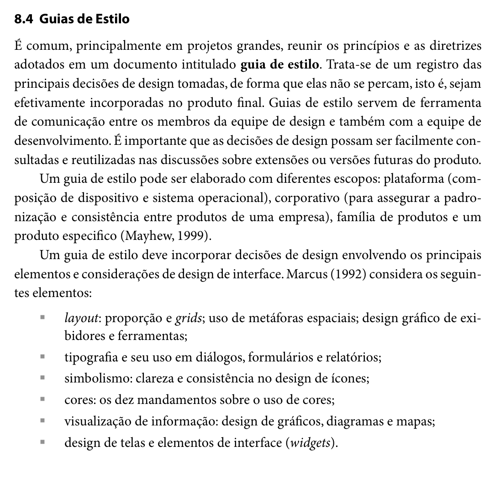
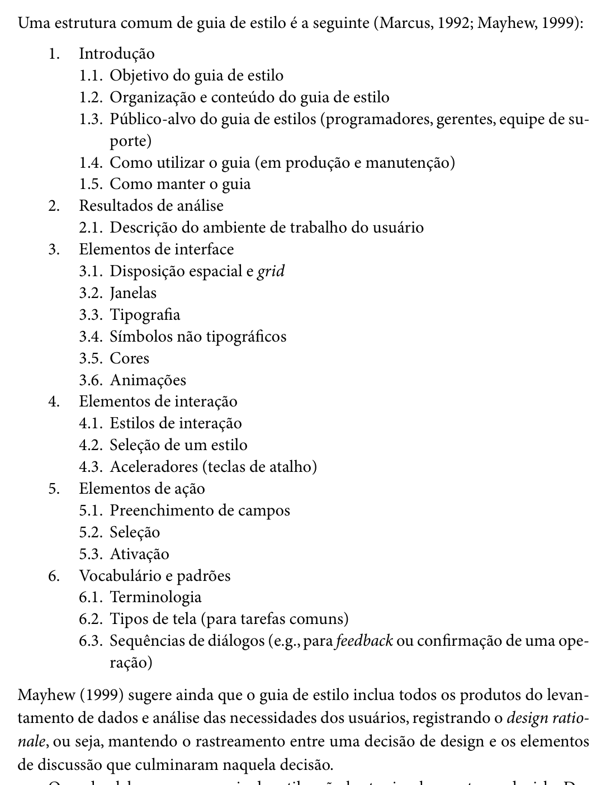

**Responsável:** Leonardo da Silva Lopes Júnior — Guia de estilo  
**Autor dos itens 15, 16 e 17:** Leonardo da Silva Lopes Júnior

<div align="center" markdown="1">

<p align="center"><b>Tabela de Contribuição</b></p>

| Membro | Contribuição |
| :--- | :--- |
| Leonardo da Silva Lopes Júnior | Concepção, fundamentação teórica (Mayhew, 1999; Marcus, 1992; Barbosa e Silva, 2010), estruturação formal dos itens 15, 16 e 17 com inclusão dos recortes bibliográficos do livro (Figuras 1 e 2), especificação completa das 6 seções normativas do Guia de Estilo (Introdução, Resultados de Análise, Elementos de Interface, Elementos de Interação, Elementos de Ação e Vocabulário), inclusão do padrão antitrapaça de download, paleta auditada WCAG 2.1 e demonstração de correspondência com o portal PCI Concursos. |
| Daniel da Silva Batista | Revisão técnica da coerência metodológica com o ciclo de Mayhew e alinhamento com as metas de usabilidade. |
| Pedro Rocha Ferreira Lima | Revisão da conformidade visual com os achados de análise de requisitos e padrões de acessibilidade. |
| Gemini | Auxílio na estruturação textual, organização dos códigos de cores, diagramação em Markdown e checagem de conformidade com o checklist de IHC (conforme Política de Uso de IA). |

<p align="center"><b>Tabela 1:</b> Contribuição neste artefato. <b>Fonte:</b> Leonardo da Silva Lopes Júnior (2026).</p>

</div>

# Guia de Estilo — PCI Concursos

## Introdução

Este documento apresenta o **Guia de Estilo** para o reprojeto do portal **PCI Concursos** (`pciconcursos.com.br`), correspondente aos **itens oficiais 15, 16 e 17** da Entrega 3 da disciplina de Interação Humano-Computador da Universidade de Brasília (SALES, 2026).

No modelo de ciclo de vida da Engenharia de Usabilidade proposto por Deborah Mayhew (1999), adotado pelo Grupo 07 em seu [Processo de Design](../planejamento/processo-de-design.md), a fase de **Análise de Requisitos** tem como um de seus principais produtos a elaboração do guia de estilo. Esse documento sintetiza e operacionaliza as diretrizes, princípios de IHC e metas de usabilidade derivados da análise de tarefas, do perfil de usuário e das possibilidades e limitações da plataforma, garantindo que as decisões de design sejam mantidas e reflitam no produto final de forma consistente (BARBOSA; SILVA, 2010, p. 109-110, 282).

---

## Itens de Conteúdo da Disciplina

### O que é um Guia de Estilo (Item 15)
* **Autor do item:** Leonardo da Silva Lopes Júnior

Segundo Barbosa e Silva (2010, p. 282), é prática comum, sobretudo em projetos de grande escala ou em reprojetos de sistemas complexos, reunir os princípios e as diretrizes adotados em um documento formal intitulado **guia de estilo**. Esse documento atua como o registro central das principais decisões de design concebidas pela equipe, impedindo que se dispersem ao longo do ciclo de vida e assegurando que sejam fielmente incorporadas à interface final.

Além disso, os autores destacam que os guias de estilo desempenham um papel fundamental como ferramenta de comunicação entre os designers de interação, desenvolvedores front-end, redatores e mantenedores do sistema, permitindo que soluções consolidadas sejam consultadas e reaproveitadas em extensões e versões futuras. Conforme apontado por Mayhew (1999), um guia de estilo pode abranger quatro escopos:
1. **De plataforma:** restrito às convenções do sistema operacional e hardware;
2. **Corporativo:** padronização entre diversos produtos de uma mesma instituição;
3. **De família de produtos:** regras comuns a uma suíte de softwares integrados;
4. **De um produto específico:** escopo este adotado formalmente neste projeto, focado nas particularidades e fluxos do **PCI Concursos**.

A Figura 1 reproduz o trecho da literatura (Seção 8.4, p. 282) que fundamenta a definição e a importância do guia de estilo.

<div align="center" markdown="1">



<p align="center"><b>Figura 1:</b> Definição e escopo de Guias de Estilo na literatura de IHC. <b>Fonte:</b> BARBOSA; SILVA (2010, p. 282), recorte do livro.</p>

</div>

---

### Estrutura do Guia de Estilo (Item 16)
* **Autor do item:** Leonardo da Silva Lopes Júnior

Para garantir abrangência, rigor técnico e conformidade acadêmica, Barbosa e Silva (2010, p. 283) sintetizam a estrutura clássica proposta por Marcus (1992) e Mayhew (1999) para a composição de guias de estilo. Essa estrutura organiza as decisões de design em seis seções fundamentais:

1. **Introdução:** define o objetivo do guia, sua organização interna, o público-alvo (programadores, gerentes, equipe de suporte, designers), diretrizes de uso tanto na produção quanto na manutenção e procedimentos para mantê-lo atualizado;
2. **Resultados de análise:** registra a descrição do ambiente de trabalho do usuário (condições físicas, contextuais e técnicas de uso identificadas no perfil do usuário e na plataforma) e metas de usabilidade;
3. **Elementos de interface:** padroniza a disposição espacial e grid de tela, comportamento de janelas e modais, tipografia institucional, símbolos não tipográficos (ícones e marcas), paleta de cores e animações/transições;
4. **Elementos de interação:** especifica os estilos de interação suportados (menus, busca, links), a justificativa da seleção dos estilos predominantes e aceleradores (teclas de atalho e acessibilidade);
5. **Elementos de ação:** padroniza os mecanismos de preenchimento de campos em formulários, elementos de seleção (dropdowns, checkboxes, rádios) e mecanismos de ativação (botões e acionadores);
6. **Vocabulário e padrões:** estabelece a terminologia oficial e compreensível para os termos de domínio, os tipos de telas para as tarefas comuns e as sequências de diálogos (mensagens de confirmação, avisos de erro e feedback).

Adicionalmente, Mayhew (1999) recomenda explicitar o *design rationale* (a justificativa de cada decisão), assegurando o rastreamento direto entre os problemas levantados nas etapas anteriores e os elementos de interface projetados. A Figura 2 ilustra o trecho da literatura (Seção 8.4, p. 283) que estabelece essa divisão estrutural.

<div align="center" markdown="1">



<p align="center"><b>Figura 2:</b> Estrutura de Guia de Estilo segundo Marcus (1992) e Mayhew (1999). <b>Fonte:</b> BARBOSA; SILVA (2010, p. 283), recorte do livro.</p>

</div>

---

## Estrutura Normativa do Guia de Estilo

A seguir, apresentam-se as decisões de design do novo **PCI Concursos** organizadas rigorosamente segundo os seis eixos normativos da literatura (MARCUS, 1992; MAYHEW, 1999; BARBOSA; SILVA, 2010).

---

### 1. Introdução

#### 1.1 Objetivo do guia de estilo
O objetivo deste Guia de Estilo é estabelecer os padrões normativos de interface, diretrizes de usabilidade, convenções de interação e vocabulário controlado para o reprojeto do portal **PCI Concursos**. Este documento serve como referência técnica e projetual para a equipe do Grupo 07 durante a elaboração dos protótipos de baixa fidelidade (Protótipo de Papel / Nível 1) e alta fidelidade (Figma / Nível 3), garantindo que as metas de usabilidade definidas na fase de Análise de Requisitos sejam cumpridas e que o sistema ofereça uma experiência de uso consistente, segura, transparente e despoluída aos concurseiros e estudantes de todo o país.

#### 1.2 Organização e conteúdo do guia de estilo
O guia está estruturado em estrita conformidade com as diretrizes consolidadas de IHC, dividindo-se em:
* **Resultados de análise:** contextualização do ambiente físico, técnico e cognitivo do usuário, requisitos das personas e metas de usabilidade;
* **Elementos de interface:** normas de grid responsivo modular, janelas/modais, tipografia de alta legibilidade, iconografia padronizada, paleta cromática auditada (WCAG 2.1) e animações suaves;
* **Elementos de interação:** estilos de diálogo homem-máquina, critérios de seleção de estilos e atalhos de acessibilidade;
* **Elementos de ação:** padrões para preenchimento de formulários, seleção de itens, hierarquia de ativação de botões e o **padrão antitrapaça de download**;
* **Vocabulário e padrões:** glossário oficial de concursos públicos, padrões estruturais de telas e sequências de diálogos com feedback imediato;
* **Correspondência com o site avaliado:** demonstração ponto a ponto da aderência das decisões à resolução dos diagnósticos empíricos do PCI Concursos.

#### 1.3 Público-alvo
Este guia destina-se aos seguintes papéis envolvidos no projeto:
* **Designers de Interação e Avaliadores (Grupo 07):** responsáveis por conceber os protótipos e inspecionar conformidades ergonômicas;
* **Desenvolvedores Front-end:** responsáveis pela codificação fiel dos componentes visuais, respeitando tokens de cor, espaçamentos e acessibilidade;
* **Analistas de Usabilidade e Acessibilidade:** responsáveis por auditorias heurísticas e testes com usuários;
* **Gestores Editoriais e Conteudistas:** responsáveis pela publicação de editais, videoaulas, simulados e comunicados oficiais.

#### 1.4 Como utilizar o guia
* **Em produção (projeto e desenvolvimento):** deve ser consultado obrigatoriamente antes da criação de qualquer novo fluxo, componente ou tela, servindo como especificação normativa para escolha de cores, tamanhos de fonte, espaçamentos, áreas de toque e mensagens de erro;
* **Em manutenção e avaliação:** serve como checklist de referência durante avaliações heurísticas, testes de usabilidade e auditorias de acessibilidade, orientando correções rápidas de divergências visuais e comportamentais.

#### 1.5 Como manter o guia
O guia deve ser revisado de forma iterativa ao final de cada ciclo de avaliação com usuários (Etapas 5 e 7). Quaisquer modificações em decisões de design devem ser registradas no histórico de versão do documento, acompanhadas de seu respectivo *design rationale* (a justificativa da alteração embasada nos dados observados nas avaliações empíricas).

---

### 2. Resultados de Análise

#### 2.1 Descrição do ambiente de trabalho do usuário
Com base no [Perfil do Usuário](../analise-de-requisitos/perfil-de-usuario.md) consolidado na Etapa 2 e nas análises documentais ([DOC-01](../analise-de-requisitos/perfil-de-usuario.md#51-analise-documental-01-responsavel-daniel-da-silva-batista) a [DOC-04](../analise-de-requisitos/perfil-de-usuario.md#54-analise-documental-04-responsavel-leonardo-da-silva-lopes-junior)), identificou-se que o público do PCI Concursos caracteriza-se por:
* **Dispositivos e Resoluções:** Uso heterogêneo entre smartphones (telas de 5 a 6,7 polegadas em trânsito, ônibus e intervalos de trabalho sob redes 4G/5G oscilantes) e computadores desktop/notebooks (monitores de 13 a 24 polegadas em casa ou escritórios). O layout deve assegurar legibilidade sem depender de zoom manual;
* **Condições de Iluminação e Fadiga Ocular:** Variações extremas desde leitura sob sol intenso em pontos de ônibus até sessões noturnas prolongadas de estudo em quartos com iluminação reduzida, justificando a oferta indispensável de modo escuro com alto contraste;
* **Carga Cognitiva e Estresse Temporal:** Concurseiros estudam sob pressão de datas limites de inscrição e prazos curtos de intervalos de descanso. A interface deve eliminar anúncios piscantes e concorrentes, priorizando respiro visual e clareza informativa;
* **Conectividade:** Grande parcela dos acessos móveis dá-se sob planos limitados de dados móveis, exigindo carregamento leve de ativos, ausência de scripts desnecessários e **zero salto de layout (*Zero CLS*)**.

#### 2.2 Requisitos derivados das personas e análise documental
As quatro personas modeladas no projeto orientam diretamente as escolhas de interface:
* **Maria Helena dos Santos (PER-01 — 53 anos, Concurseira Ativa e Cautelosa):** Sofre com ardência visual ao ler na tela e quase clicou em botões verdes falsos de *"DOWNLOAD"* de propagandas no teste real (USR-01 / CEN-02). $\rightarrow$ *Demanda botões oficiais de download isolados de anúncios e contraste elevado.*
* **Lucas Ferreira Rocha (PER-02 — 24 anos, Iniciante Dinâmico):** Precisa localizar editais abertos no DF sem ter que rolar dezenas de páginas de cidades do interior de outros estados (CEN-03). $\rightarrow$ *Demanda chips reativos de filtragem por UF no topo da tabela.*
* **Thiago Moraes Albuquerque (PER-03 — 21 anos, Estudante Universitário):** Utiliza smartphones no transporte público e busca simulados e vagas de estágio, mas perdeu o progresso das questões e confundiu-se com termos ambíguos de estágio probatório (CEN-05 e CEN-06). $\rightarrow$ *Demanda alvos de toque aumentados (44x44px), modo foco e busca inteligente com desambiguação semântica.*
* **Renata Cristina Freitas (PER-04 — 31 anos, Analista Administrativa CLT):** Assiste a videoaulas no intervalo de almoço no celular e cadastrou e-mail para receber vagas, mas foi bombardeada por mensagens genéricas de prefeituras distantes (CEN-07 e CEN-08). $\rightarrow$ *Demanda player móvel que não sobreponha anúncios aos controles no modo paisagem e newsletter com filtros por UF e carreira, com saída em 1 clique (LGPD).*

#### 2.3 Metas de usabilidade do projeto
Conforme preconizado por Mayhew (1999) e Barbosa e Silva (2010), o guia operacionaliza as seguintes metas de usabilidade:
1. **Segurança no Uso:** Eliminação total de armadilhas visuais e anúncios enganosos que induzam o usuário a baixar arquivos maliciosos;
2. **Eficácia:** Garantia de que concurseiros e estudantes encontrem o edital, videoaula ou prova desejada em menos de 3 minutos de navegação;
3. **Eficiência:** Redução drástica do tempo de resposta das consultas mediante carregamento assíncrono e filtros reativos;
4. **Facilidade de Aprendizado (*Learnability*):** Menus simplificados em 4 agrupamentos funcionais com ícones autoexplicativos;
5. **Acessibilidade Universal (WCAG 2.1 AA):** Garantia de contraste mínimo de 4.5:1 para texto normal, 3:1 para componentes de interface e áreas de toque mínimas de 44x44px.

---

### 3. Elementos de Interface

#### 3.1 Disposição espacial e grid
* **Sistema de Grid:** Baseado em **12 colunas** no desktop (largura máxima centralizada de 1280px), **8 colunas** em tablets e **4 colunas** no mobile, estruturado sobre uma escala modular de múltiplos de 8 pontos (**8pt Grid System**);
* **Margens e Calhas (*Gutters*):**
  * *Desktop:* margens externas de 32px e calhas de 24px;
  * *Tablet:* margens externas de 24px e calhas de 16px;
  * *Mobile:* margens externas de 16px e calhas de 12px;
* **Tokens de Espaçamento:**
  * `$space-xxs: 4px` (microajustes);
  * `$space-xs: 8px` (padding interno de tags e badges);
  * `$space-sm: 16px` (padding interno de cartões e inputs);
  * `$space-md: 24px` (gutter de colunas e distância entre campos);
  * `$space-lg: 32px` (respiro entre seções de conteúdo);
  * `$space-xl: 48px` (raio protetivo antitrapaça de downloads);
  * `$space-2xl: 64px` (respiro de rodapé).

#### 3.2 Janelas e modais
* **Modais de Diálogo:** Reservados para ações focadas e de confirmação (ex.: confirmar descadastramento de e-mail, visualizar detalhes rápidos de uma questão de simulado ou exibir filtros avançados em telas móveis);
* **Mecanismos de Saída:** Todo modal deve oferecer três vias seguras de fechamento:
  1. Botão explícito *"Fechar [X]"* no canto superior direito (área mínima de 44x44px);
  2. Clique na máscara semitransparente externa (*overlay* com opacidade de 50%);
  3. Pressionamento da tecla `Esc` no teclado;
* **Controle de Foco (*Focus Trap*):** Enquanto o modal estiver ativo, a navegação via `Tab` deve permanecer confinada exclusivamente aos elementos internos do modal.

#### 3.3 Tipografia
Adotam-se famílias tipográficas sem serifa modernas, de excelente legibilidade em telas de alta e baixa densidade de pixels. A Tabela 2 apresenta a escala modular padronizada:

<div align="center" markdown="1">

<p align="center"><b>Tabela 2: Escala Tipográfica Padronizada do PCI Concursos</b></p>

| Nível / Uso | Família Tipográfica | Tamanho | Peso | Altura de Linha (*Line-height*) |
| :--- | :--- | :---: | :---: | :---: |
| **Título Principal (H1)** | *Inter*, sans-serif | 32 px (Desktop) / 28 px (Mobile) | 700 (Bold) | 1.25 (40 px) |
| **Título de Seção (H2)** | *Inter*, sans-serif | 24 px (Desktop) / 22 px (Mobile) | 600 (Semi-bold) | 1.30 (32 px) |
| **Título de Módulo (H3)** | *Inter*, sans-serif | 20 px (Desktop) / 18 px (Mobile) | 600 (Semi-bold) | 1.35 (28 px) |
| **Subtítulos e Destaques** | *Inter*, sans-serif | 16 px | 500 (Medium) | 1.40 (22 px) |
| **Corpo de Texto (Padrão)** | *Inter*, sans-serif | 16 px | 400 (Regular) | 1.55 (24 px) |
| **Rótulos e Metadados** | *Inter*, sans-serif | 14 px | 500 (Medium) | 1.45 (20 px) |
| **Legendas e Badges** | *Inter*, sans-serif | 12 px (tamanho mínimo absoluto) | 600 (Semi-bold) | 1.40 (16 px) |
| **Numerais e Protocolos** | Monospaçada (`ui-monospace, Consolas`) | 14 px | 500 (Medium) | 1.40 (20 px) |

<p align="center"><b>Fonte:</b> Leonardo da Silva Lopes Júnior (2026).</p>

</div>

#### 3.4 Símbolos não tipográficos (ícones e marcas)
* **Estilo Visual:** Linhas geométricas limpas (*outline*), bidimensionais, com espessura uniforme de 2px e dimensões de base de `24 x 24 px` (com versões de `16 x 16 px` para botões compactos);
* **Catálogo de Ícones Essenciais:**
  * 🔍 **Lupa:** Busca geral e acionamento de pesquisas;
  * 📄 **Documento PDF:** Exclusivo para arquivos autênticos de provas e editais oficiais;
  * 📍 **Pin / Mapa:** Tag de localização geográfica de concursos (ex.: `[📍 DF]`);
  * 📅 **Calendário:** Prazos de inscrição e datas de provas objetivas;
  * 🔔 **Sino:** Central de alertas de vagas e newsletters;
  * ▶️ **Play:** Reprodução de videoaulas e dicas didáticas;
  * ⚠️ **Alerta:** Retificações de editais e erratas de bancas;
  * ♿ **Acessibilidade:** Vagas reservadas para Pessoas com Deficiência (PcD).
* **Logotipo Oficial:** Margem de respiro mínima equivalente à altura da letra "P". No cabeçalho escuro, utiliza-se obrigatoriamente a versão com tipografia branca (`pci_logo_white.png`).

#### 3.5 Cores
A paleta preserva a identidade visual consagrada do PCI Concursos (azul clássico), corrigindo os graves problemas de contraste anteriores. Todas as cores foram auditadas conforme o critério 1.4.3 da WCAG 2.1:

<div align="center" markdown="1">

<p align="center"><b>Tabela 3: Paleta Cromática Padronizada e Auditoria de Contraste</b></p>

| Categoria | Nome do Token | Código Hexadecimal | Amostra | Uso Recomendado | Razão de Contraste | Nível WCAG |
| :--- | :--- | :---: | :---: | :--- | :---: | :---: |
| **Primária** | `$color-primary-dark` | `#003366` | <span style="background-color:#003366;color:#FFF;padding:3px 10px;border-radius:4px;font-weight:bold;">#003366</span> | Cabeçalho principal, títulos H1/H2 e barras de topo | 11.2:1 (sobre branco) | **AAA** |
| **Primária** | `$color-primary` | `#0056B3` | <span style="background-color:#0056B3;color:#FFF;padding:3px 10px;border-radius:4px;font-weight:bold;">#0056B3</span> | Botões primários oficiais, links ativos e abas selecionadas | 7.3:1 (sobre branco) | **AAA** |
| **Superfície** | `$color-surface-bg` | `#F8F9FA` | <span style="background-color:#F8F9FA;color:#24292F;padding:3px 10px;border-radius:4px;border:1px solid #D0D7DE;font-weight:bold;">#F8F9FA</span> | Fundo geral da página (respiro sem ofuscamento) | Base | — |
| **Superfície** | `$color-surface-card` | `#FFFFFF` | <span style="background-color:#FFFFFF;color:#24292F;padding:3px 10px;border-radius:4px;border:1px solid #D0D7DE;font-weight:bold;">#FFFFFF</span> | Fundo de cartões de concursos, modais e tabelas | Base | — |
| **Bordas** | `$color-border` | `#D0D7DE` | <span style="background-color:#D0D7DE;color:#24292F;padding:3px 10px;border-radius:4px;font-weight:bold;">#D0D7DE</span> | Divisores de blocos, linhas de tabelas e contornos | 3.1:1 (UI component) | **AA** |
| **Texto** | `$color-text-main` | `#24292F` | <span style="background-color:#24292F;color:#FFF;padding:3px 10px;border-radius:4px;font-weight:bold;">#24292F</span> | Títulos, corpos de notícias e enunciados de questões | 13.8:1 (sobre branco) | **AAA** |
| **Texto** | `$color-text-muted` | `#57606A` | <span style="background-color:#57606A;color:#FFF;padding:3px 10px;border-radius:4px;font-weight:bold;">#57606A</span> | Metadados, datas, bancas e legendas secundárias | 4.8:1 (sobre branco) | **AA** |
| **Semântica** | `$color-success` | `#1A7F37` | <span style="background-color:#1A7F37;color:#FFF;padding:3px 10px;border-radius:4px;font-weight:bold;">#1A7F37</span> | *"Inscrições Abertas"*, acertos em simulados | 4.6:1 (sobre branco) | **AA** |
| **Semântica** | `$color-warning` | `#9A6700` | <span style="background-color:#9A6700;color:#FFF;padding:3px 10px;border-radius:4px;font-weight:bold;">#9A6700</span> | *"Retificação Publicada"*, *"Últimos Dias"* de inscrição | 4.7:1 (sobre branco) | **AA** |
| **Semântica** | `$color-danger` | `#CF222E` | <span style="background-color:#CF222E;color:#FFF;padding:3px 10px;border-radius:4px;font-weight:bold;">#CF222E</span> | *"Inscrições Encerradas"*, erros e cancelamento | 4.9:1 (sobre branco) | **AA** |

<p align="center"><b>Fonte:</b> Leonardo da Silva Lopes Júnior (2026).</p>

</div>

#### 3.6 Animações e transições
* **Duração e Curva:** Transições de abertura de acordeões, modais e abas devem ter duração restrita entre **150ms e 200ms** com curva de desaceleração suave (`ease-out`);
* **Acessibilidade:** Suporte mandatório à diretiva `prefers-reduced-motion: reduce`, desligando animações para usuários suscetíveis a labirintite ou vertigem.

---

### 4. Elementos de Interação

#### 4.1 Estilos de interação
1. **Navegação Categorizada Estruturada:** O menu superior substitui a lista caótica de 15 itens por quatro grandes blocos temáticos: *Oportunidades (Concursos por Região e Cargos)*, *Estudos (Provas, Aulas e Simulados)*, *Serviços (Alertas por E-mail)* e *Institucional*;
2. **Busca Direta com Sugestão Preditiva:** Campo de busca com autocompletar instantâneo agrupado por categoria (Órgãos, Disciplinas, Bancas);
3. **Manipulação Direta Reativa (Filtros por Chips):** Filtragem de concursos na tabela via cliques em chips (ex.: clicar em `[DF]` filtra a tabela em tempo real sem reload completo de página).

#### 4.2 Seleção de um estilo
A combinação entre navegação categorizada e busca facetada responde diretamente aos dois perfis de comportamento diagnosticados na Etapa 2:
* **Usuário com Objetivo Definido (ex.: Lucas e Maria Helena):** Deseja buscar um órgão específico ("Correios", "TJDFT") ou filtrar imediatamente sua região sem fricção;
* **Usuário Exploratório / Em Trânsito (ex.: Thiago e Renata):** Busca opções rápidas de estudo ou vagas do dia, demandando catálogo categorizado e de escaneamento visual limpo.

#### 4.3 Aceleradores (teclas de atalho)
Para garantir eficiência operacional e acessibilidade motora:
* **Tecla `/`:** Foca imediatamente o cursor na barra de pesquisa principal do cabeçalho;
* **Tecla `Esc`:** Fecha qualquer modal ativo, menu suspenso ou filtro aberto;
* **Atalhos de Pulo (*Skip Links*):**
  * `Alt + 1`: Salta direto para o conteúdo principal;
  * `Alt + 2`: Salta para o menu de navegação;
  * `Alt + 3`: Salta para a barra de busca;
  * `Alt + 4`: Salta para o rodapé;
* **Anel de Foco Visível:** Elementos focados pelo teclado recebem contorno azul destacado de **3px** (`box-shadow: 0 0 0 3px #0056B3`), eliminando o foco invisível.

---

### 5. Elementos de Ação

#### 5.1 Preenchimento de campos em formulários
* **Rótulos Permanentes (*Top Labels*):** O rótulo fica fixo acima da caixa de entrada, nunca sumindo durante a digitação;
* **Validação em Tempo Real:** Validação sintática instantânea ao sair do campo (*onBlur*), com mensagem de erro em fonte 14px em vermelho (`#CF222E`) e ícone explicativo;
* **Dimensão Mínima de Toque:** Campos de texto com altura mínima de **48px** e padding horizontal de **16px**.

#### 5.2 Seleção
* **Caixas de Seleção (*Checkboxes*):** Usadas para seleções múltiplas e independentes (ex.: selecionar as UFs de interesse: `[x] DF`, `[x] GO`, `[ ] MT`);
* **Botões de Rádio (*Radio Buttons*):** Exclusivos para escolhas mutuamente excludentes (ex.: periodicidade da newsletter: `(o) Diária` ou `( ) Semanal`);
* **Menus Suspensos (*Dropdowns*):** Empregados para listas com mais de 7 opções (como lista de todas as 27 UFs do Brasil).

#### 5.3 Ativação e hierarquia de botões
Os botões seguem hierarquia visual estrita de quatro níveis (Tabela 4):

<div align="center" markdown="1">

<p align="center"><b>Tabela 4: Padrões de Botões e Mecanismos de Ativação</b></p>

| Tipo | Estilo Visual | Uso Principal | Comportamento de Hover |
| :--- | :--- | :--- | :--- |
| **Botão Primário** | Fundo azul sólido (`#0056B3`), texto branco, cantos arredondados de 6px | Ação principal da tela (ex.: "Pesquisar", "Cadastrar Alerta", "Baixar Prova Oficial") | Clareia o fundo para `#0069D9` e exibe cursor *pointer* |
| **Botão Secundário** | Fundo transparente, borda de 1.5px em azul (`#0056B3`), texto azul | Ações de apoio (ex.: "Ver Retificações", "Filtrar por Região", "Refazer Questão") | Fundo suave `rgba(0, 86, 179, 0.08)` |
| **Botão Terciário (Link)** | Sem borda e sem fundo, texto azul sublinhado no hover | Ações de cancelamento ou suporte (ex.: "Limpar Filtros", "Cancelar", "Voltar") | Adiciona sublinhado e muda cor para azul escuro |
| **Botão Destrutivo** | Fundo vermelho sólido (`#CF222E`), texto branco, cantos de 6px | Ações irreversíveis (ex.: "Cancelar Assinatura de Alertas", "Excluir Conta") | Escurece o tom para `#A40E26` |

<p align="center"><b>Fonte:</b> Leonardo da Silva Lopes Júnior (2026).</p>

</div>

---

#### 5.4 O Padrão Antitrapaça de Download Oficial (Diretriz Crítica de Segurança)
Para extirpar a vulnerabilidade diagnosticada em USR-01, TAR-02 e CEN-02, na qual participantes quase caíram em anúncios publicitários disfarçados de botões verdes *"DOWNLOAD"*, institui-se o **Padrão Antitrapaça de Download**:

<div align="center" markdown="1">

```
+-----------------------------------------------------------------------------------+
|  [ZONA PROTEGIDA DE DOWNLOAD OFICIAL DO PCI CONCURSOS]                            |
|                                                                                   |
|   +---------------------------------------------------------------------------+   |
|   |  [PDF] Baixar Caderno de Questões Oficial (Assistente_Adm_2026.pdf)       |   |
|   |  Formato: PDF Oficial | Tamanho: 2.1 MB | Verificado: Banca Oficial       |   |
|   +---------------------------------------------------------------------------+   |
|   (Botão Primário Azul Sólido #0056B3 - Largura Total - Altura Mínima 52px)       |
|                                                                                   |
|   +---------------------------------------------------------------------------+   |
|   |  [PDF] Baixar Gabarito Definitivo Oficial (Pós-Recurso) (Gabarito.pdf)    |   |
|   |  Formato: PDF Oficial | Tamanho: 340 KB | Retificado em: 15/09/2026       |   |
|   +---------------------------------------------------------------------------+   |
|   (Botão Secundário Contornado com Ícone de Chave de Respostas)                   |
|                                                                                   |
|  * RAIO DE EXCLUSÃO PROTETIVO: Nenhum banner ou anúncio publicitário pode ser    |
|    posicionado a menos de 48px de distância vertical ou horizontal desta caixa.  |
+-----------------------------------------------------------------------------------+
```

<p align="center"><b>Figura 3:</b> Esquema do Padrão Antitrapaça de Download Seguro. <b>Fonte:</b> Leonardo da Silva Lopes Júnior (2026).</p>

</div>

* **Norma Mandatória:** A área de download oficial deve ter um **raio protetivo de 48px** absolutamente livre de banners promocionais e exibir claramente o nome do arquivo, formato `.pdf`, tamanho em megabytes e selo de arquivo verificado.

---

#### 5.5 Busca com Desambiguação Semântica (Resolução de TAR-06)
Para sanar a colisão terminológica de *"estágio"* identificada em TAR-06 e CEN-06:
* O campo de busca ativa um menu preditivo desambiguador:
  * 🎓 *"Vagas de Estágio para Estudantes (Nível Médio e Superior no DF)"*;
  * ⚖️ *"Regras de Estágio Probatório de Servidores Públicos (Editais Efetivos)"*.

---

#### 5.6 Formulário Parametrizado de Alertas por E-mail (Resolução de TAR-08)
O formulário de newsletter deixa de ser um campo de texto isolado e torna-se uma **Central de Alertas Personalizados**:
* Campo de e-mail com validação em tempo real;
* Seletores de UFs prioritárias (`DF`, `GO`, etc.);
* Seletores de escolaridade (*Médio*, *Técnico*, *Superior*);
* Seletores de carreira (*Administrativa*, *Tribunais*, *Fiscal*, etc.);
* Termo de consentimento explícito em conformidade com a LGPD e cancelamento garantido com 1 clique.

---

### 6. Vocabulário e Padrões de Conteúdo

#### 6.1 Terminologia controlada do domínio
A Tabela 5 estabelece a padronização entre termos ambíguos do sistema antigo e o vocabulário normatizado:

<div align="center" markdown="1">

<p align="center"><b>Tabela 5: Vocabulário Controlado de Termos do PCI Concursos</b></p>

| Termo Antigo / Proibido | Termo Padronizado no Guia | Significado Operacional no Sistema |
| :--- | :--- | :--- |
| "Aberta", "Matrículas" | **Inscrições Abertas** | Período de submissão de formulário e pagamento de taxa ativo. |
| "Vai sair", "Previsto" | **Inscrições Previstas / Autorizado** | Concurso autorizado oficialmente, aguardando publicação do edital. |
| "Fechado", "Passou prazo" | **Inscrições Encerradas** | Prazo expirado; certame aguarda provas ou convocações. |
| "Errata", "Mudança avulsa" | **Retificação de Edital** | Documento retificador oficial de cronograma, requisitos ou vagas. |
| "Teste", "Exame" | **Caderno de Provas** | Caderno oficial de questões em PDF para download. |
| "Chave de respostas" | **Gabarito Oficial Preliminar** | Respostas divulgadas pela banca antes dos recursos. |
| "Gabarito final" | **Gabarito Oficial Definitivo** | Respostas pós-recursos, indicando formalmente anulações. |
| Apenas "Estágio" | **Estágio para Estudantes** | Vagas de estágio curricular para graduandos ou ensino médio. |
| Apenas "Estágio" | **Estágio Probatório** | Período legal de avaliação do servidor público efetivo. |

<p align="center"><b>Fonte:</b> Leonardo da Silva Lopes Júnior (2026).</p>

</div>

#### 6.2 Tipos de tela para tarefas comuns
* **Tela Inicial (*Homepage*):** Cabeçalho com busca inteligente com atalho `/`, menu categorizado em 4 blocos, carrossel dos 3 principais concursos nacionais, tabela de concursos abertos agrupados por região com filtros reativos e acesso direto a videoaulas e provas;
* **Tela de Resultados de Busca / Listagem Regional:** Layout com barra de chips de estados no topo (`[Todos] [DF] [GO] [MT] [MS]`), listagem paginada (20 a 50 itens) com tags visuais coloridas de status e sem publicidade intercalada;
* **Ficha Detalhada do Concurso:** Abas limpas (*Visão Geral*, *Cargos e Salários*, *Cronograma & Retificações*, *Downloads Oficiais* com padrão antitrapaça);
* **Tela de Videoaulas e Dicas:** Player responsivo com "Modo Foco" (oculta anúncios ao redor durante a reprodução), trilha sequencial pedagógica (*"Próxima Aula"*) e botão para download de resumo esquemático em PDF.

#### 6.3 Sequências de diálogos e feedback
* **Carregamento Assíncrono (*Skeleton Screens*):** Durante a filtragem de certames, a interface exibe contêineres esqueletos cinzas pulsantes nas dimensões exatas das linhas, evitando saltos de layout (*Zero CLS*);
* **Resultados Inexistentes (*Empty States*):** Nunca exibir tela em branco. Deve-se apresentar ilustração amigável com mensagem acolhedora: *"Nenhum concurso encontrado para os filtros selecionados. Dica: tente selecionar 'Todas as UFs' ou cadastre um alerta para receber avisos quando o edital abrir"*, acompanhado do botão `[Limpar Filtros]`;
* **Mensagens de Confirmação:** Ao cadastrar alertas por e-mail, exibir banner verde de sucesso com instruções claras sobre o recebimento da mensagem de validação na caixa postal.

---

## Correspondência com o Site Avaliado (Item 17)

O Guia de Estilo formulado atende estritamente ao **Item 17** da lista de verificação da disciplina, estabelecendo correspondência direta com as características reais e com os gargalos observados no portal **PCI Concursos**:

<div align="center" markdown="1">

<p align="center"><b>Tabela 6: Correspondência entre o Guia de Estilo e os Diagnósticos do PCI Concursos</b></p>

| Problema Diagnosticado na Etapa 2 | Artefato de Origem | Diretriz Padronizada no Guia de Estilo | Impacto Direto no Novo PCI Concursos |
| :--- | :---: | :--- | :--- |
| Botões falsos verdes de *"DOWNLOAD"* em anúncios comerciais fraudulentos | **USR-01 / CEN-02 / TAR-02** | **Padrão Antitrapaça de Download (Seção 5.4):** Botão primário azul sólido padronizado com ícone de PDF, tamanho em MB e raio de isolamento protetivo de 48px livre de anúncios. | Protege usuários maduros (como Maria Helena) contra malwares e cliques acidentais. |
| Agrupamento indiscriminado de todos os estados no Centro-Oeste sem filtro para o DF | **DOC-02 / CEN-03 / TAR-03** | **Grid Reativo com Chips Regionais (Seções 3.1 e 4.1):** Seletores instantâneos de UF no topo da tabela sem recarregar a tela. | Permite a Lucas (`PER-02`) filtrar oportunidades de Brasília em menos de 5 segundos no celular. |
| Retificações de editais ocultas no fim da página sem destaque visual | **DOC-02 / CEN-04 / TAR-04** | **Badges e Alertas Semânticos (Seções 3.5 e 6.1):** Selo âmbar destacado no cabeçalho: `[⚠️ Retificação Publicada em DD/MM]`. | Evita perda de prazos de inscrição e datas de provas alteradas por bancas examinadoras. |
| Layout desconfigurado no mobile e perda de progresso de questões em simulados | **DOC-03 / CEN-05 / TAR-05** | **Grid Mobile Modular e Zero CLS (Seções 3.1 e 4.4):** Áreas de toque de 48px, contêineres de altura fixa e persistência de dados localmente. | Garante a Thiago (`PER-03`) resolver questões no ônibus em movimento sem marcações involuntárias. |
| Colisão terminológica de "estágio" e ausência de vagas estudantis | **DOC-03 / CEN-06 / TAR-06** | **Desambiguação Semântica na Busca (Seção 5.5) e Vocabulário Controlado:** Distinção entre estágio acadêmico e estágio probatório. | Elimina 12 minutos de busca frustrada e abandono do portal por universitários. |
| Videoaulas sem trilha pedagógica e layout móvel sobrepondo anúncios no player | **DOC-04 / CEN-07 / TAR-07** | **Modo Foco e Player Responsivo (Seções 3.1 e 6.2):** Ocultação de banners laterais no modo horizontal móvel e trilha sequencial com PDF. | Permite a Renata (`PER-04`) estudar em intervalos de trabalho de 30 minutos com qualidade. |
| Newsletter massiva e generalista sem segmentação por UF nem cancelamento fácil | **DOC-04 / CEN-08 / TAR-08** | **Central de Alertas Parametrizados (Seção 5.6):** Seleção de UF e carreira, periodicidade flexível e descadastramento em 1 clique (LGPD). | Elimina a sobrecarga de spams na caixa postal de concurseiros com dupla jornada de trabalho. |

<p align="center"><b>Fonte:</b> Leonardo da Silva Lopes Júnior (2026).</p>

</div>

---

## Agradecimentos

A equipe agradece o apoio da ferramenta de inteligência artificial generativa **Gemini (Google)** na organização textual, cálculo das razões de contraste cromático e formatação em Markdown deste artefato, em estrita conformidade com a Política de Uso de IA da disciplina. A fundamentação teórica, a seleção dos trechos bibliográficos dos livros, as decisões de design normativo e a revisão técnica foram conduzidas e validadas integralmente pelo autor responsável.

---

## Bibliografia

> [1] SALES, André Barros de. *Plano de Ensino FIHC 022026 - Turma 01*. Brasília: FCTE/UnB, 2026.  
> [2] BARBOSA, Simone Diniz Junqueira; SILVA, Bruno Santana da. *Interação Humano-Computador*. Rio de Janeiro: Elsevier, 2010.  
> [3] BARBOSA, Simone D. J. et al. *Interação Humano-Computador e Experiência do Usuário*. 1. ed. Autopublicação, 2021. ISBN: 978-65-00-19677-1.  
> [4] MARCUS, Aaron. *Graphic Design for Electronic Displays*. New York: ACM Press, 1992.  
> [5] MAYHEW, Deborah J. *The Usability Engineering Lifecycle: A Practitioner's Handbook for User Interface Design*. San Francisco: Morgan Kaufmann, 1999.  
> [6] NIELSEN, Jakob. *Usability Engineering*. San Francisco: Morgan Kaufmann, 1993.  
> [7] COOPER, Alan. *The Inmates Are Running the Asylum: Why High Tech Products Drive Us Crazy and How to Restore the Sanity*. Indianapolis: Sams Publishing, 1999.  
> [8] PATERNÒ, Fabio. *Model-Based Design and Evaluation of Human-Computer Interfaces*. London: Springer-Verlag, 1999.  
> [9] PCI CONCURSOS. *Portal PCI Concursos*. Disponível em: <https://www.pciconcursos.com.br/>. Acesso em: 6 out. 2026.  
> [10] GOVERNO DIGITAL. *Design System do Governo Federal*. Disponível em: <https://www.gov.br/ds/>. Acesso em: 6 out. 2026.  
> [11] W3C. *Web Content Accessibility Guidelines (WCAG) 2.1*. World Wide Web Consortium, 2018. Disponível em: <https://www.w3.org/TR/WCAG21/>.

---

## Histórico de Versões

<div align="center" markdown="1">

| Versão | Data | Descrição | Autor(es) | Revisor(es) |
| :---: | :---: | :--- | :---: | :---: |
| `0.1` | 28/09/2026 | Abertura do documento de Guia de Estilo da Etapa 3 e estruturação inicial. | Leonardo da Silva Lopes Júnior | Daniel da Silva Batista |
| `1.0` | 05/10/2026 | Implementação da fundamentação teórica dos Itens 15 e 16 com inclusão dos recortes bibliográficos do livro (Figuras 1 e 2). | Leonardo da Silva Lopes Júnior | Pedro Rocha Ferreira Lima |
| `1.1` | 06/10/2026 | Preenchimento completo das 6 seções estruturais do guia de estilo (Marcus; Mayhew), detalhamento do padrão antitrapaça de download, paleta auditada WCAG 2.1 e correspondência com o PCI Concursos (Item 17). | Leonardo da Silva Lopes Júnior | Daniel da Silva Batista |

</div>
