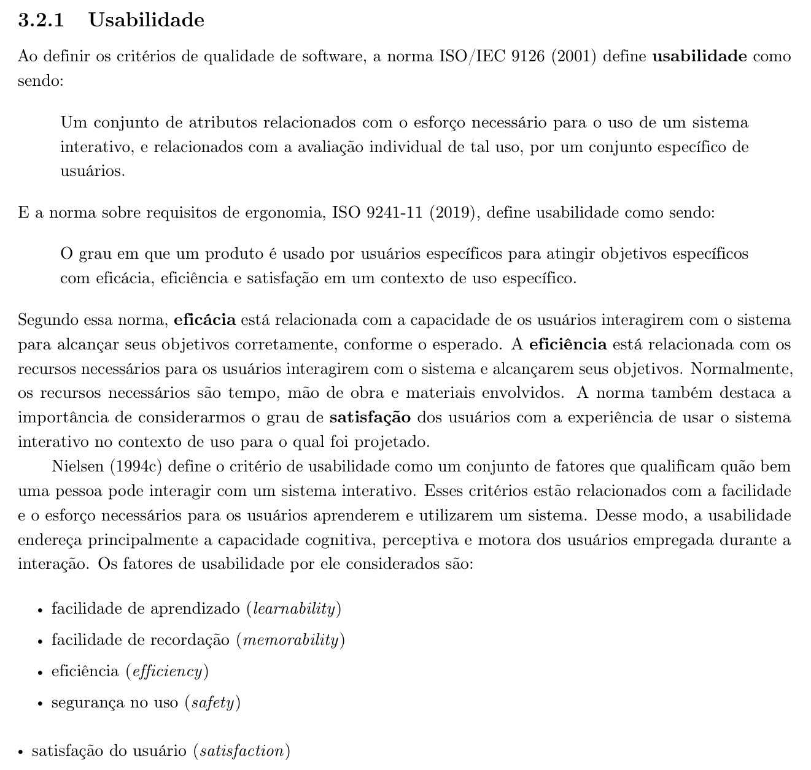
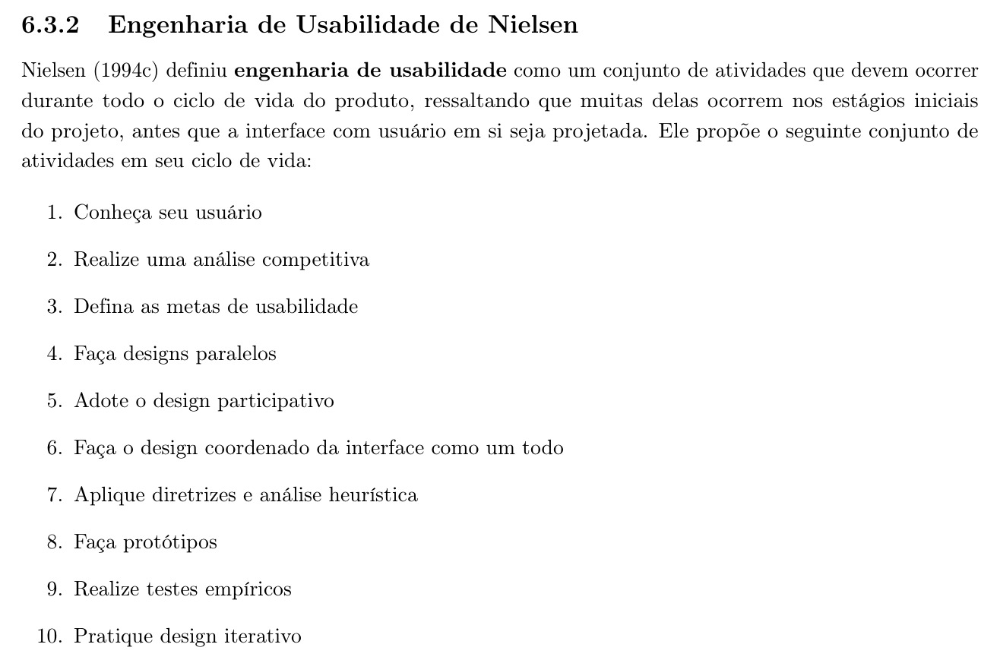
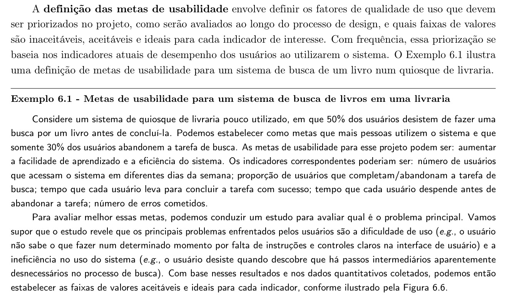
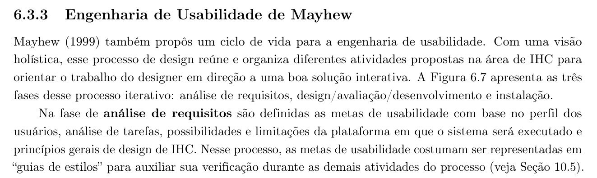

<b>Tabela de Contribuição</b>

| Membro | Contribuição |
| :--- | :--- |
| Pedro Rocha Ferreira Lima | Elaboração integral do conteúdo sobre metas de usabilidade, fundamentação teórica com recortes bibliográficos (Figuras 1 a 4), análise das situações observadas no site, aspectos de IHC e impactos para as personas, e aplicação das metas ao PCI Concursos. |
| Daniel da Silva Batista | Revisão técnica de conformidade com os modelos de tarefas e inspeção ergonômica. |
| Arthur Sismene Carvalho | Validação das violações no contexto de simulados e acesso móvel. |
| Leonardo da Silva Lopes Júnior | Revisão de consistência com os hábitos dos concurseiros maduros e ativos. |
| Claude Opus 5.5 (Anthropic), via Antigravity | Auxílio na localização das referências no texto (conforme Política de Uso de IA). |

<b>Fonte:</b> Pedro Rocha Ferreira Lima (2026).

# Metas de Usabilidade

## 1. Introdução

Este documento define metas de usabilidade para o site PCI Concursos, aplicando o referencial teórico do livro-texto da disciplina de Interação Humano-Computador (IHC).

Segundo o livro, "a definição das metas de usabilidade envolve definir os fatores de qualidade de uso que devem ser priorizados no projeto, como serão avaliados ao longo do processo de design, e quais faixas de valores são inaceitáveis, aceitáveis e ideais para cada indicador de interesse" (BARBOSA et al., 2021, p. 127).

O documento segue três passos: (1) apresenta os fatores de usabilidade de Nielsen (1994) descritos no Capítulo 3 do livro, que servem de base para qualquer definição de metas; (2) descreve como o processo de definição de metas é conduzido nos ciclos de vida de Engenharia de Usabilidade de Nielsen e de Mayhew (Capítulo 6); e (3) aplica esse referencial ao PCI Concursos, estabelecendo indicadores e faixas inaceitável, aceitável e ideal a partir de evidências coletadas por observação direta da navegação do site.

Como este exercício não parte de uma etapa prévia, formalizada, de perfil de usuário e análise de tarefas para o PCI Concursos, as metas propostas baseiam-se no público implícito do site — pessoas em busca de informações sobre concursos públicos, com níveis de escolaridade e familiaridade com tecnologia variados — e em evidências observáveis diretamente na interface, tal como o próprio livro admite ao afirmar que a priorização das metas "com frequência... se baseia nos indicadores atuais de desempenho dos usuários ao utilizarem o sistema" (BARBOSA et al., 2021, p. 127).

---

## 2. Fundamentação Teórica

### 2.1 Fatores de usabilidade

A ISO 9241-11 define usabilidade como "o grau em que um produto é usado por usuários específicos para atingir objetivos específicos com eficácia, eficiência e satisfação em um contexto de uso específico" (BARBOSA et al., 2021, p. 41).

Nessa norma, eficácia diz respeito à capacidade de os usuários alcançarem corretamente seus objetivos; eficiência, aos recursos (tempo, mão de obra, materiais) necessários para alcançá-los; e satisfação, ao grau de contentamento dos usuários com a experiência de uso (BARBOSA et al., 2021, p. 41).

De forma complementar, o livro adota os cinco fatores de usabilidade propostos por Nielsen (1994), que "qualificam quão bem uma pessoa pode interagir com um sistema interativo" (BARBOSA et al., 2021, p. 41):

- **Facilidade de aprendizado (learnability)** — "tempo e esforço necessários para que o usuário aprenda a utilizar o sistema com determinado nível de competência e desempenho" (p. 41).
- **Facilidade de recordação (memorability)** — "esforço cognitivo do usuário necessário para lembrar como interagir com a interface do sistema interativo, conforme aprendido anteriormente", especialmente relevante em sistemas de uso esporádico (p. 42).
- **Eficiência (efficiency)** — "tempo necessário para conclusão de uma atividade com apoio computacional", importante para manter a produtividade do usuário já experiente (p. 42).
- **Segurança no uso (safety)** — "grau de proteção de um sistema contra condições desfavoráveis ou até mesmo perigosas para os usuários", alcançada evitando problemas e facilitando sua recuperação (p. 42–43).
- **Satisfação do usuário (satisfaction)** — "avaliação subjetiva que expressa o efeito do uso do sistema sobre as emoções e os sentimentos do usuário" (p. 43).

A Figura 1 reproduz o trecho da literatura (Seção 3.2.1) que apresenta essas definições.

<b>Figura 1: Referência Bibliográfica — Critérios de Usabilidade segundo a ISO/IEC 9126, a ISO 9241-11 e os Fatores de Nielsen</b>

<b>Fonte:</b> BARBOSA et al. (2021, p. 41–42).

O livro alerta que "dificilmente um único sistema será muito bom em todos os critérios de usabilidade, porque não é fácil articular esses critérios sem que haja perdas em um ou mais deles" (BARBOSA et al., 2021, p. 43), o que torna necessário conhecer as necessidades dos usuários e priorizar os fatores mais relevantes para cada projeto — é exatamente essa priorização que as metas de usabilidade formalizam.

### 2.2 Como as metas de usabilidade são definidas

No ciclo de vida de Engenharia de Usabilidade de Nielsen, "defina as metas de usabilidade" é o terceiro de dez passos, logo após conhecer o usuário e realizar uma análise competitiva (BARBOSA et al., 2021, p. 126). A Figura 2 reproduz esse ciclo.

<b>Figura 2: Referência Bibliográfica — Ciclo de Vida da Engenharia de Usabilidade de Nielsen</b>

<b>Fonte:</b> BARBOSA et al. (2021, p. 126).

O livro detalha esse passo:

> "A definição das metas de usabilidade envolve definir os fatores de qualidade de uso que devem ser priorizados no projeto, como serão avaliados ao longo do processo de design, e quais faixas de valores são inaceitáveis, aceitáveis e ideais para cada indicador de interesse. Com frequência, essa priorização se baseia nos indicadores atuais de desempenho dos usuários ao utilizarem o sistema." (BARBOSA et al., 2021, p. 127)

O livro ilustra esse processo com o Exemplo 6.1: um quiosque de livraria em que 50% dos usuários abandonam a busca por um livro; a meta é reduzir o abandono para 30%, priorizando facilidade de aprendizado e eficiência, com indicadores como número de usuários que acessam o sistema, proporção de conclusão/abandono da busca, tempo até concluir, tempo até abandonar e número de erros (BARBOSA et al., 2021, p. 127). A Figura 3 reproduz esse trecho.

<b>Figura 3: Referência Bibliográfica — Definição de Metas de Usabilidade e Faixas de Valores por Indicador</b>

<b>Fonte:</b> BARBOSA et al. (2021, p. 127).

A Figura 6.6 do livro representa essas faixas visualmente, com o valor atual e o valor almejado para cada indicador, segmentados em inaceitável, aceitável e ideal (BARBOSA et al., 2021, p. 127). Este documento adota essa mesma estrutura — indicador mais faixa inaceitável/aceitável/ideal — ao propor metas para o PCI Concursos.

Já no ciclo de vida de Engenharia de Usabilidade de Mayhew, as metas de usabilidade são definidas na fase de análise de requisitos, "com base no perfil dos usuários, análise de tarefas, possibilidades e limitações da plataforma em que o sistema será executado e princípios gerais de design de IHC"; nesse processo, elas "costumam ser representadas em 'guias de estilos' para auxiliar sua verificação durante as demais atividades do processo" (BARBOSA et al., 2021, p. 129). A Figura 4 reproduz esse trecho.

<b>Figura 4: Referência Bibliográfica — Metas de Usabilidade na Fase de Análise de Requisitos (Ciclo de Mayhew)</b>

<b>Fonte:</b> BARBOSA et al. (2021, p. 129).

Isso reforça que uma meta de usabilidade não é arbitrária: ela decorre de quem são os usuários, do que precisam fazer e das restrições da plataforma — por isso a seção seguinte descreve o site antes de propor qualquer meta.

---

## 3. Objeto de Análise: o Site PCI Concursos

O PCI Concursos é um portal de divulgação de concursos públicos e processos seletivos no Brasil. Sua proposta central é permitir que o usuário encontre oportunidades por região, estado, cidade ou cargo, além de oferecer notícias, apostilas para venda, simulados e provas de concursos anteriores.

A navegação principal do site inclui um contador de vagas (ex.: "35.558 vagas em concursos") e seções de Concursos (subdivididas por região geográfica — Nacional, Sudeste, Sul, Norte, Nordeste e Centro-Oeste — e por estado), Apostilas, Notícias, Provas, Simulados, Organizadoras, Cargos e Contato. Há também autenticação via login do Google, o que indica cadastro de usuário associado à interação com o site.

A busca por cargo é feita em uma página dedicada (pciconcursos.com.br/cargos), com um campo de texto ("Pesquise por cargos (ex: dentista, psicólogo, médico entre outros)") seguido de uma lista alfabética de mais de 300 cargos, pela qual o usuário pode rolar até encontrar o cargo desejado.

A listagem de concursos por estado (ex.: pciconcursos.com.br/concursos/sp) agrupa oportunidades por cidade, em lista alfabética com centenas de municípios — no caso de São Paulo, mais de 600.

---

## 4. Situação Atual Observada no Site

A Tabela 1 relaciona, para cada persona considerada, situações observadas na navegação do site (06/10/2026) ao aspecto de IHC envolvido e ao impacto correspondente sobre a tarefa da persona, servindo de base para a priorização das metas propostas na seção seguinte.

<b>Tabela 1: Situações Observadas no PCI Concursos por Persona</b>

| Persona | Situação observada no site | Aspecto de IHC relacionado | Impacto para a persona |
| :--- | :--- | :--- | :--- |
| **Perfil 1 — Estudante Universitário / Iniciante** | A busca por cargo oferece um campo de texto livre, mas não apresenta sugestão automática visível; abaixo, há uma lista alfabética extensa de cargos. | Eficiência; facilidade de aprendizado | Usuários que ainda não conhecem o nome exato do cargo podem ter dificuldade para encontrar a opção desejada e gastar mais tempo na tarefa. |
| **Perfil 1 — Estudante Universitário / Iniciante** | A página de concursos por estado apresenta uma grande quantidade de cidades em ordem alfabética. Em São Paulo, por exemplo, a relação de municípios é extensa e ocupa grande parte da página. | Eficiência; facilidade de navegação | O estudante pode precisar percorrer uma lista muito extensa para localizar sua cidade, aumentando o esforço da tarefa. |
| **Perfil 1 — Estudante Universitário / Iniciante** | A página inicial reúne diferentes conteúdos, como concursos, notícias, apostilas, provas, videoaulas e outras seções. | Visibilidade; organização da informação | Usuários iniciantes podem ter dificuldade para identificar rapidamente qual seção deve ser acessada para cumprir uma tarefa específica. |
| **Perfil 1 — Estudante Universitário / Iniciante** | As notícias e concursos exibem muitas informações simultaneamente, incluindo quantidade de vagas, nível de escolaridade, remuneração, datas e links para materiais. | Eficiência; carga cognitiva | A quantidade de informações pode dificultar uma comparação rápida entre oportunidades, principalmente para quem ainda não possui familiaridade com concursos. |
| **Perfil 1 — Estudante Universitário / Iniciante** | O login está disponível por meio da conta Google, evitando a necessidade de criação manual de uma senha. | Facilidade de aprendizado; segurança | Reduz a complexidade do cadastro e utiliza um mecanismo de autenticação já conhecido pelo usuário. |
| **Perfil 1 — Estudante Universitário / Iniciante** | O site oferece versão adaptável para diferentes dispositivos, favorecendo consultas fora do computador. | Eficiência; satisfação | O estudante pode acessar concursos e materiais pelo celular durante deslocamentos ou intervalos de estudo, ampliando a flexibilidade de uso. |
| **Perfil 2 — Concurseiro Ativo / Adulto e Maduro** | A listagem de concursos apresenta datas de inscrição e, em alguns casos, expressões como "Prorrogado até" e "Reaberto até", porém sem uma padronização visual de status para todas as oportunidades. | Visibilidade do estado do sistema; segurança no uso; satisfação | O concurseiro precisa interpretar diferentes formas de apresentação das situações das inscrições, podendo aumentar o risco de acompanhar de forma inadequada um prazo. |
| **Perfil 2 — Concurseiro Ativo / Adulto e Maduro** | A busca pode ser realizada por diferentes caminhos, como cargo, cidade, vaga, organizadora e provas, mas essas informações estão distribuídas em páginas distintas. | Eficiência; consistência; navegação | Usuários que fazem pesquisas mais específicas podem precisar alternar entre várias páginas para cruzar informações sobre uma mesma oportunidade. |
| **Perfil 2 — Concurseiro Ativo / Adulto e Maduro** | A página de provas possui sua própria busca e uma extensa listagem de cargos, funcionando como uma área separada da busca principal por concursos. | Consistência; eficiência | O usuário experiente pode encontrar a prova em uma área e o concurso correspondente em outra, exigindo navegação adicional para relacionar as informações. |
| **Perfil 2 — Concurseiro Ativo / Adulto e Maduro** | Em páginas detalhadas de concursos, informações como cargos, quantidade de vagas, remuneração, datas, taxa de inscrição e etapas aparecem em blocos de texto extensos. | Eficiência; legibilidade; carga cognitiva | A tarefa de identificar rapidamente as informações mais importantes pode exigir leitura cuidadosa e comparação manual. |
| **Perfil 2 — Concurseiro Ativo / Adulto e Maduro** | As apostilas são apresentadas junto às oportunidades de concurso e também aparecem em áreas de destaque da página. | Satisfação; relevância da informação | Para quem procura exclusivamente edital, prazo ou prova, os materiais comerciais podem funcionar como conteúdo secundário e aumentar o ruído visual. |
| **Perfil 2 — Concurseiro Ativo / Adulto e Maduro** | Um mesmo concurso pode oferecer vários cargos, diferentes níveis de escolaridade, salários e etapas específicas, exigindo leitura cuidadosa da oportunidade. | Eficiência; compatibilidade com a tarefa | O usuário precisa filtrar mentalmente as informações para identificar apenas o cargo compatível com sua preparação e objetivo. |
| **Perfil 3 — Administrador da Plataforma / Usuário Avançado** | O site possui diferentes áreas de consulta — cargos, cidades, vagas, organizadoras e provas — que precisam manter informações coerentes entre si. | Consistência; controle; qualidade dos dados | Um administrador ou gestor de conteúdo teria maior necessidade de verificar se as informações publicadas permanecem consistentes entre as diferentes áreas do sistema. |
| **Perfil 3 — Administrador da Plataforma / Usuário Avançado** | As páginas de notícias exibem concursos novos e também retificações, reaberturas e prorrogações de inscrições, indicando necessidade de atualização frequente do conteúdo. | Feedback; controle; prevenção de erros | O administrador precisa garantir que alterações nos editais sejam refletidas corretamente nas informações apresentadas aos usuários. |
| **Perfil 3 — Administrador da Plataforma / Usuário Avançado** | Existe uma área "Colaborar" que permite enviar informações ou links de novos concursos, editais ou provas para inclusão no site. | Eficiência; controle; feedback | O fluxo de entrada de novas informações é simplificado por um formulário específico, mas o formulário consultado não apresenta ao usuário um acompanhamento visível do status da contribuição após o envio. |
| **Perfil 3 — Administrador da Plataforma / Usuário Avançado** | Uma página de concurso reúne informações detalhadas e links para os editais e provas relacionadas, mas o acesso aos arquivos pode exigir verificação de segurança e JavaScript. | Controle; segurança; acessibilidade | Durante a manutenção ou conferência de conteúdo, etapas adicionais para acessar os arquivos podem dificultar a verificação rápida de documentos e links. |
| **Perfil 3 — Administrador da Plataforma / Usuário Avançado** | A lista de cargos contém nomenclaturas semelhantes ou variações, como diferentes formas de denominação de cargos e funções. | Consistência; organização da informação | Para uma pessoa responsável pelos dados, a existência de nomenclaturas semelhantes pode dificultar a padronização, categorização e manutenção dos registros. |
| **Perfil 3 — Administrador da Plataforma / Usuário Avançado** | O site apresenta atualização diária das informações e mantém grande quantidade de concursos ativos simultaneamente. | Controle; eficiência; prevenção de erros | A quantidade e frequência das atualizações aumentam a necessidade de mecanismos de conferência, identificação de alterações e manutenção estruturada dos dados. |

<b>Fonte:</b> Pedro Rocha Ferreira Lima (2026), a partir de inspeção do portal em 06/10/2026.

Como o site é público e de uso recorrente por um grande volume de pessoas, este documento não inclui medição de desempenho com usuários reais (ex.: taxas de abandono, tempos de tarefa); as evidências acima baseiam-se exclusivamente na inspeção da interface, compatível com a fase inicial de definição de metas descrita pelo livro, mas que deve ser complementada por testes com usuários antes da validação final (BARBOSA et al., 2021, p. 127).

---

## 5. Metas de Usabilidade Propostas

Seguindo o formato do Exemplo 6.1 do livro (BARBOSA et al., 2021, p. 127), cada meta da Tabela 2 prioriza um fator de usabilidade, associa-o a um indicador mensurável e define as faixas inaceitável, aceitável e ideal para esse indicador.

<b>Tabela 2: Metas de Usabilidade Propostas para o PCI Concursos</b>

| # / Fator priorizado | Indicador | Inaceitável | Aceitável | Ideal |
| :--- | :--- | :--- | :--- | :--- |
| **M1 — Eficiência** | Tempo até o usuário localizar um concurso específico por cargo, a partir da página inicial | Mais de 90 s ou abandono da busca | Entre 40 e 90 s | Até 40 s |
| **M2 — Eficiência** | Tempo até o usuário localizar os concursos abertos em sua cidade | Mais de 2 min ou abandono da busca | Entre 1 e 2 min | Até 1 min |
| **M3 — Segurança no uso** | Proporção de usuários que identificam corretamente se um concurso listado está com inscrições abertas ou encerradas, sem abrir a página de detalhe | Menos de 50% identificam corretamente | Entre 50% e 80% | Mais de 80% |
| **M4 — Facilidade de aprendizado** | Tempo até um usuário sem experiência prévia no site realizar com sucesso sua primeira busca por cargo ou cidade | Mais de 3 min ou necessidade de ajuda externa | Entre 1 e 3 min, sem ajuda externa | Até 1 min, sem ajuda externa |
| **M5 — Facilidade de recordação** | Proporção de usuários que, após 7 dias sem acessar o site, retornam e completam a mesma tarefa (busca por cargo ou cidade) sem reaprendizado perceptível | Menos de 60% completam sem dificuldade | Entre 60% e 85% | Mais de 85% |
| **M6 — Satisfação do usuário** | Nota média de satisfação pós-tarefa ("Quão fácil foi encontrar a informação que você procurava?"), escala de 1 (muito difícil) a 5 (muito fácil) | Média abaixo de 3,0 | Média entre 3,0 e 4,0 | Média acima de 4,0 |

<b>Fonte:</b> Pedro Rocha Ferreira Lima (2026).

Assim como no Exemplo 6.1, essas faixas são decisões de projeto propostas a partir da inspeção da interface (BARBOSA et al., 2021, p. 127) — não são medições já realizadas — e deverão ser confirmadas ou recalibradas após testes de usabilidade com usuários reais do PCI Concursos.

---

## 6. Razão da Seleção das Metas

A ordem de prioridade entre os fatores de usabilidade segue o alerta do livro de que "dificilmente um único sistema será muito bom em todos os critérios de usabilidade" (BARBOSA et al., 2021, p. 43), o que exige escolher quais fatores guiam as decisões de design do PCI Concursos em caso de conflito.

### 6.1 Segurança no uso (M3)

Priorizada em primeiro lugar porque o custo de uma falha é alto e irreversível: se um usuário não percebe que um concurso já encerrou, ele pode perder uma oportunidade real de inscrição.

O livro define esse fator como a proteção contra "condições desfavoráveis ou até mesmo perigosas para os usuários" (BARBOSA et al., 2021, p. 42–43); no contexto de concursos públicos, a informação de prazo tem exatamente esse caráter crítico, reforçado pela ausência de indicadores de status observada na seção anterior.

### 6.2 Eficiência (M1 e M2)

Como o site é usado por um público que compara dezenas de oportunidades de diferentes cidades e cargos, reduzir o tempo de busca tem impacto direto sobre a utilidade do site: a longa lista alfabética de cidades e cargos observada na navegação é o principal fator que pode comprometer esse indicador.

### 6.3 Facilidade de aprendizado (M4)

O site recebe tanto usuários recorrentes quanto pessoas que buscam informação sobre concursos apenas ocasionalmente (ex.: ao saber de um edital por indicação de terceiros); por isso, é importante que a primeira busca não exija conhecimento prévio da estrutura do site.

### 6.4 Facilidade de recordação (M5)

Muitos concursos têm ciclos de preparação e inscrição longos, de modo que o usuário pode acessar o site esporadicamente ao longo de semanas ou meses; por isso a facilidade de retomar uma tarefa já realizada antes é relevante, mas em grau menor do que aprender a tarefa pela primeira vez.

### 6.5 Satisfação do usuário (M6)

Mantida como última prioridade formal não por ser menos importante, mas porque, como o livro observa, ela é uma "avaliação subjetiva" (BARBOSA et al., 2021, p. 43) que tende a ser consequência do bom desempenho nos demais fatores: um site seguro, eficiente e fácil de aprender tende a gerar maior satisfação, mesmo sem intervenções voltadas exclusivamente à experiência percebida.

Essa priorização não dispensa a avaliação dos demais fatores — todos os seis indicadores da Tabela 2 devem ser medidos — mas orienta decisões de design em caso de conflito, como recomenda o livro ao tratar da definição de metas de usabilidade (BARBOSA et al., 2021, p. 127).

---

## 7. Bibliografia

> [1] BARBOSA, Simone D. J. et al. *Interação Humano-Computador e Experiência do Usuário*. 1. ed. Autopublicação, 2021. ISBN: 978-65-00-19677-1.  
> [2] INTERNATIONAL ORGANIZATION FOR STANDARDIZATION. *ISO 9241-11:2018 — Ergonomics of human-system interaction — Part 11: Usability: Definitions and concepts*. Geneva: ISO, 2019.  
> [3] NIELSEN, Jakob. *Usability Engineering*. Boston: Academic Press, 1994.  
> [4] PCI CONCURSOS. *Portal PCI Concursos*. Disponível em: <https://www.pciconcursos.com.br/>. Acesso em: 6 out. 2026.

---

## 8. Histórico de Versões

| Versão | Data | Descrição | Autor(es) | Revisor(es) |
| :---: | :---: | :--- | :---: | :---: |
| `1.0` | 06/10/2026 | Elaboração do artefato de Metas de Usabilidade: fundamentação teórica com recortes bibliográficos, situação atual observada no site por persona, metas propostas (M1 a M6) e razão da seleção. | Pedro Rocha Ferreira Lima | Daniel da Silva Batista |

<b>Fonte:</b> Pedro Rocha Ferreira Lima (2026).

