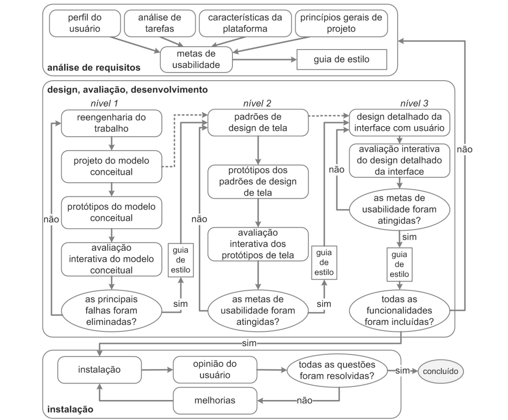

# Processo de Design

## 1. Introdução

Um processo de design em Interação Humano-Computador (IHC) consiste em um conjunto de atividades básicas – análise, síntese e avaliação – que visa projetar sistemas interativos com alta qualidade de uso. Existem diversas propostas de ciclos de vida na literatura, como o Ciclo de Vida Simples, o Ciclo de Vida em Estrela e a Engenharia de Usabilidade de Nielsen.

Para a condução deste projeto focado na reestruturação do portal do Tribunal de Contas do Distrito Federal (TCDF), a equipe escolheu adotar o **Ciclo de Vida da Engenharia de Usabilidade de Mayhew**.

## 2. Escolha do Processo: Engenharia de Usabilidade de Mayhew

A decisão por utilizar a Engenharia de Usabilidade de Mayhew baseou-se em dois fatores principais:

1. **Recomendação Acadêmica e Didática:** Conforme orientado pelo professor em sala de aula, o ciclo de Mayhew é considerado a melhor alternativa para equipes de estudantes e profissionais que estão tendo o primeiro contato prático com o ciclo de vida completo de IHC. Isso ocorre porque as etapas de Mayhew são extremamente bem detalhadas, autoexplicativas e guiadas passo a passo, reduzindo a margem de erro para quem nunca executou um projeto desse tipo antes.
2. **Alinhamento com o Cronograma:** O fluxograma proposto por Mayhew divide-se em fases e níveis de detalhamento que espelham perfeitamente as avaliações e entregas exigidas no Plano de Ensino da disciplina (desde a análise do perfil de usuário até a avaliação de protótipos de alta fidelidade).

### 2.1 As Fases de Mayhew

O processo de Mayhew é dividido em três fases principais:

* **Fase 1: Análise de Requisitos**
    Envolve a definição das metas de usabilidade baseadas no perfil do usuário, na análise de tarefas, nas possibilidades e limitações da plataforma e nos princípios gerais de design.
* **Fase 2: Design, Avaliação e Desenvolvimento**
    Esta é a fase iterativa. Ocorre em três níveis crescentes de fidelidade:
    * *Nível 1:* Reengenharia do trabalho e prototipação do modelo conceitual (Baixa fidelidade).
    * *Nível 2:* Estabelecimento de padrões de design de tela (Média fidelidade).
    * *Nível 3:* Design detalhado da interface (Alta fidelidade).
    Ao fim de cada nível, os protótipos são avaliados para garantir o cumprimento das metas de usabilidade.
* **Fase 3: Instalação**
    Corresponde à etapa de coleta de feedback e opiniões dos usuários após o sistema ser implementado, buscando correções em novas atualizações.

<b>Figura 1:</b> Engenharia de Usabilidade de Mayhew. <b>Fonte:</b> BARBOSA e SILVA (2010).

## 3. Aplicação Prática no Projeto TCDF

A teoria de Mayhew será aplicada de forma pragmática ao longo do nosso projeto da seguinte maneira:

- Na **Fase 1**, a equipe realizará entrevistas e questionários para definir o Perfil de Usuário dos cidadãos do DF que utilizam o TCDF, estabelecendo metas de usabilidade claras.
- Na **Fase 2**, faremos o reprojeto (reengenharia) da interface do portal atual, criando primeiro um protótipo de papel (Nível 1) para validar a arquitetura da informação, e posteriormente evoluindo para um protótipo de alta fidelidade no Figma (Nível 3), sempre com avaliações heurísticas e testes com usuários reais a cada iteração.

## 4. Bibliografia

> 1. BARBOSA, Simone Diniz Junqueira; SILVA, Bruno Santana da. **Interação Humano-Computador**. 1. ed. Rio de Janeiro: Elsevier, 2010.

## 5. Histórico de Versões

| Versão | Data | Descrição | Autor(es) | Revisor(es) |
| :---: | :---: | :--- | :---: | :---: |
| `1.0` | 06/09/2026 | Criação do documento de Processo de Design e definição da metodologia. | Daniel da Silva Batista | Pedro Rocha Ferreira Lima |

